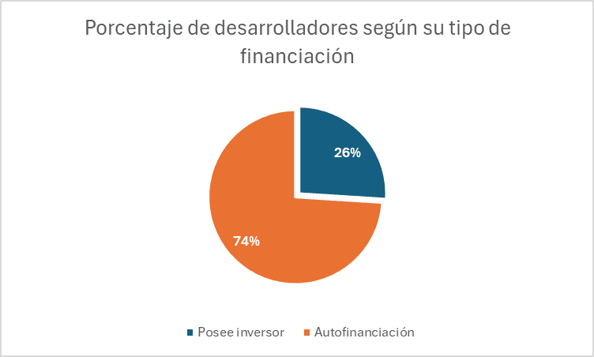
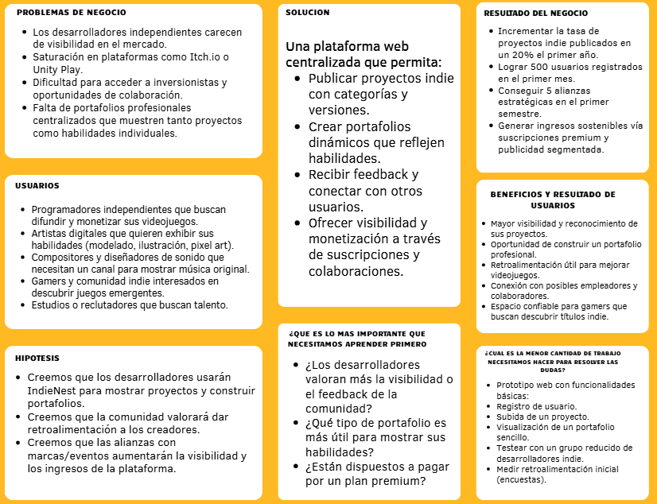
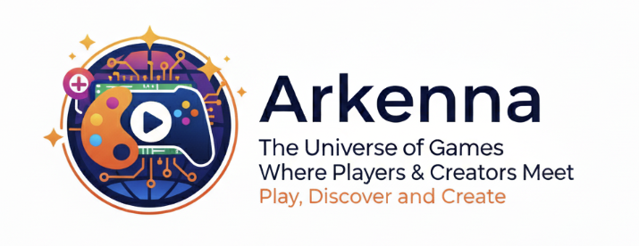
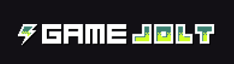
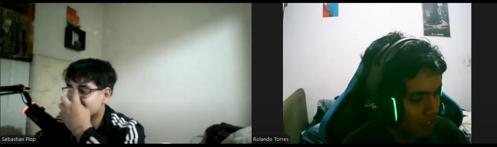
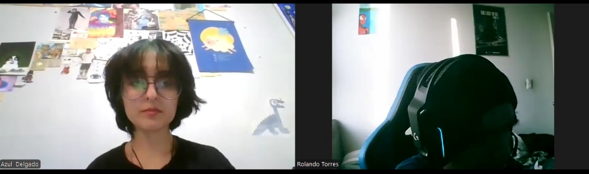
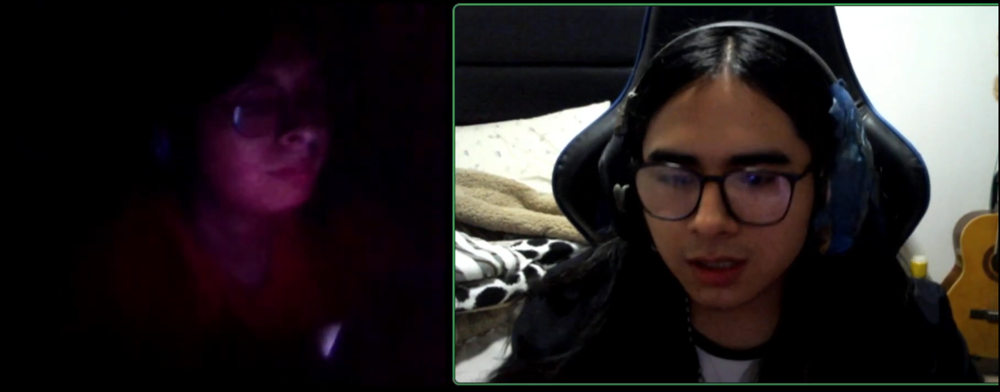

# UNIVERSIDAD PERUANA DE CIENCIAS APLICADAS
# FACULTAD DE INGENIERÍA
### PROGRAMA ACADÉMICO DE INGENIERÍA DE SOFTWARE

**Ciclo:** 2025-02
 
**Sección:** 7349
 
**Docente del curso:** Efraín Ricardo Bautista Ubillús

---
# INFORME DE TRABAJO(TB1)

**Nombre de la Startup:** Arkenna
**Nombre del producto:** IndieNest

## Integrantes
- Carlos Augusto Paredes Chavez - U202321613
- Daniel Jonatan Aquino Solorzano - U202217678
- Johnny Alexander Ojanama Abanto - U20231F412
- Rolando Andre Torres Diaz - U202323369
- Giuliano Angel Pelaez Vargas - U20221E121  

**Fecha:** Agosto, 2025

---

| Versión | Fecha | Autor | Descripción de modificación |
|---------|-------|-------|-----------------------------|
| 1.0    | a | Giuliano Angel Pelaez Vargas | Versión inicial |
| 1.1 |

---

## Project Report Collaboration Insights
[Repositorio en GitHub](https://github.com/Arkenna/upc-pre-202520-1asi0729-7349-Arkenna-report-TB1/blob/main/README.md)

---

# Tabla de Contenido

1. [Capítulo I: Introducción](#capítulo-i-introducción)  
   - [1.1. Startup Profile](#11-startup-profile)  
     - [1.1.1. Descripción de la Startup](#111-descripción-de-la-startup)  
     - [1.1.2. Perfiles de integrantes del equipo](#112-perfiles-de-integrantes-del-equipo)  
   - [1.2. Solution Profile](#12-solution-profile)  
     - [1.2.1. Antecedentes y problemática](#121-antecedentes-y-problemática)  
     - [1.2.2. Lean UX Process](#122-lean-ux-process)  
       - [1.2.2.1. Lean UX Problem Statements](#1221-lean-ux-problem-statements)  
       - [1.2.2.2. Lean UX Assumptions](#1222-lean-ux-assumptions)  
       - [1.2.2.3. Lean UX Hypothesis Statements](#1223-lean-ux-hypothesis-statements)  
       - [1.2.2.4. Lean UX Canvas](#1224-lean-ux-canvas)  
   - [1.3. Segmentos Objetivo](#13-segmentos-objetivo)  

2. [Capítulo II: Requirements Elicitation & Analysis](#capítulo-ii-requirements-elicitation--analysis)  
   - [2.1. Competidores](#21-competidores)  
     - [2.1.1. Análisis competitivo](#211-análisis-competitivo)  
     - [2.1.2. Estrategias y tácticas frente a competidores](#212-estrategias-y-tácticas-frente-a-competidores)  
   - [2.2. Entrevistas](#22-entrevistas)  
     - [2.2.1. Diseño de entrevistas](#221-diseño-de-entrevistas)  
     - [2.2.2. Registro de entrevistas](#222-registro-de-entrevistas)  
     - [2.2.3. Análisis de entrevistas](#223-análisis-de-entrevistas)  
   - [2.3. Needfinding](#23-needfinding)  
     - [2.3.1. User Personas](#231-user-personas)  
     - [2.3.2. User Task Matrix](#232-user-task-matrix)  
     - [2.3.3. User Journey Mapping](#233-user-journey-mapping)  
     - [2.3.4. Empathy Mapping](#234-empathy-mapping)  
   - [2.4. Big Picture Event Storming](#24-big-picture-event-storming)  
   - [2.5. Ubiquitous Language](#25-ubiquitous-language)  

3. [Capítulo III: Requirements Specification](#capítulo-iii-requirements-specification)  
   - [3.1. User Stories](#31-user-stories)  
   - [3.2. Impact Mapping](#32-impact-mapping)  
   - [3.3. Product Backlog](#33-product-backlog)  

4. [Capítulo IV: Product Design](#capítulo-iv-product-design)  
   - [4.1. Style Guidelines](#41-style-guidelines)  
     - [4.1.1. General Style Guidelines](#411-general-style-guidelines)  
     - [4.1.2. Web Style Guidelines](#412-web-style-guidelines)  
   - [4.2. Information Architecture](#42-information-architecture)  
     - [4.2.1. Organization Systems](#421-organization-systems)  

# Student Outcome

| Criterio específico | Acciones realizadas | Conclusiones |
|---------------------|---------------------|--------------|
# Student Outcome

| Criterio específico | Giuliano Angel Pelaez Vargas | Daniel Jonatan Aquino Solorzano | Rolando Andre Torres Diaz | Johnny Alexander Ojanama Abanto | Carlos Augusto Paredes Chavez | Conclusiones |
|---------------------|------------------------------|---------------------------------|---------------------------|---------------------------------|-------------------------------|--------------|
| Comunica oralmente con efectividad a diferentes rangos de audiencia | asd | asd | asd | asd | asd | asd |
| Comunica por escrito con efectividad a diferentes rangos de audiencia | asd | asd | asd | asd | asd | asd |

---

# Capítulo I: Introducción

## 1.1. Startup Profile

### 1.1.1. Descripción de la Startup 
Nuestra startup, **Arkena**, es una aplicación web donde programadores, compositores, artistas y equipos de desarrollo se juntan para subir y promocionar sus videojuegos y/o proyectos personales junto a su portafolio dando visibilidad a sus habilidades dentro de su rubro.
 
**Misión:** Nuestra misión es abrirle las puertas a desarrolladores independientes dándoles un lugar donde subir sus videojuegos y/o proyectos.

**Visión:** Nuestra visión es volvernos un gran apoyo para los desarrolladores siendo su lugar ideal para subir sus proyectos.
### 1.1.2. Perfiles de integrantes del equipo 
| Acerca de | Integrante |
|-------------|----------|
| Estudiando actualmente la carrera de Ingeniería de Software. Me considero una persona responsable con sus trabajos y puntual en las entregas de estos. Tengo conocimientos técnicos en programación en lenguajes como C++ y Java.          |**Aquino Solorzano, Daniel Jonathan(u202217678)**  |
|           | **Ojanama Abanto,Johnny Alexander(u20231f412)** |
|           | **Paredes Chavez, Carlos Augusto (u202321613)** |
| Estoy cursando el 5to ciclo de la carrera de Igeniería de Software. Me considero una persona solidaria y enfocado en los trabajos. Tengo conocimientos en los lenguajes de programacion como C++, Python y Lua.    | **Pelaez Vargas, Giuliano Angel (u20221e121)**  |
| Actualmente estoy estudiando ingeniería de software en la universidad peruana de ciencias aplicadas. Personalmente, me considero una persona amigable y responsable, lo cual me puede ayudar en la universidad. También creo que estas cualidades me permitirán construir relaciones sólidas con mis compañeros y profesores, así como ordenar mi tiempo. | **Torres Díaz, Rolando Andre(u202323369)** |   

---
## 1.2. Solution Profile
 La plataforma o aplicación web se encargará de que los desarrolladores de videojuegos independientes, tanto como programadores, diseñadores y compositores publiquen sus proyectos y así puedan promocionarlos. De esta manera, la aplicación actúa como un portafolio centralizado en la promoción de los proyectos que cada usuario y promocione con el espacio que se le es brindado.
 
 ---
 
 
### 1.2.1. Descripción de la Startup
Según la revista digital “Economía”, entre los desafíos para el desarrollo indie en el contexto peruano destacan, principalmente, la necesidad de financiar sus proyectos en páginas de crowdfunding como Kickstarter; además de la limitada formación profesional y la falta de medios de difusión y comercialización que ayuden a darle visibilidad a sus trabajos, ya que, aunque existan eventos y ferias como el “Lima Indie Games Festival” o el “MasGamers Tech Festival”, no se tiene aún una red completamente sólida a la vez que eficiente que una a desarrolladores, distribuidores y jugadores a nivel nacional.

Por otra parte, el periodico digital “The Objective” habla sobre cómo se vive esta situación en España, donde resalta que en estos años ya no importa tanto el nivel de creatividad que tenga el desarrollador a la hora de que tenga visibilidad su videojuego, sino que es más importante aún tener sólidos presupuestos y una buena estrategia de marketing para que su trabajo tenga la visibilidad que se merece.

De acuerdo con un artículo publicado por el sitio web de “AnaitGames” se han reportado casos de desarrolladores independientes que afrontan problemas al querer ganar visibilidad publicando sus juegos en tiendas virtuales como la “eShop” de Nintendo. La problemática es tal que muchos se ven en la obligación de devaluar sus trabajos y publicar sus primeros proyectos con descuentos que son demasiado para que le puedan sacar buen provecho a sus trabajos.

Se menciona también, en otro artículo del mismo sitio web, que la gran cantidad de videojuegos que se lanza al mercado frecuentemente puede resultar abrumador para el público consumidor, pero realmente no genera un problema en ellos, sino en los autores de estos proyectos que, sin importar la calidad de sus juegos, no consiguen llegar al público objetivo. Se menciona además, de una encuesta desarrollada por “Games Industry” a 60 desarrolladores, que sus principales inquietudes y preocupaciones son: Por un lado, la falta de visibilidad que puede afectar a sus proyectos debido a los algoritmos deficientes de búsqueda de las tiendas virtuales; y por el otro lado está el hecho de que no encuentran inversores que estén interesados en sus proyectos. Estos dos factores son los principales responsables de que muchos equipos de desarrollo de videojuegos se queden sin base financiera para poder lanzar un segundo título.

**Figura 1**
Gráfico pastel
 

 
Nota: Gráfico pastel sobre el porcentaje de desarrolladores según su tipo de financiación, de la encuesta desarrollada por “Games Industry”. Elaborado por el equipo de trabajo.

**Conclusión de la figura 1:**
-   Se puede visualizar que, del total de 60 desarrolladores encuestados, solo el 26% posee algún tipo de inversor que lo apoye en sus proyectos, mientras que el 74% debe recurrir a la autofinanciación para poder cubrir los gastos de sus proyectos.
    
-   La necesidad de este tipo de financiación puede llevar a muchos desarrolladores a quiebres financieros y les quita la posibilidad de pensar en proyectos de vida importantes como comprar una casa o tener una familia debido a la cantidad de gastos que generarían.

 
**5W & 2H**

-   What?

	- **¿Cuál es el objetivo principal de la plataforma?**
	
	    Facilitar la promoción de desarrolladores de videojuegos independientes y artistas mediante publicación de portafolios para que cada desarrollador tenga la oportunidad de promocionarse y tener visibilidad para potenciales empleadores y financiadores
    
	-   **¿Qué problema o necesidad busca resolver?**
	
		Según se menciona en los antecedentes, hoy en día es muy difícil ganar visibilidad en el mercado digital de videojuegos debido a la inmensa competencia, del mismo modo la poca visibilidad genera que los desarrolladores indie no encuentren financiadores para sus proyectos, lo que los obliga a recurrir a la autofinanciación
    
	-   **¿Cuál es la relación entre la plataforma y los usuarios?**
   
	    IndieNest actúa como un repositorio de proyectos de desarrolladores independientes y, a la vez, como un promotor de los mismos. Considera y promociona tanto a los proyectos por sí mismos como a sus desarrolladores, contando tanto programadores como demás participantes como diseñadores, testers, entre otros.
    

-    When?
		-   **¿En qué momento los usuarios utilizan más la aplicación?**
    
			Cuando el usuario se encuentra aburrido buscando algo nuevo para jugar o momentos de necesidad para un equipo de desarrollo que busca un lugar donde publicar y promocionar sus proyectos o cuando un desarrollador, artista o compositor busca darse a conocer.

		-   **¿Existen periodos clave de uso?**
	
			Si, durante las épocas de vacaciones de veranos el pico de usuarios subirá, puesto que tendrán más tiempo para jugar y por ello habrá más tráfico de usuarios que buscan videojuegos para descargar comprar

		-   **¿Hay momentos críticos donde se detectan problemas en el uso?**
  
			Si, cuando el usuario no desarrollador se le ocurra subir un proyecto estará confundido al no saber muy bien cómo manejar ello.

-   Where?
	-  **¿Dónde se utiliza la plataforma?**
   
	    IndieNest se puede utilizar en casa. Está diseñada para que los usuarios creen un portafolio sobre sus trabajos donde se sientan más cómodos.
    

 
	  -   **¿La ubicación del usuario influye en su uso?**
   
		    No, ya que el usuario utilizará la aplicación para promover tanto sus proyectos como su perfil, sea de desarrollador, diseñador, entre otros, con el que haya influido en el proyecto.
    

-   Who?
La aplicación está dirigida para los desarrolladores independientes (con experiencia o sin experiencia) que buscan ser reconocidos, la plataforma les ofrece la oportunidad de subir sus proyectos tanto subiendolos como un equipo o solo asi recibiendo feedbacks de los usuarios y posibles contratos con algunas empresas que buscan programadores, diseñadores o compositores de videojuegos.En general, está pensada en que los usuarios puedan tener la oportunidad de encontrar un trabajo publicando sus proyectos transcurridos en la aplicación, enfrentando tanto los aspectos prácticos en el proceso.

	-   **¿Quiénes son los principales usuarios?**
    

		-   Segmento 1: Programadores independientes
    
		-   Segmento 2: Artistas digitales      
    

	-   **¿Quiénes están involucrados en el desarrollo?**
  
	    Ingenieros de software, diseñadores UX/UI, desarrolladores de FrontEnd y BackEnd, Q/A testers, arquitectos de software y analistas de base de datos
    
-   Why?
La causa principal del problema radica tanto en la visibilidad de sus proyectos ya que carecen de espacios especializados donde puedan presentar sus proyectos y acceder a oportunidades laborales. Las plataformas que existen, sólo permiten subir los videojuegos como un equipo de desarrollo pero a diferencia de ellos, nuestra aplicación permitirá, aparte de ello, promocionarse a los usuarios mediante un portafolio donde se podrá ver que hicieron en su rubro sea compositor, artista o desarrollador.

  

-   How?
Los usuarios podrán registrarse de forma gratuita y subir sus proyectos mediante una interfaz intuitiva. Las funcionalidades clave incluyen:
	
	-   **¿Cómo funciona la plataforma?**  
    IndieNest vende videojuegos y promociona tanto a los mismos como a sus desarrolladores, involucrando distintos rubros como los programadores, compositores, diseñadores etc. La aplicación es capaz de registrar usuarios que pueden tanto comprar juegos como subir sus propios proyectos y, además, poder promocionarse como creador a través de un portafolio, ya sea programador, compositor u otra ocupación en el desarrollo de videojuegos. Sobre los proyectos que el usuario puede subir, puede clasificarlos por género o categoría y, de ser necesario, aplicar restricción de edad. Al subir su proyecto, el usuario puede colocarle una descripción detallada sobre el mismo, detallar la versión del proyecto (si es una demo, versión beta o versión final) y permite recibir feedback a través de comentarios. El método de pago sería a través de Stripe para la compra de juegos.

-   How Much?
	-   Servidores (S/1.200.000.00)
	- Personal (S/450.000.00)
	- Infraestructura (S/800.000.00)
	- Marketing (S/25.000.00)
	- Licencias y herramientas de desarrollo (S/75.000.00)
	- Mantenimiento de software y hardware (S/50.000.00)
    
---

### 1.2.2. Lean UX Process.

---

#### 1.2.2.1 Lean UX Problem Statements.
La problemática principal que enfrentan los desarrolladores independientes de videojuegos es la falta de visibilidad y difusión de sus proyectos en el mercado. Muchos carecen de recursos financieros, estrategias de marketing o acceso a redes de contacto que les permitan promocionar sus juegos de manera efectiva. Actualmente, las plataformas existentes como Itch.io o Unity Play ofrecen visibilidad limitada, están saturadas de contenido o restringen la publicación a determinados motores, lo que dificulta destacar. Esto provoca que proyectos de calidad queden sin publicidad, generando desmotivación en los creadores.

**Problem Statement**  
¿Cómo podemos ayudar a los desarrolladores independientes a dar visibilidad y promocionar sus videojuegos y proyectos personales a través de IndieNest, asegurando un espacio accesible, atractivo y colaborativo que potencie su alcance y les permita construir un portafolio sólido?

---

### 1.2.2.2. Lean UX Assumptions.
Los desarrolladores independientes necesitan un espacio donde exponer sus proyectos sin depender de grandes presupuestos.  

Los usuarios buscan no solo promocionar sus videojuegos, sino también mostrar sus habilidades individuales (programación, arte, música, diseño).  

IndieNest, al centralizar proyectos y perfiles en un portafolio interactivo, permitirá mejorar la visibilidad de los desarrolladores frente a comunidades y posibles empleadores.  

La oportunidad de recibir feedback y conectar con otros usuarios aumentará la motivación de los creadores y mejorará la calidad de sus proyectos.  
 
La aplicación debe diferenciarse de competidores ofreciendo usabilidad sencilla, portafolios dinámicos y funcionalidades de promoción personalizadas.

---

##### 1.2.2.2.1. Assumptions Worksheet 
**¿Quién es el usuario?**  
Desarrolladores independientes (programadores, artistas, compositores, diseñadores) y jugadores interesados en descubrir nuevos proyectos.  

**¿Dónde encaja el producto en su vida?**  
En la etapa de promoción de proyectos, construcción de portafolio profesional y búsqueda de oportunidades de networking y colaboración.  

**¿Qué problemas tiene y cómo se resuelven?**  
La falta de visibilidad y retroalimentación. IndieNest resuelve centralizando proyectos, ofreciendo portafolios dinámicos y un sistema de feedback dentro de la plataforma.  

**¿Cuándo y cómo se usa el producto?**  
Se utiliza al momento de subir un proyecto, mostrar un portafolio, recibir retroalimentación o buscar colaboradores. Los jugadores lo usan para descubrir videojuegos indie y dar soporte a desarrolladores.  

**¿Qué características son importantes?**  
-   Creación de portafolios dinámicos.
-   Publicación de proyectos clasificados por categorías.
-   Espacios de retroalimentación y comentarios.
-   Filtros de búsqueda avanzada.
-   Perfiles verificados de creadores.
-   Conexión entre creadores y jugadores.

---

##### 1.2.2.2.2. Business Outcomes 
-   Incrementar en un 20% la tasa de proyectos subidos durante el primer año.
-   Posicionar a IndieNest como la principal plataforma local de difusión de videojuegos indie.
-   Generar ingresos mediante suscripciones premium, publicidad segmentada y colaboraciones con marcas tecnológicas.
-   Establecer alianzas con eventos gaming para potenciar la comunidad.
-   Mejorar la imagen de marca como espacio innovador y confiable para los desarrolladores independientes.

---

##### 1.2.2.2.3. User 
-   **Programadores independientes**  
    Buscan publicar sus proyectos, darse a conocer y construir un portafolio.  
-   **Artistas digitales**  
    Desean mostrar habilidades en ilustración, modelado 3D, pixel art y participar en proyectos colaborativos.  
- **Compositores y diseñadores de sonido**  
Necesitan exhibir bandas sonoras y conectar con equipos que requieran música original.

---

##### 1.2.2.2.4. User Outcomes 
-   Contar con un espacio accesible y confiable para promocionar proyectos.
-   Construir un portafolio profesional y dinámico.
-   Recibir retroalimentación útil de la comunidad y mejorar proyectos.
-   Incrementar la visibilidad y alcance de los videojuegos indie.
-   Acceder a posibles oportunidades laborales o colaboraciones.
-   Fortalecer la comunidad gamer y creativa mediante la interacción en la plataforma.

---

##### 1.2.2.2.5. Features
-   Perfiles dinámicos con portafolios.
-   Publicación de proyectos clasificados por categoría/versión.  
-   Filtros avanzados de búsqueda y descubrimiento.
-   Espacios de comentarios y retroalimentación.
-   Sistema de validación de perfiles de creadores.
-   Conexión entre creadores y posibles empleadores.
-   Integración de métodos de pago (Stripe) para monetizar proyectos.
-   Gamificación para incentivar participación (badges, logros).
-   Comunidad y foros temáticos.

---

#### 1.2.2.3. Lean UX Hypothesis Statements.

---

##### 1.2.2.3.1. Hipótesis de Usuario
-   **Creemos que los usuarios utilizarán IndieNest para mostrar sus proyectos y habilidades.**  
 Sabremos que tenemos razón cuando veamos que al menos el 60% de usuarios completa su portafolio en el primer mes.  
 
-   **Creemos que los usuarios valorarán la retroalimentación de la comunidad para mejorar sus proyectos.**  
 Sabremos que tenemos razón cuando más del 50% de proyectos publicados reciban comentarios en las primeras semanas.  
-   **Creemos que los usuarios buscarán colaborar con otros creadores dentro de la plataforma.**  
Sabremos que tenemos razón cuando el 30% de usuarios inicie al menos una colaboración en el primer semestre.

---

##### 1.2.2.3.2. Hipótesis de Negocio
-   **Creemos que la aplicación tendrá un buen recibimiento inicial gracias a sus funcionalidades innovadoras.**  
Sabremos que tuvimos éxito cuando logremos 500 usuarios registrados en el primer mes.  

-   **Creemos que los planes de suscripción premium ayudarán a generar ingresos sostenibles.**  
Sabremos que tuvimos éxito cuando al menos el 20% de usuarios activos adquiera un plan premium en el primer año.  
    
- **Creemos que marcas y eventos de gaming estarán interesados en colaborar con IndieNest.**  
Sabremos que esto es cierto cuando tengamos al menos 5 alianzas estratégicas en el primer semestre.

---

#### 1.2.2.4. Lean UX Canvas.

---

## 1.3. Segmentos Objetivo.

- Segmento 1: Programador independiente
	-Perfil: Estudiantes o egresados de la carrera, así como desarrolladores autodidactas.
	-   Necesidades:
		-   Mostrar proyectos para darse a conocer y 		postular a trabajos y/o equipos de desarrollo.
		-   Conseguir retroalimentación de la comunidad y así mejorar
	-   Como ayuda IndieNest:
		-   Centraliza publicar sus proyectos junto a la posibilidad de poder promocionar aún más sus trabajos.
    
		-   Permite ver los diversos trabajos en los que el usuario trabajó como programador, como un portafolio.
-   Segmento 2:Artistas digitales
	-   Perfil: Estudiantes y egresados de Arte Digital, Diseño Gráfico, Animación, así como Dibujantes autodidactas.
	-   Necesidades:
		-   Participar en proyectos indie que requieran modelado 3D, pixel art o ilustración.
		-   Exhibir sus habilidades artísticas y de composición del arte al público general y otros programadores.
	-   Como ayuda IndieNest:
		-   Permite ver los diversos trabajos en los que el usuario trabajó como artista, como un portafolio. 	

---

# 2. Capitulo II: Requirements Elicitation & Analysis
## 2.1. Competidores 
Actualmente las plataformas digitales de publicación y promoción de videojuegos independientes se identifican en 3 competidores principales.

**Itch.Io**
-   **Descripción:** Plataforma internacional especializada en la publicación de videojuegos indie. Permite a desarrolladores publicar y vender sus proyectos de manera sencilla.
-   **Ventajas:**
	-   Comunidad global con más de 100 mil juegos publicados.
	-   Flexibilidad en precios.
	-   Permite donaciones directas a los desarrolladores.
-   **Desventajas:**
	-   Saturación de contenido: difícil destacar entre la gran cantidad de proyectos.
	-   Falta de visibilidad del equipo
	
**Unity Play**
-   **Descripción:** Espacio oficial de Unity donde los desarrolladores pueden compartir demos y prototipos creados con ese motor
-   **Ventajas:**
	-   Integración directa con el motor Unity
	-   Ideal para mostrar pruebas rápidas y prototipos funcionales
	-   Fácil de usar para desarrolladores ya familiarizados con el motor
-   **Desventajas:**
	-   Limitado solo a proyectos realizados con Unity  
	-   Escala visibilidad y alcance comercial
	-   No sirve como un espacio de networking entre desarrolladores y empresas

**Game Jolt**
-   **Descripción:** Plataforma online para descubrir y compartir juegos, además de interactuar con jugadores y desarrolladores
-   **Ventajas**
	-   Espacio social integrado
	-  Fomenta la creación de diversos tipos de comunidades, no solo en el desarrollo de videojuegos
	- Monetización sin comisiones a la plataforma
-   **Desventajas**
	- Desenfoque en el equilibrio entre plataforma social y de desarrollo de videojuegos
	- Desplazamiento del enfoque en los juegos
	- Eliminación de funciones de transmisión en vivo

---

### 2.1.1 Análisis Competitivo.

**Competitive Analysis Landscape**

**¿Por qué llevar a cabo este análisis?**  
Este análisis se realiza para conocer más a fondo a nuestros competidores y de esa forma tener un mejor entendimiento de cuales son las características, ventajas y desventajas que posee cada uno de ellos a fin de compararlos con nuestro startup.

|             | Startup    | Competidor 1 | Competidor 2 | Competidor 3 |
|-------------|------------|--------------|--------------|--------------|
|**Nombre**   |  Arkenna   |   Itch Io    |  Unity Play  |  Game Jolt   |
|**Logo**   |||||
| **Perfil - Overview**|Aplicación web que permite subir y promocionar proyectos personales o videojuegos junto a un portafolio|Mercado online para creadores digitales independientes, centrado en videojuegos indie y que permite a cualquiera decida la forma en que quiere vender su producto|Plataforma para crear contenido usando herramientas de Unity que además ofrece un espacio para publicar juegos desarrollados por cualquier persona|Espacio digital social que permite alojar videojuegos indie para jugadores y desarrolladores, asi como interactuar en comunidades|
| **Perfil - Ventaja competitiva** |Permite la creación de portafolios dinámicos, así como un espacio para retroalimentación y comentarios, además de poder establecer una conexión entre creadores y consumidores|Permite la publicación de juegos sin filtro previo, lo que favorece la libertad creativa, además permite vender otro tipo de productos como libros y bandas sonoras|Posee sincronización directa con Unity para la subida de contenido, otorga acceso a una amplia comunidad de desarrolladores y permite la publicación de portafolios o prototipos|Ofrece un espacio social que conecta a jugadores, artistas y desarrolladores, facilitando la creación de comunidades. Además ofrece un sistemas de pago sin comisiones a la plataforma|
| **Perfil de Marketing - Mercado objetivo** |Programadores independientes y artistas, ambos en su mayoría estudiantes o egresados de una carrera que buscan un espacio para poder promocionar sus proyectos|Desarrolladores independientes que buscan un espacio para crear contenido si limitaciones creativas, además de comunidades alternativas|Estudiantes y mentores que buscan un sitio para crear y mostrar prototipos, además de comunidades de desarrolladores|Jovenes que buscan entretenimiento y una comunidad digital, así como desarrolladores indie|
| **Perfil de Marketing - Estrategias de marketing** |Publicaciones en redes sociales a forma de llamar la atención de posibles consumidores de nuestra aplicación, además de incentivar una comunidad activa dentro de nuestra plataforma |Promoción orgánica mediante la transmisión boca a boca y la comunidad indie, así como transparencia en comisiones e inclusión social|Integración con Unity Hub y enfoque en la comunidad de desarrolladores, además de anexos con Unity Technologies|Funcionalidades de red social, asi como la gamificación a base de logros y recompensas y eventos temáticos como festivales digitales y concursos|
| **Perfil de Producto - Productos & Servicios** |IndieNest como aplicación web para la promoción de proyectos relacionados a videojuegos indie, donde el objetivo es darle visibilidad a desarrolladores y artistas independientes|Servicios de monetización libre de comisiones, así como foros y Game Jams para fomentar la creación colectiva|Servicios para publicar prototipos y portafolios de desarrolladores, integración con Unity Learn y recursos didácticos para mentores de desarrolladores|Sistema de monetización para desarroladores como suscripciones y apoyo directo de fans y funciones de red social|
| **Perfil de Producto - Precios & Costos** |Plataforma web gratuita con planes de suscripción premium para funcionalidades adicionales a desarrolladores y consumidores de videojuegos|Plataforma de publicación gratuita con comisiones flexibles que dependen del desarrolador y no de la plataforma|Plataforma  gratuita para desarroladores y jugadores pero con servicios de pago opcional como Unity Pro|Publicación gratuita y comisiones sobre un porcentaje de la monetización recibida por el desarrollador|
| **Perfil de Producto - Canales de distribución (Web y/o Móvil)** |Web|Web|Web|Web y Móvil|
| **Análisis SWOT - Fortalezas** |Promoción de desarrolladores y artistas, publicación de portafolios para fijar la atencion de potenciales empleadores|Comisión flexibles para creadores y una comunidad indie gigante, además de ser el motor de contenido utilizado en varios Game Jams     |Integración directa con distintas herramientas de Unity, 100% gratuito y con enfoques educativos y comunitarios |Características de red social, así como integración de apps móviles y monetización social como suscripciones y donaciones a desarrolladores|
| **Análisis SWOT - Debilidades** |Visibilidad inicial opacada por empresas grandes como Epic o Steam|Carencia de aplicación móvil y un ecosistema muy conglomerado que hace dificil destacar dentro de la plataforma|No posee servicios de monetización interna, comunidad pequeña en comparación con los demás competidores y una sola opción en el motor de sus videojuegos|Menor catálogo que otras plataformas, limitación del público objetivo y exceso de funciones que no tienen que ver con videojuegos|
| **Análisis SWOT - Oportunidades** |Evolución activa en el mercado gracias a las características innovadoras de la aplicación, además de un crecimiento en el mercado debido a las funcionalidades únicas que posee la plataforma|Expansión del negocio con una app móvil y aumentar alianzas con universidades, festivales y estudios independientes|Incremento de uso educativo de Unity e integración con redes sociales para mayor visibilidad de portafolios y proyectos|Aprovechar la gran comunidad de la generación Z, alianzas con creadores de contenido como influencers y streamers  |
| **Análisis SWOT - Amenazas** |Competencia alta en el mercado de videojuegos (Steam y Epic)|Saturación de contenido y piratería de videojuegos que afecten a desarrolladores|Competencia de plataformas que ofrecen monetización para sus desarrolladores y dependencia de la popularida de Unity como motor de videojuego|Riesgo de disperción de contenido y dificultad de métodos de monetización en comparación como otras plataformas como Patreon|

### 2.1.2. Estrategias y tácticas frente a competidores.

- **Diferenciarnos de la competencia:** Nos debemos enfocar en la funcionalidad principal que queremos darle a nuestra aplicación la cual es la promoción abierta de desarrolladores de videojuegos así como artistas digitales y musicales, otorgándoles la capacidad de subir a la pagina sus portafolios y proyectos para que de esta manera puedan atraer la atención de los potenciales empleadores.
- **Aprovechar al máximo la difusión de nuestra app en redes sociales:**  Necesitamos generar anuncios publicitarios digitales lo más llamativos posibles para atraer la atención de nuestros segmentos objetivos y de esa forma reducir la poca visibilidad que podría tener la app en sus primeros meses de lanzamiento. Se necesitarán campañas publicitarias que transmitan de forma sencilla y objetiva el objetivo de nuestro startup para atrapar a potenciales clientes.
- **Aprovechar las funcionalidades innovadoras de la app:** Al contar con características que no son muy vistas en el mercado digital de videojuegos podemos aprovechar este caso para seguir evolucionando estas funcionalidades en el futuro y así poder sacarles un mayor provecho a la aplicación a largo plazo, ideando nuevas características que nazcan a partir de reseñas y feedback realizado por nuestros clientes.
- **Crecimiento en el mercado:** Tenemos que aprovechar el boom y los ingresos económicos que pueda generar la aplicación web que vamos a lanzar para seguir invirtiendo en nuevas capacidades y funcionalidades, enfocándonos en las funcionalidades core de nuestro producto y nuestro clientes principales. Con esta inversión buscamos incrementar aún más las ganancias de nuestro producto para seguir creciendo en el mercado y ganar mayor visibilidad como marca internacionalmente, al punto en el que lleguemos a poder competir con marcas reconocidas en todo el mundo como Steam o Epic.

## 2.2. Entrevistas.

---

### 2.2.1. Diseño de entrevistas.
**Perfil:** Estudiantes o egresados de Ingeniería de Software, así como desarrolladores autodidactas.  
**Necesidades:** Mostrar proyectos, obtener retroalimentación y postular a trabajos/equipos de desarrollo.

**Preguntas de entrevista:**
-   ¿Qué tipo de proyectos de videojuegos has desarrollado hasta ahora (demos, prototipos, juegos completos)?  
-   ¿En qué plataformas sueles publicar actualmente tus videojuegos y qué dificultades has tenido allí?  
-   ¿Qué tan importante es para ti tener un portafolio digital que muestre tu experiencia como programador?  
-   ¿Qué obstáculos enfrentas para darte a conocer como desarrollador independiente?  
-   ¿Qué tan relevante es para ti recibir retroalimentación de otros programadores o jugadores?  
-   ¿Qué funcionalidades consideras indispensables en una plataforma que busque ayudarte a promocionar tus proyectos?  
-   ¿Qué impacto tendría para ti que IndieNest centralice tu trabajo y te permita mostrarlo como portafolio profesional?

 **Perfil:** Estudiantes y egresados de Arte Digital, Diseño Gráfico, Animación, o dibujantes autodidactas.  
**Necesidades:** Participar en proyectos indie, exhibir sus habilidades artísticas y tener visibilidad ante programadores y la comunidad.

**Preguntas de entrevista:**
-   ¿Qué tipo de trabajos artísticos realizas relacionados a los videojuegos (modelado 3D, pixel art, ilustración, animación)?  
-   ¿Dónde sueles mostrar tus trabajos actualmente y qué limitaciones encuentras en esos espacios?  
-   ¿Has tenido dificultades para unirte a proyectos indie como artista? ¿Cuáles?  
-   ¿Qué tan importante es para ti que tu portafolio artístico esté integrado a una plataforma orientada a videojuegos indie?  
-   ¿Qué valoras más en una plataforma: visibilidad, conexión con programadores, retroalimentación o todas por igual?  
-   ¿Qué características te motivarían a subir tus proyectos artísticos a IndieNest?  
-   ¿Cómo crees que una plataforma como IndieNest podría ayudarte a obtener más oportunidades de colaboración o laborales?
### 2.2.2. Registro de entrevistas.
- Segmento 1 : Programador Independiente

| Entrevistado 1 | Nombre y Apellido  | Edad | Distrito | Inicio de Entrevista | Resumen |
|----------------|--------------------|-----------|-------------|-------------|------------|
|| Sebastian Adriano Pajares Oyola |  22 años | Santiago de Surco | 10:20 - 10:25 | Sebastian es un programador independiente que actualmente no cuenta con una plataforma fija para publicar sus proyectos. Durante la entrevista comentó que, al no tener un espacio centralizado, sus trabajos suelen perder visibilidad, lo cual limita su alcance como desarrollador. Esto le representa un desafío importante para darse a conocer dentro de la comunidad y para mostrar su experiencia a posibles colaboradores o empleadores. |

| Entrevistado 2 | Nombre y Apellido  | Edad | Distrito | Inicio de Entrevista | Resumen |
|----------------|--------------------|-----------|-------------|-------------|------------|
|(la foto) | a |  a | a | a | a |

| Entrevistado 3 | Nombre y Apellido  | Edad | Distrito | Inicio de Entrevista | Resumen |
|----------------|--------------------|-----------|-------------|-------------|------------|
|(la foto) | a |  a | a | a | a |

- Segmento 2 : Artistas Digitales 

| Entrevistado 1 | Nombre y Apellido  | Edad | Distrito | Inicio de Entrevista | Resumen |
|----------------|--------------------|-----------|-------------|-------------|------------|
|(la foto) | Carlos Alberto Marin Sangama |  21 años |Los Olivos|3:25 - 6:10  |

| Entrevistado 2 | Nombre y Apellido  | Edad | Distrito | Inicio de Entrevista | Resumen |
|----------------|--------------------|-----------|-------------|-------------|------------|
| | Azul Delgado Sanchez | 22 años | Santiago de Surco | 5:50 - 5:56 | Azul Delgado es una artista digital que principalmente realiza ilustraciones digitales y algo de pixel art. Actualmente está practicando modelado 3D porque le interesa mucho el diseño de personajes en los videojuegos. Ella suele publicar su trabajo en Instagram y Discord, pero comenta que pierde cierta notoriedad debido a otro tipo de contenido. También menciona que tuvo dificultades para integrarse en proyectos indie como artista. En una plataforma valora que los equipos busquen artistas específicos, y también aprecia que una aplicación le brinde visibilidad a sus proyectos al momento de subirlos.|

| Entrevistado 3 | Nombre y Apellido  | Edad | Distrito | Inicio de Entrevista | Resumen |
|----------------|--------------------|-----------|-------------|-------------|------------|
| | Eriol Jared Constantine Huaytalla Robles |  18 | San Martin de Porres | a | Eriol es un artista digital que realiza ilustraciones digitales y esta interesado en el modelaje 3D. Suele subir sus ilustraciones a redes sociales como instagram o X pero el algoritmo de las mismas impide su crecimiento en reconocimiento y a su vez tambien cree que al ser un ilustrador que recien se adentra en ese mundo le es mas dificil ser elegido por otros para participar en proyectos independientes  |

### 2.2.3. Análisis de entrevistas.
## 2.3 Needfinding.
### 2.3.1. User Personas.
### 2.3.2. User Task Matrix.
### 2.3.3. User Journey Mapping.
### 2.3.4. Empathy Mapping.
## 2.3. Big Picture Event Storming.
## 2.4. Ubiquitous Language.
# 3. Capítulo III: Requirements Specification.
## 3.1. User Stories.

|Epic/Story ID|Título| Descripción |Criterios de Aceptación|Relacionado con (Epic ID)|
|--|--|--|--|--|
|US01|**Registro de Usuario**|**Como usuario** **Quiero poder** registrarme en IndieNest **para** crear mi perfil y comenzar a subir mis proyectos.|**Scenario 1**  **DADO QUE** soy un nuevo usuario,   **CUANDO** ingreso mis datos y confirmo el registro,  **ENTONCES** mi cuenta se crea y puedo acceder a mi panel.  **Scenario 2**  **DADO QUE** ya tengo cuenta,   **CUANDO** intento registrarme con el mismo correo,  **ENTONCES** el sistema me avisa que ya existe una cuenta con ese correo y me sugiere iniciar sesión.|EP01|
|US02|**Crear Portafolio**|**Como desarrollador** **Quiero crear** un portafolio en IndieNest **para** mostrar mis habilidades a posibles empleadores.|**Scenario 1**  **DADO QUE** tengo proyectos subidos,   **CUANDO** activo la opción de portafolio,  **ENTONCES** se genera una página pública con mi información y trabajos.  **Scenario 2**  **DADO QUE** no tengo proyectos,   **CUANDO** intento activar el portafolio,  **ENTONCES** el sistema me sugiere subir al menos uno.|EP01|
|US03|**Subir un Proyecto**|**Como desarrollador** **Quiero poder** subir un nuevo proyecto **para** que otros usuarios lo vean y comenten.|**Scenario 1**  **DADO QUE** tengo un archivo ejecutable y capturas,   **CUANDO** completo el formulario de subida,  **ENTONCES** el proyecto aparece en mi perfil y en el feed.  **Scenario 2**  **DADO QUE** no completo los campos obligatorios,   **CUANDO** intento publicar,  **ENTONCES** el sistema me avisa qué me falta.|EP01|
|US04|**Clasificar proyectos por género**|**Como desarrollador** **Quiero poder** asignar un género a mi proyecto **para** que sea más fácil de encontrar proyectos de cierto género.|**Scenario 1**  **DADO QUE** selecciono "Plataformas",   **CUANDO** defino el género de un proyecto y lo publico,  **ENTONCES** el proyecto aparece en la categoría correspondiente.  **Scenario 2**  **DADO QUE** no selecciono género,   **CUANDO** intento publicar el proyecto,  **ENTONCES** el sistema me pide escoger algún género.|EP01|
|US05|**Indicar versión del proyecto**|**Como desarrollador** **Quiero poder** especificar si mi proyecto es demo, beta o final **para** que los usuarios sepan su estado.|**Scenario 1**  **DADO QUE** escojo "Beta",   **CUANDO** publico el proyecto,  **ENTONCES** el estado de desarrollo del proyecto se muestra junto al titulo.  **Scenario 2**  **DADO QUE** cambio la versión a "Final",   **CUANDO** guardo los cambios,  **ENTONCES** el estado del proyecto se actualiza.|EP01|
|US06|**Recibir Comentarios**|**Como desarrollador** **Quiero poder** recibir comentarios en mis proyectos **para** obtener feedback de parte del público.|**Scenario 1**  **DADO QUE** un usuario comenta,   **CUANDO** reviso la sección de comentarios de mi publicación,  **ENTONCES** encuentro su mensaje y le puedo contestar.  **Scenario 2**  **DADO QUE** recibo un comentario inapropiado,   **CUANDO** lo reporto,  **ENTONCES** el sistema lo envía a moderación.|EP01|
|US07|**Editar proyectos**|**Como desarrollador** **Quiero poder** editar la información de mis proyectos **para** mantenerla actualizada.|*Scenario 1*  **DADO QUE** cambio la descripción,   **CUANDO** guardo los cambios,  **ENTONCES** la nueva versión se muestra al público.  **Scenario 2**  **DADO QUE** elimino una imagen parte de la publicación,   **CUANDO** guardo los cambios,  **ENTONCES** ya no aparece en la galería.|EP01|
|US08|**Buscar colaboradores**|**Como desarrollador** **Quiero poder** buscar colaboradores por habilidades **para** contactarlos para hacer una colaboración.|**Scenario 1**  **DADO QUE** busco "artista 3D",   **CUANDO** aplico el filtro,  **ENTONCES** veo perfiles que cumplen ese criterio.  **Scenario 2**  **DADO QUE** no hay resultados,   **CUANDO** aplico el filtro,  **ENTONCES** el sistema me sugiere ampliar la búsqueda.|EP01|
|US09|**Recibir Solicitudes de Colaboración**|**Como desarrollador** **Quiero poder** recibir solicitudes de otros usuarios **para** unirme a sus proyectos.|**Scenario 1**  **DADO QUE** un artista me invita,   **CUANDO** reviso la bandeja,  **ENTONCES** puedo aceptar o rechazar.  **Scenario 2**  **DADO QUE** rechazo una solicitud,   **CUANDO** confirmo,  **ENTONCES** el remitente recibe una notificación.|EP01|
|US10|**Filtrar proyectos por Género**|**Como usuario** **Quiero poder** filtrar proyectos por género **para** encontrar proyectos que se amolden a mis gustos más fácilmente.|*Scenario 1*  **DADO QUE** selecciono "Terror",   **CUANDO** hago clic en "Aplicar Filtro",  **ENTONCES** veo solo proyectos de Terror".|EP02|
|US11|**Redactar Descripción de Perfil Profesional**|**Como desarrollador** **Quiero poder** listar mis habilidades técnicas **para** que otros sepan en qué puedo contribuir a sus proyectos.|**Scenario 1**  **DADO QUE** agrego texto en la descripción de mi perfil,   **CUANDO** hago clic en "Guardar",  **ENTONCES** la descripción aparece en mi perfil.  **Scenario 2**  **DADO QUE** elimino datos o toda la descripción de mi perfil,   **CUANDO** hago clic en "Guardar",  **ENTONCES** ya no se muestra la descripción en mi perfil.|EP01|
|US12|**Recibir calificaciones en los proyectos**|**Como desarrollador** **Quiero poder** recibir calificaciones en mis proyectos **para** medir su impacto en el público.|**Scenario 1**  **DADO QUE** un usuario escribe un comentario,   **CUANDO** le da clic a "Guardar Comentarios",  **ENTONCES** se muestra la reseña en la sección "Comentarios".  **Scenario 2**  **DADO QUE** el usuario califica con 5 estrellas,   **CUANDO** le da clic en "Agregar Puntuación",  **ENTONCES** el promedio de puntuación sube.  **Scenario 3**  **DADO QUE** el usuario califica con 1 o menos estrellas,   **CUANDO** le da clic en "Agregar Puntuación",  **ENTONCES** el promedio de puntuación disminuye.|EP01|
|US13|**Integrar enlaces externos**|**Como desarrollador** **Quiero poder** añadir un enlace a repositorios o páginas externas **para** ampliar la información.|**Scenario 1**  **DADO QUE** agrego un enlace a GitHub en la sección "Enlaces" de mi perfil,   **CUANDO** doy clic en "Guardar Enlace",  **ENTONCES** se actualiza la sección "Enlaces" y el número de enlaces guardados al lado.  **Scenario 2**  **DADO QUE** el enlace es inválido,   **CUANDO** doy clic en "Guardar Enlace",  **ENTONCES** el sistema me avisa que el enlace es inválido.**Scenario 3**  **DADO QUE** un usuario está viendo mi descripción,   **CUANDO** hace clic en "Enlaces",  **ENTONCES** el sistema muestra los enlaces guardados.|EP01|
|US14|**Revisar Estadísticas**|**Como desarrollador** **Quiero poder** revisar estadísticas de visitas y descargas **para** evaluar el alcance de mi proyecto.|**Scenario 1**  **DADO QUE** voy a la sección "Desempeño" de mi proyecto,   **CUANDO** voy a la sección "Descargas",  **ENTONCES** el sistema muestra las descargas que tuvo mi proyecto.  **Scenario 2**  **DADO QUE** voy a la sección "Descargas",   **CUANDO** hago clic en "Visitas",  **ENTONCES** el sistema muestra la cantidad de visitas que tuvo mi proyecto.|EP01|
|US15|**Recibir Notificaciones de los Proyectos**|**Como desarrollador** **Quiero poder** recibir notificaciones de actividad **para** estar al tanto de las interacciones de los usuarios.|**Scenario 1**  **DADO QUE** alguien deja un comentario,   **CUANDO** a la sección de "Notificaciones",  **ENTONCES** se muestra un mensaje "Alguien comentó en **Nombre del Proyecto**".  **Scenario 2**  **DADO QUE** presiono en "Marcar como leído",   **CUANDO** entro a la sección "Notificaciones",  **ENTONCES** la notificación ya no figura como pendiente.|EP01|
|US16|**Activar o Desactivar Notificaciones de Proyectos**|**Como desarrollador** **Quiero poder** silenciar notificaciones de ciertas actividades **para** no sobrecargar mi dispositivo de notificaciones.|**Scenario 1**  **DADO QUE** estoy en un proyecto propio,   **CUANDO** le doy clic a "Desactivar Notificaciones",  **ENTONCES** el sistema deja de enviarme notificaciones sobre ese proyecto.  **Scenario 2**  **DADO QUE** estoy en un proyecto al que silencié notificaciones anteriormente,   **CUANDO** hago clic en "Reactivar Notificaciones",  **ENTONCES** el sistema vuelve a enviarme notificaciones sobre ese proyecto.|EP01|
|US17|**Integrar pagos**|**Como desarrollador** **Quiero poder** vender mis juegos **para** generar ingresos de mis proyectos.|*Scenario 1*  **DADO QUE** configuro Stripe,   **CUANDO** publico un juego y le coloco el precio,  **ENTONCES** los usuarios pueden comprarlo.  **Scenario 2**  **DADO QUE** un usuario le da clic a "Comprar por **Precio**",   **CUANDO** paga el juego a través de Stripe,  **ENTONCES** el sistema muestra el mensaje de "Juego Comprado Exitosamente" y aparece el juego en su biblioteca.|EP01|
|US18|**Subir Contenido Descargable (DLC)**|**Como desarrollador** **Quiero subir** más contenido para un juego ya subido a través de un DLC **para** añadir más jugabilidad al proyecto.|**Scenario 1**  **DADO QUE** deseo agregar el DLC a un proyecto ya subido,   **CUANDO** hago clic en "Agregar Contenido Descargable" y arrastro el archivo para subir el contenido,  **ENTONCES** el sistema muestra el mensaje "Se añadió **Nombre del DLC** al proyecto exitosamente" y mostrará el botón de "Descargar DLC" a los usuarios.   **Scenario 2**  **DADO QUE** hago clic en "Agregar Contenido Descargable",   **CUANDO** arrastro un archivo inválido e intento subirlo,  **ENTONCES** el sistema muestra el mensaje "Archivo Inválido, intente de nuevo".|EP01|
|US19|**Descargar DLC**|**Como usuario**, **Quiero poder** descargar el contenido descargable de un juego ya comprado **para** tener más contenido.|  **Scenario 1**  **DADO QUE** deseo añadir el DLC al juego ya descargado,   **CUANDO** le doy clic a "Comprar DLC por **Precio**",  **ENTONCES** el sistema muestra el mensaje "DLC Comprado Exitosamente" y lo agrega en mi biblioteca con el juego original.  **Scenario 2**  **DADO QUE** he comprado el DLC,   **CUANDO** hago clic en "Descargar DLC",  **ENTONCES** el DLC se descargará en mi dispositivo y se integrará en el juego original.|EP02|
|US20|**Seguir o Dejar de Seguir Desarrolladores**|**Como usuario**, **quiero poder** seguir desarrolladores **para** mantenerme al tanto de sus proyectos.|**Scenario 1**  **DADO QUE** estoy en el buscador de la aplicación,   **CUANDO** escribo el nombre de un desarrollador o el grupo en el que desarrolla y le doy clic al botón "Buscar",  **ENTONCES** el sistema muestra el mensaje "Siguiendo a **Nombre**".  **Scenario 2**  **DADO QUE** estoy en el perfil de un desarrollador al que sigo,   **CUANDO** le doy clic al botón "Dejar de Seguir",  **ENTONCES** el sistema muestra el mensaje "Dejó de seguir a **Nombre**".|EP02|
|US21|**Activar o Desactivar Notificaciones de desarrolladores**|**Como usuario**, **quiero poder** saber cuando el desarrollador que sigo sube alguna publicación **para** enterarme rápidamente de estas.|**Scenario 1**  **DADO QUE** estoy en el perfil de una cuenta a la que sigo,   **CUANDO** le doy clic al botón "Activar Notificaciones",  **ENTONCES** el sistema muestra el mensaje "Se activaron las notificaciones".  **Scenario 2**  **DADO QUE** estoy en el perfil de un desarrollador al que sigo,   **CUANDO** le doy clic al botón "Desactivar Notificaciones",  **ENTONCES** el sistema muestra el mensaje "Se desactivaron las notificaciones".|EP02|
|US22|**Marcar o desmarcar proyectos como favoritos**|**Como usuario** **Quiero poder** seleccionar proyectos como favoritos **para** acceder rápidamente a ellos cuando desee.|**Scenario 1**  **DADO QUE** estoy viendo un proyecto,   **CUANDO** hago clic en un ícono de estrella amarillo,  **ENTONCES** el sistema muestra el mensaje "Se guardó como favorito" y lo guarda en mi lista "Favoritos".  **Scenario 2**  **DADO QUE** estoy en mi lista de "Favoritos",   **CUANDO** doy clic en el ícono de tacho de basura en un proyecto,  **ENTONCES** el sistema muestra el mensaje "Eliminado de Favoritos".|EP02|
|US23|**Compartir proyectos en redes sociales**|**Como usuario**, **quiero poder** compartir proyectos en redes sociales **para** aumentar su visibilidad.|**Scenario 1**  **DADO QUE** estoy en la ficha de un proyecto,  **CUANDO** hago clic en "Compartir en Twitter",  **ENTONCES** se publica un enlace con la portada del proyecto.  **Scenario 2**  **DADO QUE** no tengo sesión iniciada en la red social,  **CUANDO** intento compartir,  **ENTONCES** el sistema me solicita iniciar sesión.|EP01|
|US24|**Recibir recomendaciones personalizadas**|**Como usuario**, **quiero poder** recibir recomendaciones de proyectos en mi feed **para** descubrir contenido relevante según mis intereses.|**Scenario 1**  **DADO QUE** he interactuado con juegos de plataformas,  **CUANDO** entro al feed,  **ENTONCES** el sistema me sugiere más de ese género.  **Scenario 2**  **DADO QUE** marco que no me interesa un género,  **CUANDO** refresco el feed,  **ENTONCES** ese tipo de contenido deja de aparecer.|EP02|
|US25|**Realizar o Borrar Publicaciones**|**Como creador**, **quiero poder** tener un apartado en el que subir publicaciones de texto comentando datos que le interesen a mi público **para** intercambiar ideas y formar una comunidad al rededor de mis proyectos.|**Scenario 1**  **DADO QUE** voy a la pestaña "Comunidad" en mi perfil,  **CUANDO** creo un hilo y hago clic en "Publicar",  **ENTONCES** se sube una publicación con el texto que escribí.  **Scenario 2**  **DADO QUE** deseo borrar un hilo que ya subí,  **CUANDO** doy a la opción del tacho de basura y le doy clic a "Eliminar",  **ENTONCES** el sistema borra el hilo de la pestaña de comunidad.|EP01|
|US26|**Adjuntar imágenes en publicaciones**|**Como creador**, **quiero poder** adjuntar imágenes en mis publicaciones **para** dar avances de proyectos que esté desarrollando.|**Scenario 1**  **DADO QUE** estoy escribiendo un hilo,  **CUANDO** hago clic en el botón de clip y en la opción de "Adjuntar Imagen" y elijo una imagen de mi galería,  **ENTONCES** se adjunta la imagen al hilo.  **Scenario 2**  **DADO QUE** estoy escribiendo un hilo y deseo adjuntar una imagen,  **CUANDO** trato de adjuntar un archivo inválido,  **ENTONCES** el sistema muestra el mensaje "Pruebe otra imagen".  **Scenario 3**  **DADO QUE** estoy escribiendo un hilo y adjunté una imagen,  **CUANDO** le hago clic al símbolo de "x" en una esquina de la imagen,  **ENTONCES** el sistema muestra el mensaje "Imagen eliminada" y la imagen se elimina del hilo.|EP01|
|US27|**Adjuntar videos en publicaciones**|**Como creador**, **quiero poder** adjuntar videos en mis publicaciones **para** dar avances de proyectos que esté desarrollando.|**Scenario 1**  **DADO QUE** estoy escribiendo un hilo,  **CUANDO** hago clic en el botón de clip y en la opción de "Adjuntar Video" y elijo un video de mi galería,  **ENTONCES** se adjunta el video al hilo.  **Scenario 2**  **DADO QUE** estoy escribiendo un hilo y deseo adjuntar un video,  **CUANDO** trato de adjuntar un archivo inválido,  **ENTONCES** el sistema muestra el mensaje "Pruebe otro video".  **Scenario 3**  **DADO QUE** estoy escribiendo un hilo y adjunté un video,  **CUANDO** le hago clic al símbolo de "x" en una esquina del video,  **ENTONCES** el sistema muestra el mensaje "Video eliminado" y el video se elimina del hilo.|EP01|
|US28|**Colocar videos de otra red social en una publicación**|**Como artista** **quiero poder** colocar un link de un video de otra red y que se vea grande, no solo como un enlace **para** hacer más llamativa mi publicación.|**Scenario 1**  **DADO QUE** realizo una publicación,   **CUANDO** coloco un enlace a un video de YouTube,  **ENTONCES** el enlace aparece pero la miniatura del video se coloca.  **Scenario 2**  **DADO QUE** un usuario está viendo una publicación que tiene la miniatura de un video de YouTube con su enlace,   **CUANDO** el usuario hace clic en el enlace o en la miniatura,  **ENTONCES** el sistema lo redirige en otra pestaña al video de Youtube.  **Scenario 3**  **DADO QUE** un usuario está viendo una publicación que tiene la miniatura de un video de YouTube con su enlace, pero el video ya no está disponible,   **CUANDO** el usuario hace clic en el enlace o en la miniatura,  **ENTONCES** el sistema lo redirige en otra pestaña al video con el mensaje de "No Disponible".|EP01|
US29|**Reportar publicaciones inadecuadas**|**Como usuario**, **quiero poder** reportar publicaciones con contenido inadecuado o insultos **para** eliminar mensajes inadecuados en la comunidad que me encuentre.|**Scenario 1**  **DADO QUE** subo un archivo GIF,  **CUANDO** guardo el portafolio,  **ENTONCES** la animación se reproduce correctamente.  **Scenario 2**  **DADO QUE** el archivo excede el tamaño permitido,  **CUANDO** intento subirlo,  **ENTONCES** el sistema me solicita optimizarlo.|EP01|
US30|**Generar una biblioteca de juegos comprados**|**Como usuario**, **quiero poder** navegar en una biblioteca propia de juegos comprados **para** tener a la mano los proyectos que ya haya comprado.|**Scenario 1**  **DADO QUE** he comprado solo un juego,  **CUANDO** haga clic en la pestaña "Biblioteca",  **ENTONCES** el sistema me mostrará el juego que compré con la fecha de compra y la opción de descargarlo.  **Scenario 2**  **DADO QUE** no he comprado ningún juego,  **CUANDO** haga clic en la pestaña "Biblioteca",  **ENTONCES** el sistema me mostrará un espacio vacío y un mensaje que dice "Aún no tienes juegos".|EP02|
US31|**Ordenar la biblioteca**|**Como usuario**, **quiero poder** ordenar la biblioteca de juegos comprados en categorías según su género **para** organizar los juegos que ya tengo comprados por género.|**Scenario 1**  **DADO QUE** tengo juegos de distintos géneros,  **CUANDO** haga clic en la flecha del botón "Ordenar por" y haga clic en la opción "Género",  **ENTONCES** el sistema ordenará los juegos de la biblioteca en bloques según género.|EP02|
US32|**Definir tiempo de juego máximo de reembolso**|**Como creador**, **quiero restringir** reembolsos de proyectos publicados según el tiempo de juego o transcurrido desde su compra **para** evitar perdidas en el lanzamiento de mis proyectos.|**Scenario 1**  **DADO QUE** transcurrieron 5 días desde que un usuario compró un juego,  **CUANDO** haga clic en el botón "Reembolsar Producto" en la pantalla del juego,  **ENTONCES** el sistema le mostrará el mensaje "Pasados cinco días desde la compra no es posible reembolsar".  **Scenario 2**  **DADO QUE** usuario compró un juego y tiene registradas más de 2 horas de juego,  **CUANDO** haga clic en el botón "Reembolsar Producto" en la pantalla del juego,  **ENTONCES** el sistema le mostrará el mensaje "Pasadas 2 horas de juego desde la compra no es posible reembolsar".|EP01|
US33|**Recibir Notificaciones de recomendaciones específicas**|**Como usuario**, **quiero poder** recibir recomendaciones de juegos particulares que encajen con los juegos recientes que haya comprado **para** encontrar contenido que se adecúe a mis gustos.|**Scenario 1**  **DADO QUE** compré solo juegos de acción,  **CUANDO** salga un proyecto del mismo género,  **ENTONCES** el sistema pueda recomendármelo con el mensaje "Porque juegas de acción, te recomendamos **Nombre del Juego**".|EP02|
US34|**Apagar Notificaciones de recomendaciones**|**Como usuario**, **quiero poder** apagar las recomendaciones de juegos que encajen con los juegos recientes que haya comprado **para** evitar llenar mi apartado de notificaciones.|**Scenario 1**  **DADO QUE** recibí una notificación de un juego que comparte el género de los juegos que compré,  **CUANDO** haga clic en el botón "No recomendar más de este tipo",  **ENTONCES** el sistema borrará la notificación y no recomendará más proyectos.|EP02|
|US35|**Ver juegos por ubicación geográfica**|**Como usuario**, **quiero poder** ver juegos desarrollados en mi país o región **para** apoyar creadores locales.|**Scenario 1**  **DADO QUE** selecciono “Perú” como filtro,  **CUANDO** aplico la búsqueda,  **ENTONCES** el sistema me muestra proyectos peruanos.  **Scenario 2**  **DADO QUE** no hay juegos registrados en esa región,  **CUANDO** aplico el filtro,  **ENTONCES** el sistema me indica que no hay resultados.|EP02|
|US36|**Ver logros desbloqueables en juegos**|**Como usuario**, **quiero poder** ver los logros que puedo desbloquear en cada juego **para** motivarme a completarlos.|**Scenario 1**  **DADO QUE** estoy en la ficha de un juego,  **CUANDO** hago clic en “Logros”,  **ENTONCES** veo una lista de objetivos y recompensas.  **Scenario 2**  **DADO QUE** el juego no tiene logros configurados,  **CUANDO** accedo a esa sección,  **ENTONCES** el sistema me indica que no hay logros disponibles.|EP02|
|US37|**Ver reseñas destacadas de otros usuarios**|**Como usuario**, **quiero poder** ver reseñas destacadas de otros usuarios **para** tomar decisiones informadas antes de jugar.|**Scenario 1**  **DADO QUE** un juego tiene muchas reseñas,  **CUANDO** entro a la sección de comentarios,  **ENTONCES** el sistema me muestra las más votadas primero.  **Scenario 2**  **DADO QUE** no hay reseñas destacadas,  **CUANDO** accedo a comentarios,  **ENTONCES** el sistema me muestra las más recientes.|EP02|
## 3.2. Impact Mapping.
## 3.3. Product Backlog.
# 4. Capitulo IV: Product Design.
## 4.1. Style guidelines.
### 4.1.1. General Style Guidelines.
### 4.1.2. Web Style Guidelines.
## 4.2. Information Architecture
### 4.2.1. Organization Systems.
### 4.2.2. Labeling Systems.
### 4.2.3. SEO Tags and Meta Tags.
### 4.2.4. Searching System.
### 4.2.5. Navigation Systems.
## 4.3. Landing Page UI Design.
### 4.3.1. Landing Page Wireframe
### 4.3.2. Landing Page Moc-up
## 4.4 Web Applications UX/UI Design
### 4.4.1. Web Applications Wireframes
### 4.4.2. Web Applications Wireflow Diagrams
### 4.4.3. Web Applications Mock-ups
### 4.4.4. Web Applications User Flow Diagrams
## 4.5 Web Applications Prototyping
## 4.6 Domain-Driven Software Architecture
### 4.6.1. Design-Level Event Storming
### 4.6.2. Software Architecture Context Diagram
### 4.6.3. Software Architecture Container Diagrams
### 4.6.4.Software Architecture Components Diagrams
## 4.7Software Object-Oriented Design
### 4.7.1. Class Diagrams
## 4.8. Database Design
### 4.8.1.Database Diagrams
# 5. Capitulo V Product Implementation, Validation & Deployment
## 5.1. Software Configuration Management
### 5.1.1. Software Development Environment Configuration
### 5.1.2. Source Code Management
### 5.1.3. Source Code Style Guide & Conventions
### 5.1.4. Software Deployment Configuration
## 5.2. Landing Page, Services & Applications Implementation

# Referencias bibliográficas

> Trivi M. (2020). Varios desarrolladores independientes critican la poca visibilidad de sus juegos en la eShop. [https://www.anaitgames.com/noticias/desarrolladores-independientes-criticas-visibilidad-eshop](https://www.anaitgames.com/noticias/desarrolladores-independientes-criticas-visibilidad-eshop)

> Trivi M. (2018). Los desarrolladores indies se muestran pesimistas con el estado actual de la industria. [https://www.anaitgames.com/articulos/los-desarrolladores-indies-se-muestran-pesimista-con-el-estado-actual-de-la-industria](https://www.anaitgames.com/articulos/los-desarrolladores-indies-se-muestran-pesimista-con-el-estado-actual-de-la-industria)

> Revista Economía. (2025). Cómo los juegos indie están conquistando el mercado y redefiniendo la industria del gaming. [https://www.revistaeconomia.com/como-los-juegos-indie-estan-conquistando-el-mercado-y-redefiniendo-la-industria-del-gaming](https://www.revistaeconomia.com/como-los-juegos-indie-estan-conquistando-el-mercado-y-redefiniendo-la-industria-del-gaming)

> Perales A. (2018). El arte en los videojuegos españoles: mucho más que una cuestión de estética. [https://theobjective.com/further/cultura/2018-08-01/arte-videojuegos-espanoles](https://theobjective.com/further/cultura/2018-08-01/arte-videojuegos-espanoles)

> Delgado M. (2021). Itchio: El mejor sitio para descubrir juegos indie. [https://vandal.elespanol.com/reportaje/itchio-el-mejor-sitio-para-descubrir-videojuegos-indies](https://vandal.elespanol.com/reportaje/itchio-el-mejor-sitio-para-descubrir-videojuegos-indies)

> WriteSeen (2025). Game Jolt: What It Is, How It Works, And Key Features. [https://writeseen.com/blog/game-jolt](https://writeseen.com/blog/game-jolt)

