

#### UNIVERSIDAD PERUANA DE CIENCIAS APLICADAS
## FACULTAD DE INGENIERÍA
### Desarrollo de Aplicaciones Open Source

**Ciclo:** 2025-20

**Código del curso:** 1ASI0729

**NRC:** 7349

**Docente del curso:** Efraín Ricardo Bautista Ubillús

---
## INFORME DE TRABAJO(TP1)

**Nombre de la Startup:** Arkenna

**Nombre del producto:** IndieNest

 

## Integrantes
-Carlos Augusto Paredes Chavez - U202321613

-Daniel Jonatan Aquino Solorzano - U202217678

-Johnny Alexander Ojanama Abanto - U20231F412

-Rolando Andre Torres Diaz - U202323369

-Giuliano Angel Pelaez Vargas - U20221E121

 

### **Fecha:** Octubre, 2025

---

| Versión | Fecha | Autor                                                                                                                                                         | Descripción de modificación |
|---------|-------|---------------------------------------------------------------------------------------------------------------------------------------------------------------|-----------------------------|
| 1.0    | 20.09.2025 | Carlos Augusto Paredes Chavez Daniel Jonatatn Aquino Solorzano Giuliano Angel Pelaez Vargas Johnny Alexander Ojanama Abanto Rolando Andre Torres Diaz       | Desarrollo inicial del proyecto. Incluye desarrollo del perfil de la Startup y proceso Lean UX; además, se analizaron los competidores y se definieron los Segmentos Objetivos para, posteriormente, elaborar las entrevistas. Luego, se desarrolló el Needfinding, el Event Storming y se definió el Lenguaje Ubicuo. Después, se empezó se realizó la especificación de requerimientos con las User Stories, Product Backlog e Impact Mapping. Seguidamente se prototipó y desarrolló la Landing Page para el proyecto a la par que su base de datos. Finalmente, se desarrolló el Sprint Planning 1 del proyecto. |
| 1.1 | 11.10.2025 | Carlos Augusto Paredes Chavez-Daniel Jonatatn Aquino Solorzano Giuliano Angel Pelaez Vargas Johnny Alexander Ojanama Abanto Rolando Andre Torres Diaz | Se levantaron las observaciones realizadas en la anterior entrega sobre las user Stories, el desarrollo del Lean UX, el desarrollo del C4, el Sprint Backlog, presentación del proyecto y despliegue de la Landing Page. Se realizó la documentación adecuada para el desarrollo del Sprint 2, el desarrollo, documentación y despliegue de la evidencia para el Sprint Review y, finalmente, los Team insights. |

---

## Project Report Collaboration Insights
[Repositorio en GitHub](https://github.com/Arkenna/upc-pre-202520-1asi0729-7349-Arkenna-report-TB1/blob/main/README.md)

---

# Tabla de Contenido

1. [Capítulo I: Introducción](#capítulo-i-introducción)  
   - [1.1. Startup Profile](#11-startup-profile)  
     - [1.1.1. Descripción de la Startup](#111-descripción-de-la-startup)  
     - [1.1.2. Perfiles de integrantes del equipo](#112-perfiles-de-integrantes-del-equipo)  
   - [1.2. Solution Profile](#12-solution-profile)  
     - [1.2.1. Antecedentes y problemática](#121-antecedentes-y-problemática)  
     - [1.2.2. Lean UX Process](#122-lean-ux-process)  
       - [1.2.2.1. Lean UX Problem Statements](#1221-lean-ux-problem-statements)  
       - [1.2.2.2. Lean UX Assumptions](#1222-lean-ux-assumptions)  
       - [1.2.2.3. Lean UX Hypothesis Statements](#1223-lean-ux-hypothesis-statements)  
       - [1.2.2.4. Lean UX Canvas](#1224-lean-ux-canvas)  
   - [1.3. Segmentos Objetivo](#13-segmentos-objetivo)  

2. [Capítulo II: Requirements Elicitation & Analysis](#capítulo-ii-requirements-elicitation--analysis)  
   - [2.1. Competidores](#21-competidores)  
     - [2.1.1. Análisis competitivo](#211-análisis-competitivo)  
     - [2.1.2. Estrategias y tácticas frente a competidores](#212-estrategias-y-tácticas-frente-a-competidores)  
   - [2.2. Entrevistas](#22-entrevistas)  
     - [2.2.1. Diseño de entrevistas](#221-diseño-de-entrevistas)  
     - [2.2.2. Registro de entrevistas](#222-registro-de-entrevistas)  
     - [2.2.3. Análisis de entrevistas](#223-análisis-de-entrevistas)  
   - [2.3. Needfinding](#23-needfinding)  
     - [2.3.1. User Personas](#231-user-personas)  
     - [2.3.2. User Task Matrix](#232-user-task-matrix)  
     - [2.3.3. User Journey Mapping](#233-user-journey-mapping)  
     - [2.3.4. Empathy Mapping](#234-empathy-mapping)  
   - [2.4. Big Picture Event Storming](#24-big-picture-event-storming)  
   - [2.5. Ubiquitous Language](#25-ubiquitous-language)  

3. [Capítulo III: Requirements Specification](#capítulo-iii-requirements-specification)  
   - [3.1. User Stories](#31-user-stories)  
   - [3.2. Impact Mapping](#32-impact-mapping)  
   - [3.3. Product Backlog](#33-product-backlog)  

4. [Capítulo IV: Product Design](#capítulo-iv-product-design)  
   - [4.1. Style Guidelines](#41-style-guidelines)  
     - [4.1.1. General Style Guidelines](#411-general-style-guidelines)  
     - [4.1.2. Web Style Guidelines](#412-web-style-guidelines)  
   - [4.2. Information Architecture](#42-information-architecture)  
     - [4.2.1. Organization Systems](#421-organization-systems)
     - [4.2.2. Labeling Systems](#422-labeling-systems)
     - [4.2.3. SEO Tags and Meta Tags](#423-seo-tags-and-meta-tags)
     - [4.2.4. Searching Systems](#424-searching-systems)
     - [4.2.5. Navigation Systems](#425-navigation-systems)
   - [4.3. Landing Page UI Design](#43-landing-page-ui-design)
  	 - [4.3.1. Landing Page Wireframe](#431-landing-page-wireframe)
     - [4.3.2.Landing Page Mock-up](#432-landing-page-mock-up)
   - [4.4. Web Applications UX/UI Design](#44-web-applications-ux/ui-design)
     - [4.4.1. Web Applications Wireframes](#441-web-applications-wireframes)
     - [4.4.2. Web Applications Wireflow Diagrams](#442-web-applications-wireflow-diagrams)
     - [4.4.3. Web Applications Mock-ups](#443-web-applications-mock-ups)
     - [4.4.4. Web Applications User Flow Diagrams](#424-web-applications-user-flow-diagrams)
   - [4.5. Web Applications Prototyping](#45-web-applicaitons-prototyping)
   - [4.6. Domain-Driven Software Architecture](#46-domain-driven-software-architecture)
  	 - [4.6.1. Design Level Event Storming](#461-design-level-event-storming)
     - [4.6.2. Software Architecture Context Diagram](#462-software-architecture-context-diagrams)
     - [4.6.3. Software Architecture Container Diagrams](#463-software-architecture-container-diagrams)
     - [4.6.4. Software Architecture Components Diagrams](#464-software-architecture-components-diagrams)
   - [4.7. Software Object-Oriented Design](#47-software-object-oriented-design)
     - [4.7.1. Class Diagrams](#471-class-diagrams)
   - [4.8. Database Design](#48-database-design)
     - [4.8.1. Database Diagrams](#481-database-diagrams)

5. [Capítulo V: Product Implementation, Validation & Deployment](#capítulo-v-product-implementation-validation-&-deployment)
   - [5.1. Style Guidelines](#51-style-guidelines)
     - [5.1.1. Software Development Environment Configuration](#511-software-development-environment-configuration)
     - [5.1.2. Source Code Management](#512-source-code-management)
     - [5.1.3. Source Code Style Guide & Conventions](#513-source-code-style-guide-&-conventions)
     - [5.1.4. Software Deployment Configuration](#514-software-deployment-configuration)
   - [5.2. Style Guidelines](#52-style-guidelines)
     - [5.2.1. Sprint 1](#521-sprint-1)
       - [5.2.1.1. Sprint Planning 1](#5211-sprint-planning-1)
       - [5.2.1.2. Aspect Leaders and Collaborators](#5212-aspect-leaders-and-collaborators)
       - [5.2.1.3. Sprint Backlog 1](#5213-sprint-backlog-1)
       - [5.2.1.4. Development Evidence for Sprint Review](#5214-development-evidence-for-sprint-review)
       - [5.2.1.5. Execution Evidence for Sprint Review](#5215-execution-evidence-for-sprint-review)
       - [5.2.1.6. Services Documentation Evidence for Sprint Review](#5216-services-documentation-evidence-for-sprint-review)
       - [5.2.1.7. Software Deployment Evidence for Sprint Review](#5217-software-deployment-evidence-for-sprint-review)
       - [5.2.1.8. Team Collaboration Insights during Sprint](#5218-team-collaboration-insights-during-sprint)
    - [5.2.2. Sprint 2](#522-sprint-2)
       - [5.2.2.1. Sprint Planning 2](#5221-sprint-planning-2)
       - [5.2.2.2. Aspect Leaders and Collaborators](#5222-aspect-leaders-and-collaborators)
       - [5.2.2.3. Sprint Backlog 2](#5223-sprint-backlog-2)
       - [5.2.2.4. Development Evidence for Sprint Review](#5224-development-evidence-for-sprint-review)
       - [5.2.2.5. Execution Evidence for Sprint Review](#5225-execution-evidence-for-sprint-review)
       - [5.2.2.6. Services Documentation Evidence for Sprint Review](#5226-services-documentation-evidence-for-sprint-review)
       - [5.2.2.7. Software Deployment Evidence for Sprint Review](#5227-software-deployment-evidence-for-sprint-review)
       - [5.2.2.8. Team Collaboration Insights during Sprint](#5228-team-collaboration-insights-during-sprint)
    - [5.2.2. Sprint 3](#532-sprint-3)
       - [5.2.2.1. Sprint Planning 3](#5231-sprint-planning-3)
       - [5.2.2.2. Aspect Leaders and Collaborators](#5222-aspect-leaders-and-collaborators)
       - [5.2.2.3. Sprint Backlog 3](#5233-sprint-backlog-3)
       - [5.2.2.4. Development Evidence for Sprint Review](#5234-development-evidence-for-sprint-review)
       - [5.2.2.5. Execution Evidence for Sprint Review](#5235-execution-evidence-for-sprint-review)
       - [5.2.2.6. Services Documentation Evidence for Sprint Review](#5236-services-documentation-evidence-for-sprint-review)
       - [5.2.2.7. Software Deployment Evidence for Sprint Review](#5237-software-deployment-evidence-for-sprint-review)
       - [5.2.2.8. Team Collaboration Insights during Sprint](#5238-team-collaboration-insights-during-sprint)

	[Anexos](#anexos)

	
# Student Outcome

## Student Outcome

| Criterio específico | Giuliano Angel Pelaez Vargas | Daniel Jonatan Aquino Solorzano | Rolando Andre Torres Diaz | Johnny Alexander Ojanama Abanto | Carlos Augusto Paredes Chavez | Conclusiones |
|---------------------|------------------------------|---------------------------------|---------------------------|---------------------------------|-------------------------------|--------------|
| Comunica oralmente con efectividad a diferentes rangos de audiencia | Explicó la propuesta de valor de IndieNest en la exposición grupal, adaptando el lenguaje tanto a un público técnico (docente) como a no técnico (compañeros). | Presentó el análisis competitivo en la exposición, empleando un lenguaje claro y ejemplos para reforzar la explicación. | Expuso los resultados de las entrevistas, mostrando empatía hacia las necesidades de los usuarios y comunicando con seguridad. | Se encargó de la explicación del Lean UX Canvas, utilizando recursos visuales para mejorar la comprensión del público. | Explicó el impacto de los segmentos objetivo en el proyecto, conectando la teoría con la práctica. | En conjunto, el equipo demostró habilidades sólidas para comunicar oralmente los avances del proyecto, adaptándose al contexto y utilizando recursos visuales de apoyo. |
| Comunica por escrito con efectividad a diferentes rangos de audiencia | Redactó la sección de antecedentes y problemática, empleando un lenguaje académico y citando fuentes relevantes. | Elaboró la parte de análisis competitivo con un estilo comparativo y estructurado, útil para un lector estratégico. | Redactó la sección de entrevistas, resumiendo respuestas de manera clara y precisa. | Documentó el Lean UX Process y el Canvas, manteniendo coherencia en el formato y claridad en los objetivos. | Escribió la parte de segmentos objetivos, con un enfoque descriptivo que facilitó la comprensión de los perfiles de usuario. | El trabajo escrito refleja una comunicación clara y coherente, con lenguaje académico adaptado a un informe universitario. Se evidenció cohesión en la redacción, a pesar de la diversidad de estilos individuales. |

---

# Capítulo I: Introducción

## 1.1. Startup Profile

### 1.1.1. Descripción de la Startup 
Nuestra startup, **Arkena**, es una aplicación web donde programadores, compositores, artistas y equipos de desarrollo se juntan para subir y promocionar sus videojuegos y/o proyectos personales junto a su portafolio dando visibilidad a sus habilidades dentro de su rubro.
 
**Misión:** Nuestra misión es abrirle las puertas a desarrolladores independientes dándoles un lugar donde subir sus videojuegos y/o proyectos.

**Visión:** Nuestra visión es volvernos un gran apoyo para los desarrolladores siendo su lugar ideal para subir sus proyectos.
### 1.1.2. Perfiles de integrantes del equipo 
| Acerca de | Integrante |
|-------------|----------|
| Estudiando actualmente la carrera de Ingeniería de Software. Me considero una persona responsable con sus trabajos y puntual en las entregas de estos. Tengo conocimientos técnicos en programación en lenguajes como C++ y Java.          |**Aquino Solorzano, Daniel Jonathan(u202217678)**  |
| Actualmente estoy estudiando la carrera de ingenieria de software en el 5to ciclo academico en la UPC. Me considero alguien responsable y cooperativo cuando se trata de trabajar en equipo. Tengo conocimientos en C++, CSS, HTML y JavaScript | **Ojanama Abanto,Johnny Alexander(u20231f412)** |
|Actualmente me encuentro estudiando el 5to ciclo de la carrera de Ingeniería de Software en la Universidad Nacional Peruana de Ciencias Aplicadas. Me considero alguien proactivo y responsable, además de comunicador, habilidades que considero importantes para mi desarrollo tanto académico como profesional. Tengo conocimientos de desarrollo de Landing Page utilizando HTML, CSS y Javascript; además, poseo conocimiento de C++ y C#.| **Paredes Chavez, Carlos Augusto (u202321613)** |
| Estoy cursando el 5to ciclo de la carrera de Igeniería de Software. Me considero una persona solidaria y enfocado en los trabajos. Tengo conocimientos en los lenguajes de programacion como C++, Python y Lua.    | **Pelaez Vargas, Giuliano Angel (u20221e121)**  |
| Actualmente estoy estudiando ingeniería de software en la universidad peruana de ciencias aplicadas. Personalmente, me considero una persona amigable y responsable, lo cual me puede ayudar en la universidad. También creo que estas cualidades me permitirán construir relaciones sólidas con mis compañeros y profesores, así como ordenar mi tiempo. | **Torres Díaz, Rolando Andre(u202323369)** |   

---
## 1.2. Solution Profile
 La plataforma o aplicación web se encargará de que los desarrolladores de videojuegos independientes, tanto como programadores, diseñadores y compositores publiquen sus proyectos y así puedan promocionarlos. De esta manera, la aplicación actúa como un portafolio centralizado en la promoción de los proyectos que cada usuario y promocione con el espacio que se le es brindado.
 
 ---
 
 
### 1.2.1. Antecedentes y Problemática
Según la revista digital “Economía”, entre los desafíos para el desarrollo indie en el contexto peruano destacan, principalmente, la necesidad de financiar sus proyectos en páginas de crowdfunding como Kickstarter; además de la limitada formación profesional y la falta de medios de difusión y comercialización que ayuden a darle visibilidad a sus trabajos, ya que, aunque existan eventos y ferias como el “Lima Indie Games Festival” o el “MasGamers Tech Festival”, no se tiene aún una red completamente sólida a la vez que eficiente que una a desarrolladores, distribuidores y jugadores a nivel nacional.

Por otra parte, el periodico digital “The Objective” habla sobre cómo se vive esta situación en España, donde resalta que en estos años ya no importa tanto el nivel de creatividad que tenga el desarrollador a la hora de que tenga visibilidad su videojuego, sino que es más importante aún tener sólidos presupuestos y una buena estrategia de marketing para que su trabajo tenga la visibilidad que se merece.

De acuerdo con un artículo publicado por el sitio web de “AnaitGames” se han reportado casos de desarrolladores independientes que afrontan problemas al querer ganar visibilidad publicando sus juegos en tiendas virtuales como la “eShop” de Nintendo. La problemática es tal que muchos se ven en la obligación de devaluar sus trabajos y publicar sus primeros proyectos con descuentos que son demasiado para que le puedan sacar buen provecho a sus trabajos.

Se menciona también, en otro artículo del mismo sitio web, que la gran cantidad de videojuegos que se lanza al mercado frecuentemente puede resultar abrumador para el público consumidor, pero realmente no genera un problema en ellos, sino en los autores de estos proyectos que, sin importar la calidad de sus juegos, no consiguen llegar al público objetivo. Se menciona además, de una encuesta desarrollada por “Games Industry” a 60 desarrolladores, que sus principales inquietudes y preocupaciones son: Por un lado, la falta de visibilidad que puede afectar a sus proyectos debido a los algoritmos deficientes de búsqueda de las tiendas virtuales; y por el otro lado está el hecho de que no encuentran inversores que estén interesados en sus proyectos. Estos dos factores son los principales responsables de que muchos equipos de desarrollo de videojuegos se queden sin base financiera para poder lanzar un segundo título.

**Figura 1**
Gráfico pastel
 

 
Nota: Gráfico pastel sobre el porcentaje de desarrolladores según su tipo de financiación, de la encuesta desarrollada por “Games Industry”. Elaborado por el equipo de trabajo.

**Conclusión de la figura 1:**
-   Se puede visualizar que, del total de 60 desarrolladores encuestados, solo el 26% posee algún tipo de inversor que lo apoye en sus proyectos, mientras que el 74% debe recurrir a la autofinanciación para poder cubrir los gastos de sus proyectos.
    
-   La necesidad de este tipo de financiación puede llevar a muchos desarrolladores a quiebres financieros y les quita la posibilidad de pensar en proyectos de vida importantes como comprar una casa o tener una familia debido a la cantidad de gastos que generarían.

 
**5W & 2H**

-   What?

	- **¿Cuál es el objetivo principal de la plataforma?**
	
	    Facilitar la promoción de desarrolladores de videojuegos independientes y artistas mediante publicación de portafolios para que cada desarrollador tenga la oportunidad de promocionarse y tener visibilidad para potenciales empleadores y financiadores
    
	-   **¿Qué problema o necesidad busca resolver?**
	
		Según se menciona en los antecedentes, hoy en día es muy difícil ganar visibilidad en el mercado digital de videojuegos debido a la inmensa competencia, del mismo modo la poca visibilidad genera que los desarrolladores indie no encuentren financiadores para sus proyectos, lo que los obliga a recurrir a la autofinanciación
    
	-   **¿Cuál es la relación entre la plataforma y los usuarios?**
   
	    IndieNest actúa como un repositorio de proyectos de desarrolladores independientes y, a la vez, como un promotor de los mismos. Considera y promociona tanto a los proyectos por sí mismos como a sus desarrolladores, contando tanto programadores como demás participantes como diseñadores, testers, entre otros.
    

-    When?
		-   **¿En qué momento los usuarios utilizan más la aplicación?**
    
			Cuando el usuario se encuentra aburrido buscando algo nuevo para jugar o momentos de necesidad para un equipo de desarrollo que busca un lugar donde publicar y promocionar sus proyectos o cuando un desarrollador, artista o compositor busca darse a conocer.

		-   **¿Existen periodos clave de uso?**
	
			Si, durante las épocas de vacaciones de veranos el pico de usuarios subirá, puesto que tendrán más tiempo para jugar y por ello habrá más tráfico de usuarios que buscan videojuegos para descargar comprar

		-   **¿Hay momentos críticos donde se detectan problemas en el uso?**
  
			Si, cuando el usuario no desarrollador se le ocurra subir un proyecto estará confundido al no saber muy bien cómo manejar ello.

-   Where?
	-  **¿Dónde se utiliza la plataforma?**
   
	    IndieNest se puede utilizar en casa. Está diseñada para que los usuarios creen un portafolio sobre sus trabajos donde se sientan más cómodos.

	  -   **¿La ubicación del usuario influye en su uso?**
   
		    No, ya que el usuario utilizará la aplicación para promover tanto sus proyectos como su perfil, sea de desarrollador, diseñador, entre otros, con el que haya influido en el proyecto.
    

-   Who?

    La aplicación está dirigida para los desarrolladores independientes (con experiencia o sin experiencia) que buscan ser reconocidos, la plataforma les ofrece la oportunidad de subir sus proyectos tanto subiendolos como un equipo o solo asi recibiendo feedbacks de los usuarios y posibles contratos con algunas empresas que buscan programadores, diseñadores o compositores de videojuegos.En general, está pensada en que los usuarios puedan tener la oportunidad de encontrar un trabajo publicando sus proyectos transcurridos en la aplicación, enfrentando tanto los aspectos prácticos en el proceso.

	-   **¿Quiénes son los principales usuarios?**
		-   Segmento 1: Programadores independientes
    
		-   Segmento 2: Artistas digitales      

	-   **¿Quiénes están involucrados en el desarrollo?**
  
	    Ingenieros de software, diseñadores UX/UI, desarrolladores de FrontEnd y BackEnd, Q/A testers, arquitectos de software y analistas de base de datos
    
-   Why?

    La causa principal del problema radica tanto en la visibilidad de sus proyectos ya que carecen de espacios especializados donde puedan presentar sus proyectos y acceder a oportunidades laborales. Las plataformas que existen, sólo permiten subir los videojuegos como un equipo de desarrollo pero a diferencia de ellos, nuestra aplicación permitirá, aparte de ello, promocionarse a los usuarios mediante un portafolio donde se podrá ver que hicieron en su rubro sea compositor, artista o desarrollador.

-   How?

    Los usuarios podrán registrarse de forma gratuita y subir sus proyectos mediante una interfaz intuitiva. Las funcionalidades clave incluyen:
-   **¿Cómo funciona la plataforma?**  
    IndieNest vende videojuegos y promociona tanto a los mismos como a sus desarrolladores, involucrando distintos rubros como los programadores, compositores, diseñadores etc. La aplicación es capaz de registrar usuarios que pueden tanto comprar juegos como subir sus propios proyectos y, además, poder promocionarse como creador a través de un portafolio, ya sea programador, compositor u otra ocupación en el desarrollo de videojuegos. Sobre los proyectos que el usuario puede subir, puede clasificarlos por género o categoría y, de ser necesario, aplicar restricción de edad. Al subir su proyecto, el usuario puede colocarle una descripción detallada sobre el mismo, detallar la versión del proyecto (si es una demo, versión beta o versión final) y permite recibir feedback a través de comentarios. El método de pago sería a través de Stripe para la compra de juegos.

-   **How Much?**

    La problematica presenta un impacto relativamente alto, dado que, como se vio en la sección de antecedentes, un 60% de los desarrolladores que fueron encuestados mencionan que tienen problemas para encontrar financiamiento para sus proyectos, por lo que deben recurrir a la autofinanciación.
    
---

### 1.2.2. Lean UX Process.

---

#### 1.2.2.1 Lean UX Problem Statements.
Los desarrolladores independientes de videojuegos enfrentan una baja visibilidad y escasa difusión de sus proyectos, debido a la falta de recursos financieros, conocimientos en marketing y acceso a redes profesionales. Las plataformas actuales como Itch.io o Unity Play presentan limitaciones: saturación de contenido, baja personalización, y restricciones técnicas que dificultan destacar, especialmente para quienes no usan motores específicos. **IndieNest** busca resolver este problema ofreciendo un entorno accesible, atractivo y colaborativo que permita a los desarrolladores promocionar sus videojuegos, construir portafolios sólidos y conectar con otros creadores.  **Consideramos que**:
-   El producto debe funcionar en entornos web y móvil, con diseño responsive.    
-   No se contempla inversión en publicidad paga para los usuarios dentro de la plataforma.
-   El sistema debe ser compatible con múltiples motores de desarrollo, sin priorizar uno específico.
-   La solución debe ser viable para equipos pequeños, con recursos técnicos limitados.
-   El alcance inicial se centrará en desarrolladores hispanohablantes, especialmente en Latinoamérica.

**Problem Statement**  
¿Cómo podemos ayudar a los desarrolladores independientes a aumentar la visibilidad de sus videojuegos y proyectos personales mediante IndieNest, dentro de un entorno técnico accesible, sin depender de inversión publicitaria, y garantizando compatibilidad con diversos motores de desarrollo?

---

### 1.2.2.2. Lean UX Assumptions.
-   Los desarrolladores independientes de videojuegos necesitan una plataforma accesible donde puedan publicar sus proyectos sin depender de inversión publicitaria ni conocimientos avanzados en marketing.
    
-   Los usuarios de IndieNest buscan no solo visibilizar sus videojuegos, sino también destacar sus habilidades individuales (programación, arte, música, diseño) como parte de su identidad profesional.
    
-   Si IndieNest centraliza proyectos y perfiles en un sistema de portafolio interactivo, entonces los desarrolladores podrán aumentar su visibilidad frente a comunidades afines, reclutadores y posibles colaboradores.
    
-   Si los usuarios reciben retroalimentación constructiva y tienen oportunidades de conexión con otros creadores, entonces su motivación aumentará y podrán mejorar la calidad de sus proyectos.
    
-   Para diferenciarse de plataformas existentes, IndieNest debe ofrecer una experiencia de usuario intuitiva, portafolios personalizables, y herramientas de promoción que no dependan de motores específicos ni de pago adicional.

##### 1.2.2.2.1. Assumptions Worksheet 

**¿Quién es el usuario?** Desarrolladores independientes de videojuegos (programadores, artistas visuales, compositores, diseñadores narrativos) que buscan visibilidad profesional, y jugadores interesados en descubrir contenido indie emergente.

**¿Dónde encaja el producto en su vida?** Durante las etapas de publicación, promoción y mejora de proyectos personales. También en la construcción de portafolios profesionales y la búsqueda de oportunidades de colaboración o contratación.

**¿Qué problemas tiene y cómo se resuelven?** Los desarrolladores enfrentan baja visibilidad, falta de retroalimentación y escasa conexión con comunidades afines. IndieNest resuelve esto mediante portafolios interactivos, categorización de proyectos, espacios de feedback y herramientas de descubrimiento.

**¿Cuándo y cómo se usa el producto?** Se utiliza al subir un proyecto, actualizar el perfil profesional, recibir comentarios, buscar colaboradores o explorar contenido. Los jugadores lo usan para descubrir nuevos videojuegos, apoyar creadores y dejar reseñas.

**¿Qué características son importantes?**
-   Portafolios interactivos con personalización visual y técnica
    
-   Publicación de proyectos con clasificación por género, estado y motor
    
-   Sistema de retroalimentación con comentarios y calificaciones
    
-   Filtros de búsqueda por habilidades, género, ubicación y tipo de creador
    
-   Perfiles verificados con enlaces externos y métricas de desempeño
    
-   Herramientas de conexión entre desarrolladores y jugadores (seguimiento, notificaciones, solicitudes de colaboración)

---

##### 1.2.2.2.2. Business Outcomes 
-   Incrementar en un 20% la tasa de proyectos subidos durante el primer año.
-   Posicionar a IndieNest como la principal plataforma local de difusión de videojuegos indie.
-   Generar ingresos mediante suscripciones premium, publicidad segmentada y colaboraciones con marcas tecnológicas.
-   Establecer alianzas con eventos gaming para potenciar la comunidad.
-   Mejorar la imagen de marca como espacio innovador y confiable para los desarrolladores independientes.

---

##### 1.2.2.2.3. User 
-   **Programadores independientes**  
    Buscan publicar sus proyectos, darse a conocer y construir un portafolio.  
-   **Artistas digitales**  
    Desean mostrar habilidades en ilustración, modelado 3D, pixel art y participar en proyectos colaborativos.  
- **Compositores y diseñadores de sonido**  
Necesitan exhibir bandas sonoras y conectar con equipos que requieran música original.

---

##### 1.2.2.2.4. User Outcomes 
-   Contar con un espacio accesible y confiable para promocionar proyectos.
-   Construir un portafolio profesional y dinámico.
-   Recibir retroalimentación útil de la comunidad y mejorar proyectos.
-   Incrementar la visibilidad y alcance de los videojuegos indie.
-   Acceder a posibles oportunidades laborales o colaboraciones.
-   Fortalecer la comunidad gamer y creativa mediante la interacción en la plataforma.

---

##### 1.2.2.2.5. Features
-   Perfiles dinámicos con portafolios.
-   Publicación de proyectos clasificados por categoría/versión.  
-   Filtros avanzados de búsqueda y descubrimiento.
-   Espacios de comentarios y retroalimentación.
-   Sistema de validación de perfiles de creadores.
-   Conexión entre creadores y posibles empleadores.
-   Integración de métodos de pago (Stripe) para monetizar proyectos.
-   Gamificación para incentivar participación (badges, logros).
-   Comunidad y foros temáticos.

---

#### 1.2.2.3. Lean UX Hypothesis Statements.

---

##### 1.2.2.3.1. Hipótesis de Usuario
-   **Creemos que los desarrolladores independientes utilizarán IndieNest para mostrar sus proyectos y habilidades técnicas.** Sabremos que tenemos razón cuando al menos el 60% de usuarios complete su portafolio en el primer mes.
    
-   **Creemos que los usuarios valorarán la retroalimentación de la comunidad para mejorar sus proyectos.** Sabremos que tenemos razón cuando más del 50% de proyectos publicados reciban comentarios en las primeras semanas.
    
-   **Creemos que los usuarios buscarán colaborar con otros creadores dentro de la plataforma.** Sabremos que tenemos razón cuando el 30% de usuarios inicie al menos una colaboración en el primer semestre.
    
-   **Creemos que los usuarios preferirán IndieNest frente a otras plataformas por su enfoque inclusivo y libre de restricciones técnicas.** Sabremos que tenemos razón cuando al menos el 40% de usuarios indique en encuestas que eligió IndieNest por su compatibilidad con múltiples motores.
    
-   **Creemos que los usuarios valorarán la posibilidad de mostrar sus habilidades individuales (arte, música, programación) más allá del proyecto completo.** Sabremos que tenemos razón cuando al menos el 50% de perfiles incluya secciones específicas de habilidades en el primer trimestre.

---

##### 1.2.2.3.2. Hipótesis de Negocio
-   **Creemos que la aplicación tendrá un buen recibimiento inicial gracias a sus funcionalidades innovadoras.** Sabremos que tuvimos éxito cuando logremos 500 usuarios registrados en el primer mes.
    
-   **Creemos que los planes de suscripción premium ayudarán a generar ingresos sostenibles.** Sabremos que tuvimos éxito cuando al menos el 20% de usuarios activos adquiera un plan premium en el primer año.
    
-   **Creemos que marcas y eventos de gaming estarán interesados en colaborar con IndieNest.** Sabremos que esto es cierto cuando tengamos al menos 5 alianzas estratégicas en el primer semestre.
    
-   **Creemos que IndieNest podrá atraer desarrolladores de países con baja representación en plataformas globales.** Sabremos que tuvimos éxito cuando al menos el 30% de usuarios registrados provenga de Latinoamérica en los primeros seis meses.
    
-   **Creemos que IndieNest podrá sostener su crecimiento sin depender de inversión publicitaria directa para los usuarios.** Sabremos que esto es cierto cuando el 70% del tráfico provenga de búsquedas orgánicas, recomendaciones o redes sociales en el primer año.

---

##### 1.2.2.3.3. Hipótesis de Producto

-   **Creemos que los portafolios interactivos facilitarán la promoción de los desarrolladores.** Sabremos que tenemos razón cuando al menos el 40% de perfiles públicos reciban visitas externas (no registradas) en el primer trimestre.
    
-   **Creemos que los filtros avanzados permitirán a los usuarios encontrar contenido relevante con mayor facilidad.** Sabremos que tenemos razón cuando el 60% de búsquedas utilice al menos un filtro personalizado en el primer mes.
    
-   **Creemos que la interfaz debe ser intuitiva para usuarios sin experiencia técnica.** Sabremos que tenemos razón cuando menos del 10% de usuarios reporten dificultades de navegación en encuestas de usabilidad.
    
-   **Creemos que el sistema de notificaciones personalizadas aumentará la retención de usuarios.** Sabremos que tenemos razón cuando el 50% de usuarios activos interactúe con al menos una notificación por semana.
---

#### 1.2.2.4. Lean UX Canvas.

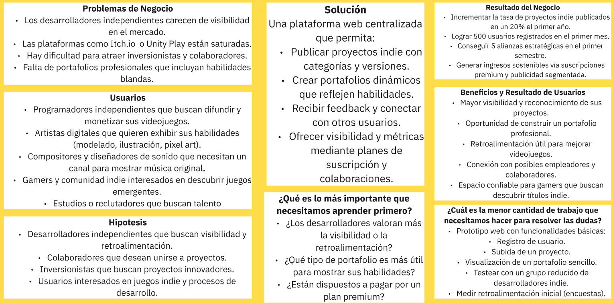 

---

## 1.3. Segmentos Objetivo.

- Segmento 1: Programador independiente
	-Perfil: Estudiantes o egresados de la carrera, así como desarrolladores autodidactas.
	-   Necesidades:
		-   Mostrar proyectos para darse a conocer y 		postular a trabajos y/o equipos de desarrollo.
		-   Conseguir retroalimentación de la comunidad y así mejorar
	-   Como ayuda IndieNest:
		-   Centraliza publicar sus proyectos junto a la posibilidad de poder promocionar aún más sus trabajos.
    
		-   Permite ver los diversos trabajos en los que el usuario trabajó como programador, como un portafolio.
-   Segmento 2:Artistas digitales
	-   Perfil: Estudiantes y egresados de Arte Digital, Diseño Gráfico, Animación, así como Dibujantes autodidactas.
	-   Necesidades:
		-   Participar en proyectos indie que requieran modelado 3D, pixel art o ilustración.
		-   Exhibir sus habilidades artísticas y de composición del arte al público general y otros programadores.
	-   Como ayuda IndieNest:
		-   Permite ver los diversos trabajos en los que el usuario trabajó como artista, como un portafolio. 	

---

# 2. Capitulo II: Requirements Elicitation & Analysis
## 2.1. Competidores 
Actualmente las plataformas digitales de publicación y promoción de videojuegos independientes se identifican en 3 competidores principales.

**Itch.Io**
-   **Descripción:** Plataforma internacional especializada en la publicación de videojuegos indie. Permite a desarrolladores publicar y vender sus proyectos de manera sencilla.
-   **Ventajas:**
	-   Comunidad global con más de 100 mil juegos publicados.
	-   Flexibilidad en precios.
	-   Permite donaciones directas a los desarrolladores.
-   **Desventajas:**
	-   Saturación de contenido: difícil destacar entre la gran cantidad de proyectos.
	-   Falta de visibilidad del equipo
	
**Unity Play**
-   **Descripción:** Espacio oficial de Unity donde los desarrolladores pueden compartir demos y prototipos creados con ese motor
-   **Ventajas:**
	-   Integración directa con el motor Unity
	-   Ideal para mostrar pruebas rápidas y prototipos funcionales
	-   Fácil de usar para desarrolladores ya familiarizados con el motor
-   **Desventajas:**
	-   Limitado solo a proyectos realizados con Unity  
	-   Escala visibilidad y alcance comercial
	-   No sirve como un espacio de networking entre desarrolladores y empresas

**Game Jolt**
-   **Descripción:** Plataforma online para descubrir y compartir juegos, además de interactuar con jugadores y desarrolladores
-   **Ventajas**
	-   Espacio social integrado
	-  Fomenta la creación de diversos tipos de comunidades, no solo en el desarrollo de videojuegos
	- Monetización sin comisiones a la plataforma
-   **Desventajas**
	- Desenfoque en el equilibrio entre plataforma social y de desarrollo de videojuegos
	- Desplazamiento del enfoque en los juegos
	- Eliminación de funciones de transmisión en vivo

---

### 2.1.1 Análisis Competitivo.

**Competitive Analysis Landscape**

**¿Por qué llevar a cabo este análisis?**  
Este análisis se realiza para conocer más a fondo a nuestros competidores y de esa forma tener un mejor entendimiento de cuales son las características, ventajas y desventajas que posee cada uno de ellos a fin de compararlos con nuestro startup.

|             | Startup    | Competidor 1                                                                                                                                                        | Competidor 2                                                                                                                                                                     | Competidor 3                                                                                                                                                                           |
|-------------|------------|---------------------------------------------------------------------------------------------------------------------------------------------------------------------|----------------------------------------------------------------------------------------------------------------------------------------------------------------------------------|----------------------------------------------------------------------------------------------------------------------------------------------------------------------------------------|
|**Nombre**   |  IndieNest   | Itch Io                                                                                                                                                             | Unity Play                                                                                                                                                                       | Game Jolt                                                                                                                                                                              |
|**Logo**   ||                                                                                                                                   |                                                                                                                                             |                                                                                                                                                 |
| **Perfil - Overview**|Aplicación web que permite subir y promocionar proyectos personales o videojuegos junto a un portafolio| Mercado online para creadores digitales independientes, centrado en videojuegos indie y que permite a cualquiera decida la forma en que quiere vender su producto   | Plataforma para crear contenido usando herramientas de Unity que además ofrece un espacio para publicar juegos desarrollados por cualquier persona                               | Espacio digital social que permite alojar videojuegos indie para jugadores y desarrolladores, asi como interactuar en comunidades                                                      |
| **Perfil - Ventaja competitiva** |Permite la creación de portafolios dinámicos, así como un espacio para retroalimentación y comentarios, además de poder establecer una conexión entre creadores y consumidores| Permite la publicación de juegos sin filtro previo, lo que favorece la libertad creativa, además permite vender otro tipo de productos como libros y bandas sonoras | Posee sincronización directa con Unity para la subida de contenido, otorga acceso a una amplia comunidad de desarrolladores y permite la publicación de portafolios o prototipos | Ofrece un espacio social que conecta a jugadores, artistas y desarrolladores, facilitando la creación de comunidades. Además ofrece un sistemas de pago sin comisiones a la plataforma |
| **Perfil de Marketing - Mercado objetivo** |Programadores independientes y artistas, ambos en su mayoría estudiantes o egresados de una carrera que buscan un espacio para poder promocionar sus proyectos| Desarrolladores independientes que buscan un espacio para crear contenido si limitaciones creativas, además de comunidades alternativas                             | Estudiantes y mentores que buscan un sitio para crear y mostrar prototipos, además de comunidades de desarrolladores                                                             | Jovenes que buscan entretenimiento y una comunidad digital, así como desarrolladores indie                                                                                             |
| **Perfil de Marketing - Estrategias de marketing** |Publicaciones en redes sociales a forma de llamar la atención de posibles consumidores de nuestra aplicación, además de incentivar una comunidad activa dentro de nuestra plataforma | Promoción orgánica mediante la transmisión boca a boca y la comunidad indie, así como transparencia en comisiones e inclusión social                                | Integración con Unity Hub y enfoque en la comunidad de desarrolladores, además de anexos con Unity Technologies                                                                  | Funcionalidades de red social, asi como la gamificación a base de logros y recompensas y eventos temáticos como festivales digitales y concursos                                       |
| **Perfil de Producto - Productos & Servicios** |IndieNest como aplicación web para la promoción de proyectos relacionados a videojuegos indie, donde el objetivo es darle visibilidad a desarrolladores y artistas independientes| Servicios de monetización libre de comisiones, así como foros y Game Jams para fomentar la creación colectiva                                                       | Servicios para publicar prototipos y portafolios de desarrolladores, integración con Unity Learn y recursos didácticos para mentores de desarrolladores                          | Sistema de monetización para desarroladores como suscripciones y apoyo directo de fans y funciones de red social                                                                       |
| **Perfil de Producto - Precios & Costos** |Plataforma web gratuita con planes de suscripción premium para funcionalidades adicionales a desarrolladores y consumidores de videojuegos| Plataforma de publicación gratuita con comisiones flexibles que dependen del desarrolador y no de la plataforma                                                     | Plataforma  gratuita para desarroladores y jugadores pero con servicios de pago opcional como Unity Pro                                                                          | Publicación gratuita y comisiones sobre un porcentaje de la monetización recibida por el desarrollador                                                                                 |
| **Perfil de Producto - Canales de distribución (Web y/o Móvil)** |Web| Web                                                                                                                                                                 | Web                                                                                                                                                                              | Web y Móvil                                                                                                                                                                            |
| **Análisis SWOT - Fortalezas** |Promoción de desarrolladores y artistas, publicación de portafolios para fijar la atencion de potenciales empleadores| Comisión flexibles para creadores y una comunidad indie gigante, además de ser el motor de contenido utilizado en varios Game Jams                                  | Integración directa con distintas herramientas de Unity, 100% gratuito y con enfoques educativos y comunitarios                                                                  | Características de red social, así como integración de apps móviles y monetización social como suscripciones y donaciones a desarrolladores                                            |
| **Análisis SWOT - Debilidades** |Visibilidad inicial opacada por empresas grandes como Epic o Steam| Carencia de aplicación móvil y un ecosistema muy conglomerado que hace dificil destacar dentro de la plataforma                                                     | No posee servicios de monetización interna, comunidad pequeña en comparación con los demás competidores y una sola opción en el motor de sus videojuegos                         | Menor catálogo que otras plataformas, limitación del público objetivo y exceso de funciones que no tienen que ver con videojuegos                                                      |
| **Análisis SWOT - Oportunidades** |Evolución activa en el mercado gracias a las características innovadoras de la aplicación, además de un crecimiento en el mercado debido a las funcionalidades únicas que posee la plataforma| Expansión del negocio con una app móvil y aumentar alianzas con universidades, festivales y estudios independientes                                                 | Incremento de uso educativo de Unity e integración con redes sociales para mayor visibilidad de portafolios y proyectos                                                          | Aprovechar la gran comunidad de la generación Z, alianzas con creadores de contenido como influencers y streamers                                                                      |
| **Análisis SWOT - Amenazas** |Competencia alta en el mercado de videojuegos (Steam y Epic)| Saturación de contenido y piratería de videojuegos que afecten a desarrolladores                                                                                    | Competencia de plataformas que ofrecen monetización para sus desarrolladores y dependencia de la popularida de Unity como motor de videojuego                                    | Riesgo de disperción de contenido y dificultad de métodos de monetización en comparación como otras plataformas como Patreon                                                           |

### 2.1.2. Estrategias y tácticas frente a competidores.

- **Diferenciarnos de la competencia:** Nos debemos enfocar en la funcionalidad principal que queremos darle a nuestra aplicación la cual es la promoción abierta de desarrolladores de videojuegos así como artistas digitales y musicales, otorgándoles la capacidad de subir a la pagina sus portafolios y proyectos para que de esta manera puedan atraer la atención de los potenciales empleadores.
- **Aprovechar al máximo la difusión de nuestra app en redes sociales:**  Necesitamos generar anuncios publicitarios digitales lo más llamativos posibles para atraer la atención de nuestros segmentos objetivos y de esa forma reducir la poca visibilidad que podría tener la app en sus primeros meses de lanzamiento. Se necesitarán campañas publicitarias que transmitan de forma sencilla y objetiva el objetivo de nuestro startup para atrapar a potenciales clientes.
- **Aprovechar las funcionalidades innovadoras de la app:** Al contar con características que no son muy vistas en el mercado digital de videojuegos podemos aprovechar este caso para seguir evolucionando estas funcionalidades en el futuro y así poder sacarles un mayor provecho a la aplicación a largo plazo, ideando nuevas características que nazcan a partir de reseñas y feedback realizado por nuestros clientes.
- **Crecimiento en el mercado:** Tenemos que aprovechar el boom y los ingresos económicos que pueda generar la aplicación web que vamos a lanzar para seguir invirtiendo en nuevas capacidades y funcionalidades, enfocándonos en las funcionalidades core de nuestro producto y nuestro clientes principales. Con esta inversión buscamos incrementar aún más las ganancias de nuestro producto para seguir creciendo en el mercado y ganar mayor visibilidad como marca internacionalmente, al punto en el que lleguemos a poder competir con marcas reconocidas en todo el mundo como Steam o Epic.

## 2.2. Entrevistas.

---

### 2.2.1. Diseño de entrevistas.
**Perfil:** Estudiantes o egresados de Ingeniería de Software, así como desarrolladores autodidactas.  
**Necesidades:** Mostrar proyectos, obtener retroalimentación y postular a trabajos/equipos de desarrollo.

**Preguntas de entrevista:**
-   ¿Qué tipo de proyectos de videojuegos has desarrollado hasta ahora (demos, prototipos, juegos completos)?  
-   ¿En qué plataformas sueles publicar actualmente tus videojuegos y qué dificultades has tenido allí?  
-   ¿Qué tan importante es para ti tener un portafolio digital que muestre tu experiencia como programador?  
-   ¿Qué obstáculos enfrentas para darte a conocer como desarrollador independiente?  
-   ¿Qué tan relevante es para ti recibir retroalimentación de otros programadores o jugadores?  
-   ¿Qué funcionalidades consideras indispensables en una plataforma que busque ayudarte a promocionar tus proyectos?  
-   ¿Qué impacto tendría para ti que IndieNest centralice tu trabajo y te permita mostrarlo como portafolio profesional?

 **Perfil:** Estudiantes y egresados de Arte Digital, Diseño Gráfico, Animación, o dibujantes autodidactas.  
**Necesidades:** Participar en proyectos indie, exhibir sus habilidades artísticas y tener visibilidad ante programadores y la comunidad.

**Preguntas de entrevista:**
-   ¿Qué tipo de trabajos artísticos realizas relacionados a los videojuegos (modelado 3D, pixel art, ilustración, animación)?  
-   ¿Dónde sueles mostrar tus trabajos actualmente y qué limitaciones encuentras en esos espacios?  
-   ¿Has tenido dificultades para unirte a proyectos indie como artista? ¿Cuáles?  
-   ¿Qué tan importante es para ti que tu portafolio artístico esté integrado a una plataforma orientada a videojuegos indie?  
-   ¿Qué valoras más en una plataforma: visibilidad, conexión con programadores, retroalimentación o todas por igual?  
-   ¿Qué características te motivarían a subir tus proyectos artísticos a IndieNest?  
-   ¿Cómo crees que una plataforma como IndieNest podría ayudarte a obtener más oportunidades de colaboración o laborales?
### 2.2.2. Registro de entrevistas.
- Segmento 1 : Programador Independiente

    **Entrevistado 1:**
  

|  Nombre y Apellido  | Edad | Distrito | Inicio de Entrevista | Resumen |
|--------------------|-----------|-------------|-------------|------------|
| Sebastian Adriano Pajares Oyola |  22 años | Santiago de Surco | 7:43 - 11:59 | Sebastian es un programador independiente que actualmente no cuenta con una plataforma fija para publicar sus proyectos. Durante la entrevista comentó que, al no tener un espacio centralizado, sus trabajos suelen perder visibilidad, lo cual limita su alcance como desarrollador. Esto le representa un desafío importante para darse a conocer dentro de la comunidad y para mostrar su experiencia a posibles colaboradores o empleadores. |

   **Entrevistado 2:**
   

|  Nombre y Apellido  | Edad | Distrito | Inicio de Entrevista | Resumen |
|--------------------|-----------|-------------|-------------|------------|
|  Juan José Meza Huanacune | 24 años | Barranco | 0:01 - 3:52 | Juan José en un programador técnico con experiencia en prototipos y demos. Publica en Itch.io y Unity Play, pero siente que sus proyectos se pierden por falta de visibilidad. Considera esencial tener un portafolio digital para mostrar su rol como programador. Enfrenta obstáculos como la falta de recursos para marketing y dificultad para formar equipos. Valora mucho la retroalimentación y cree que IndieNest podría profesionalizar su perfil y abrirle oportunidades reales. |

   **Entrevistado 3:**
   

| Nombre y Apellido  | Edad | Distrito | Inicio de Entrevista | Resumen |
|--------------------|-----------|-------------|-------------|------------|
|  Fabricio Fabián Quispe Barzola | 23 años | Chorrillos | 3:53 - 7:42 | Fabricio es estudiante de Ingeniería de Software con experiencia en game jams y desarrollo colaborativo. Publica en Itch.io y GitHub, pero busca una plataforma más visual y profesional. Necesita un portafolio para destacar en el mercado laboral. Enfrenta barreras de visibilidad y validación. Le interesa recibir feedback y conectar con otros creadores. Ve en IndieNest una herramienta clave para mostrar su trabajo y generar oportunidades. |

- Segmento 2 : Artistas Digitales 

  **Entrevistado 1:**
  

| Nombre y Apellido  | Edad | Distrito | Inicio de Entrevista | Resumen |
|--------------------|-----------|-------------|-------------|------------|
| Carlos Alberto Marin Sangama |  21 años |Los Olivos| 18:03 - 21:56 |  Carlos Marin es un artista digital que principalmente realiza modelados 3D y ilustraciones digitales a menor medida, suele publicar sus trabajos en sus redes sociales como instagram pero la limitacion que tiene es la dificil visibilidad que se puede obtener en las mismas y ademas, tiene disficultad en participar en proyectos indie al no tener un portafolio donde los demas puedan ver sus modelos e ilustraciones. |

   **Entrevistado 2:**
   

| Nombre y Apellido  | Edad | Distrito | Inicio de Entrevista | Resumen |
|--------------------|-----------|-------------|-------------|------------|
| Azul Delgado Sanchez | 22 años | Santiago de Surco | 12:00 - 15:32 | Azul Delgado es una artista digital que principalmente realiza ilustraciones digitales y algo de pixel art. Actualmente está practicando modelado 3D porque le interesa mucho el diseño de personajes en los videojuegos. Ella suele publicar su trabajo en Instagram y Discord, pero comenta que pierde cierta notoriedad debido a otro tipo de contenido. También menciona que tuvo dificultades para integrarse en proyectos indie como artista. En una plataforma valora que los equipos busquen artistas específicos, y también aprecia que una aplicación le brinde visibilidad a sus proyectos al momento de subirlos.|

   **Entrevistado 3:**
   

| Nombre y Apellido  | Edad | Distrito | Inicio de Entrevista | Resumen |
|--------------------|-----------|-------------|-------------|------------|
| Eriol Jared Constantine Huaytalla Robles |  18 | San Martin de Porres | 15:33 - 18:01 | Eriol es un artista digital que realiza ilustraciones digitales y esta interesado en el modelaje 3D. Suele subir sus ilustraciones a redes sociales como instagram o X pero el algoritmo de las mismas impide su crecimiento en reconocimiento y a su vez tambien cree que al ser un ilustrador que recien se adentra en ese mundo le es mas dificil ser elegido por otros para participar en proyectos independientes  |

  
Enlace del video de las entrevistas: https://upcedupe-my.sharepoint.com/:v:/g/personal/u202321613_upc_edu_pe/EbQaKTrBnMBKoJ1hoQwwTC0B6Uwkffz66WSolVvJ4KQQAg?e=l6yEE3&nav=eyJyZWZlcnJhbEluZm8iOnsicmVmZXJyYWxBcHAiOiJTdHJlYW1XZWJBcHAiLCJyZWZlcnJhbFZpZXciOiJTaGFyZURpYWxvZy1MaW5rIiwicmVmZXJyYWxBcHBQbGF0Zm9ybSI6IldlYiIsInJlZmVycmFsTW9kZSI6InZpZXcifX0%3D

### 2.2.3. Análisis de entrevistas.
#### Segmento objetivo 1 (Programadores independientes) 
Los entrevistados (Sebastián Pajares, Juan José Meza y Fabricio Quispe) coincidieron en que la **falta de visibilidad** es el principal obstáculo al publicar sus proyectos en plataformas actuales como *Itch.io*, *Unity Play* o *GitHub*.  

- **Necesidades identificadas:**  
  - Portafolios centralizados que permitan mostrar su rol dentro de un proyecto.  
  - Retroalimentación de calidad para mejorar sus juegos.  
  - Conexiones con otros perfiles (artistas, músicos).  

- **Problemas clave:**  
  - Sus proyectos se pierden en el exceso de contenido.  
  - Limitada capacidad de marketing y falta de recursos.  
  - Dificultad para formar equipos multidisciplinarios.  

- **Implicaciones para IndieNest:**  
  La plataforma debe priorizar funcionalidades como **portafolios profesionales dinámicos**, filtros por rol y experiencia, y un sistema de **feedback validado**, además de opciones para conectar a programadores con colaboradores.

---

#### Segmento objetivo 2 (Artistas Digitales)
Los entrevistados (Carlos Marín, Azul Delgado y Eriol Huaytalla) resaltaron que las redes sociales (*Instagram, Discord, X*) no son suficientes para posicionar su trabajo en el ámbito indie.  

- **Necesidades identificadas:**  
  - Exhibir ilustraciones, modelados 3D y pixel art en un portafolio enfocado en videojuegos.  
  - Ser contactados directamente por programadores o estudios para unirse a proyectos.  
  - Mejorar sus oportunidades de colaboración con visibilidad real.  

- **Problemas clave:**  
  - Algoritmos de redes sociales que reducen el alcance.  
  - Falta de espacios especializados donde los artistas puedan mostrar su trabajo a programadores.  
  - Dificultad de ingresar a proyectos indie si no son conocidos previamente.  

- **Implicaciones para IndieNest:**  
  La plataforma debe ofrecer un **espacio especializado en visibilidad artística**, con funciones para que los equipos busquen perfiles artísticos específicos y con portafolios visuales atractivos. Asimismo, se recomienda implementar un sistema de **match entre artistas y programadores** que potencie las oportunidades de colaboración.

---

#### Conclusión general
El análisis revela que tanto programadores como artistas comparten la frustración de la **baja visibilidad y falta de retroalimentación en sus proyectos**. Mientras los programadores buscan consolidar su perfil profesional y atraer colaboradores, los artistas buscan exhibir sus habilidades y acceder a proyectos indie.  

En conjunto, las entrevistas validan que IndieNest debe:  
- Actuar como un **repositorio centralizado de portafolios**.  
- Garantizar **visibilidad diferenciada por rol** (programador, artista, compositor).  
- Incluir **mecanismos de feedback y networking** que faciliten la colaboración.

## 2.3 Needfinding.
### 2.3.1. User Personas.
#### Segmento objetivo 1
- Sebastián Adriano Pajares Oyala

  
#### Segmento objetivo 2
- Eriol Jared Constantine Huaytalla Robles
  
### 2.3.2. User Task Matrix.

Este User Task Matrix contempla dos perfiles representativos de los segmentos principales de IndieNest:

Segmento 1 – Sebastián: Programador independiente con experiencia en desarrollo de videojuegos, enfocado en visibilidad profesional y colaboración técnica.

Segmento 2 – Eriol: Estudiante universitario interesado en diseño y modelado 3D, busca mejorar sus habilidades, ganar visibilidad y conectar con otros creadores.

| Tarea | Sebastián | | Eriol | |
|--|--|--|--|--|
| | **Frecuencia** | **Importancia** | **Frecuencia** | **Importancia** |
|Publicar proyectos terminados o en desarrollo|Alta|Alta|Media|Alta|
|Mostrar experiencia técnica o artística|Alta|Alta|Media|Alta|
|Buscar oportunidades de colaboración|Media|Alta|Media|Media|
|Recibir retroalimentación sobre su trabajo|Alta|Alta|Alta|Alta|
|Construir un portafolio profesional|Alta|Alta|Media|Alta|
|Compartir contenido en redes sociales|Media|Media|Alta|Media|
|Conectar con otros creadores|Media|Alta|Alta|Alta|
|Mejorar habilidades a través de práctica o feedback|Media|Media|Alta|Alta|
|Ser descubierto por empleadores o equipos|Alta|Alta|Media|Media|
|Participar en comunidades creativas|Media|Media|Alta|Media|
|Mostrar avances o procesos de creación|Media|Media|Alta|Media|
 

**Tareas con mayor coincidencia en frecuencia e importancia** 
Ambos usuarios coinciden en valorar altamente la retroalimentación y la conexión con otros creadores. Esto revela que, independientemente del nivel de experiencia, los usuarios buscan validación, aprendizaje y comunidad. Estas tareas no solo son frecuentes, sino que tienen un impacto directo en su motivación y crecimiento.

- Sebastián: perfil profesional y estratégico 
  Sebastián, como programador independiente, prioriza tareas que lo posicionen profesionalmente. Para él, publicar proyectos, mostrar experiencia técnica, construir un portafolio y ser descubierto por empleadores son tareas de alta frecuencia e importancia. Esto refleja una necesidad clara de consolidar su reputación y acceder a oportunidades laborales o colaborativas. Las redes sociales no son su canal principal, y su enfoque está más orientado a resultados concretos que a exposición informal.

- Eriol: perfil formativo y explorador 
  Eriol, como estudiante en formación, realiza tareas con un enfoque más exploratorio. Aunque también valora la retroalimentación y la conexión con otros, sus tareas más frecuentes están ligadas a mejorar habilidades, compartir contenido en redes sociales, y mostrar avances. Su uso de plataformas está más vinculado a visibilidad y aprendizaje que a posicionamiento profesional. Aún no prioriza tanto la búsqueda de empleadores, pero sí desea construir una base sólida para el futuro.

**Diferencias clave**
- Sebastián busca consolidar su trayectoria, mientras que Eriol busca construirla.
- Sebastián prioriza tareas que lo ayuden a ser contratado o colaborar, mientras que Eriol prioriza tareas que lo ayuden a aprender y ser visto.
- Eriol usa redes sociales como canal principal; Sebastián las usa como complemento.

**Implicaciones para IndieNest** 
La plataforma debe ofrecer funcionalidades que cubran ambos espectros:
- Para Sebastián: portafolio profesional, visibilidad técnica, filtros por rol y experiencia, y canales de colaboración directa.
- Para Eriol: espacios de aprendizaje, retroalimentación accesible, comunidad activa, y herramientas para mostrar procesos creativos.

### 2.3.3. User Journey Mapping.
#### Segmento objetivo 1
- Sebastian Adriano Pajares Oyola
  

#### Segmento objetivo 2
- Eriol Jared Constantine Huaytalla Robles
  

### 2.3.4. Empathy Mapping.
- Segmento objetivo 1

- Segmento objetivo 2
  

## 2.4. Big Picture Event Storming.

En esta sección nos enfocamos en hacer una lluvia de ideas para recolectar la mayor cantidad de eventos que pudiesen ocurrir en nuestra aplicación web y de esta forma ir descubriendo cuales serían los Bounded Context Core del negocio. Es así que modelamos el primer modelo de este panorama en el que omitimos elementos que serán implementados en la sección de Design-Level Event Storming, tales como los comandos, aggregates y políticas. Además, se muestra una descripción de cada elemento que integrará este event storming a manera de leyenda.

- **Actores:** Representados mediante un post-it amarillo, son aquellos que interactuarán con nuestra aplicación. En este contexto tenemos dos posibles actores, de los cuales los "User" representan a cualquier persona que pueda interactuar con nuestra aplicación. Y "System" representaría al sistema en si que se encargará de realizar el flujo de eventos consiguientes.

- **Eventos:** Representados mediante un post-it naranja, son todos aquellos eventos del dominio y generales que simbolizan que ha ocurrido un suceso dentro del producto.

- **Vistas:** Representadas mediante un post-it verde, vendrían a ser los paneles o interfaces de usuario que serán visibles en cada flujo de eventos.

- **Sistemas externos:** Representados mediante un post-it rojo, son aquellos sistemas que interactúan con nuestra aplicación pero que no forman parte del negocio interno. Vendrían a ser más bien entidades externas con las que necesitamos comunicarnos para realizar diferentes eventos.

- **Puntos de quiebre:** Representados mediante un post-it rojo, serían las preguntas que quedan abiertas en el flujo de eventos dentro de un contexto específico y que deben ser resueltas para futuros modelos del diseño.

A continuación mostraremos las capturas de la primera versión del event storming realizado, separandolas según el Bounded Context al que pertenezcan y comenzando con los Core del negocio.

 

**Bounded Context Project:** En este bounded context se manejan todos los eventos relacionados a la gestión de proyectos dentro de la aplicación Web. A continuación se muestran capturas de cada flujo de eventos con una descripción general.

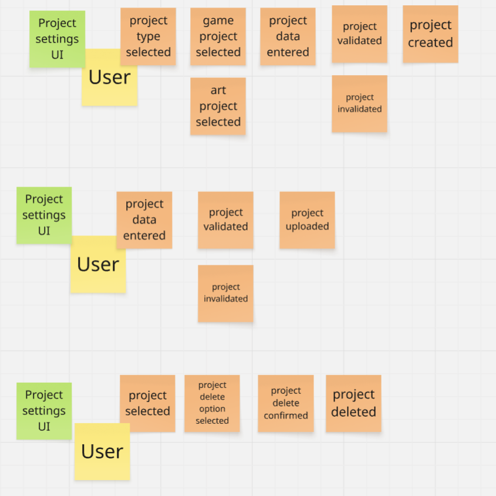

En estos tres flujos de eventos se maneja todo lo relacionado a configuraciones del proyecto. Tenemos en primer lugar el fujo que lleva a la creación de un nuevo proyecto. En segundo lugar se puede apreciar el flujo que permite la actualización de datos del proyecto. Y en último lugar se visualiza lo que vendría a ser el flujo correspondiente para la eliminación de un proyecto. Cabe resaltar que todos estos flujos suceden en la interfaz de usuario de las configuraciones de proyectos.

En estos dos flujo se puede ver, por un lado, el proceso para visualizar características clave de un proyecto como su autor o sus capturas, esto mediante la interfaz del proyecto en si. Por otra parte, se muestra también el flujo para visualizar las estadísticas del proyecto mediante su interfaz visual respectiva.

 

**Bounded Context Portfolio:** En este bounded context se manejan todos los eventos relacionados a la gestión de los portafolios de los desarrolladores y artistas. A continuación se muestran capturas de cada flujo de eventos con una descripción general.

En estos flujos se puede ver el proceso para la creación y actualización de datos de un portafolio mediante la interfaz respectiva que representa al apartado de configuraciones del portafolio.

Por otra parte se puede ver el flujo de eventos para la agregación de un nuevo proyecto al portafolio y la eliminación de uno, esto mediante su respectiva interfaz gráfica.

 

**Bounded Context Marketplace:** En este bounded context se manejan todos los eventos relacionados a las funcionalidades en relación al marketplace del producto. A continuación se muestran capturas de cada flujo de eventos con una descripción general.

En primer lugar se puede ver como, mediante su interfaz de usuario principal, se hace la búsqueda de "games previews", lo que vendría siendo una previsualización de los juegos que solo poseen información como su imagen y nombre. Por otro lado, se tiene el flujo de evento para poder mostrar los resultados del marketplace (games previews) en función de la categoría seleccionada por el usuario.

En el primer flujo se visualizan los eventos que llevan al ordenamiento del marketplace en función de los métodos que el usuario decida. Mientras que el segundo flujo muestra como el sistema mismo crea un flujo de eventos que maneja la creación y agregación de los "game previews" al marketplace. Esto ocurriría al momento en que un usuario cree un proyecto nuevo de tipo "videojuego".

 

**Bounded Context Support:** En este bounded context se manejan todos los eventos relacionado a feedback y reseñas a los proyectos. A continuación se muestran capturas de cada flujo de eventos con una descripción general.

Se pueden ver dos flujos  de eventos que suceden en la interfaz de usuario de las reseña, los cuales representan el proceso de creación de una reseña y a la votación positiva o negativa que puede tener una de estas.

En estos flujos se ve el proceso para la eliminación de una reseña y la visualización de las reseñas destacadas.

 

**Bounded Context Community:** En este bounded context se manejan todos los eventos relacionado a las discusiones que de manejan en el foro de la aplicación. A continuación se muestran capturas de cada flujo de eventos con una descripción general.

Se tienen los flujos para la creación de nuevas discusiones en secciones de los foros y la eliminación de las discusiones que le pertenezcan al usuario, esto mediante la interfaz de usuario de las discusiones.

Se pueden ver flujos relacionados a la creación  y eliminación de los comentarios que forman parte de las discusiones. Esto mediante la interfaz gráfica de los comentarios.

 

**Bounded Context Profile:** En este bounded context se maneja todo relacionado a la gestión del perfil del usuario. A continuación se muestran capturas de cada flujo de eventos con una descripción general.

En esta captura se pueden ver eventos para la agregación de proyectos al perfil del usuario, así como la visualización del perfil del autor de un proyecto y la funcionalidad de poder contactar a perfiles mediante respectiva interfaz gráfica.

Se pueden ver eventos como la subida de nivel del perfil del usuario, así como la visualización de los logros que tiene y también los juegos que posee el usuario en su perfil.

 

**Bounded Context Account:** En este bounded context se maneja la gestión de la cuenta del usuario. A continuación se muestran capturas de cada flujo de eventos con una descripción general.

Se pueden ver los flujos para el registro de una nueva cuenta y el proceso de inicio de sesión con una cuenta gmail. Cabe mencionar que en estos procesos se necesita entablar conexiones con sistemas externos como Sengrid para la verificación de existencia del email o Google Identity Platform para el proceso de inicio de sesión con una cuenta gmail.

En estos flujos se ve la funcionalidad del inicio de sesión del usuario con el ingreso manual de los datos de sus cuenta y el proceso para cerrar sesión en la aplicación.

En estos flujos se ve el proceso para la actualización de datos personales del usuario, sin embargo no se tiene claro aún mediante que interfaz gráfica se podría mostrar estas funcionalidades. El otro flujo representa el proceso para cambiar la contraseña de una cuenta, proceso que tampoco tiene aún una interfaz de usuario definida.

 

**Bounded Context Notification:** En este bounded context se maneja la gestión de las notificaciones internas y externas a la plataforma. A continuación se muestran capturas de cada flujo de eventos con una descripción general.

En estos flujos de eventos se puede ver la creación y visualización de notificaciones personalizadas en función del evento ocurrido, donde dos de ellas también se encarga de enviar un mensaje al correo del usuario con ayuda de un servicio externo.

En estos flujos se pueden ver más notificaciones que son creadas y visualizadas por el usuario, todo esto mediante la interfaz de usuario de las notificaciones.

 

**Bounded Context Payment:** En este bounded context se maneja la gestión de lo relacionado a los procesos de pago dentro de la aplicación. A continuación se muestran capturas de cada flujo de eventos con una descripción general.

En estos flujos de eventos se puede ver, por un lado, como el sistema de la aplicación se encarga de añadir un juego al carrito de compra cuando un usuario lo hay decidido comprar. Por otro lado se ve el flujo que simboliza el proceso de eliminación de un juego del carrito.

Por último tenemos el proceso de pago de un carrito de compra, donde se establece conexión con una servicio externo que procese y facilite los métodos de pago. Además se puede ver el proceso para eliminar un carrito de compra en caso el usuario cambie de opinión ante de comprar sus productos.

## 2.5. Ubiquitous Language.
- Portafolio: Página personal con proyectos y habilidades del usuario
- Proyecto o juego: Videojuego, demo o prototipos subido a la plataforma
- Colaboración: Solicitud entre usuarios para trabajar juntos en un proyecto
- Feedback: Retroalimentación en forma de comentarios o calificaciones
- Notificacion: Aviso sobre interacciones o nuevos proyectos de acuerdo a tus gustos
- Biblioteca: Colección de juegos comprados o descargados por el usuario.
- UI: Interfaz gráfica que representa el medio a través del cual el usuario puede interactuar con el producto.
- Forum/Foro: Sección interna de la aplicación donde se podrán añadir nuevos temas de disusión en tópicos específicos.
- Profile/Perfil: Simboliza el perfil del usuario dentro de la aplicación, donde se tendra información y funcionalidades para su perfil.

# 3. Capítulo III: Requirements Specification.
## 3.1. User Stories.

|Epic/Story ID|Título| Descripción |Criterios de Aceptación|Relacionado con (Epic ID)|
|--|--|--|--|--|
|US01|**Registro de Usuario**|**Como usuario** **Quiero poder** registrarme en IndieNest **para** crear mi perfil y comenzar a subir mis proyectos.|**Scenario 1**  **DADO QUE** el usuario es nuevo,   **CUANDO** ingresa sus datos y confirma el registro,  **ENTONCES** se crea su cuenta y puede acceder a su panel.  **Scenario 2**  **DADO QUE** el usuario ya tiene cuenta,   **CUANDO** intenta registrarse con el mismo correo,  **ENTONCES** el sistema le avisa que ya existe una cuenta con ese correo y le sugiere iniciar sesión.|EP01|
|US02|**Crear Portafolio**|**Como desarrollador** **Quiero crear** un portafolio en IndieNest **para** mostrar mis habilidades a posibles empleadores.|**Scenario 1**  **DADO QUE** el usuario tiene proyectos subidos,   **CUANDO** activa la opción de portafolio,  **ENTONCES** se genera una página pública con su información y trabajos.  **Scenario 2**  **DADO QUE** el usuario no tiene proyectos,   **CUANDO** intenta activar el portafolio,  **ENTONCES** el sistema le sugiere subir al menos uno.|EP01|
|US03|**Subir un Proyecto**|**Como desarrollador** **Quiero poder** subir un nuevo proyecto **para** que otros usuarios lo vean y comenten.|**Scenario 1**  **DADO QUE** el usuario tiene un archivo ejecutable y capturas,   **CUANDO** completa el formulario de subida,  **ENTONCES** el proyecto aparece en su perfil y en el feed.  **Scenario 2**  **DADO QUE** el usuario no completa los campos obligatorios,   **CUANDO** intenta publicar,  **ENTONCES** el sistema le avisa qué le falta.|EP01|
|US04|**Clasificar proyectos por género**|**Como desarrollador** **Quiero poder** asignar un género a mi proyecto **para** que sea más fácil de encontrar proyectos de cierto género.|**Scenario 1**  **DADO QUE** el usuario selecciona "Plataformas",   **CUANDO** define el género de un proyecto y lo publica,  **ENTONCES** el proyecto aparece en la categoría correspondiente.  **Scenario 2**  **DADO QUE** el usuario no selecciona género,   **CUANDO** intenta publicar el proyecto,  **ENTONCES** el sistema le pide escoger algún género.|EP01|
|US05|**Indicar versión del proyecto**|**Como desarrollador** **Quiero poder** especificar si mi proyecto es demo, beta o final **para** que los usuarios sepan su estado.|**Scenario 1**  **DADO QUE** el usuario escoge "Beta",   **CUANDO** publica el proyecto,  **ENTONCES** el estado de desarrollo del proyecto se muestra junto al título.  **Scenario 2**  **DADO QUE** el usuario cambia la versión a "Final",   **CUANDO** guarda los cambios,  **ENTONCES** el estado del proyecto se actualiza.|EP01|
|US06|**Recibir Comentarios**|**Como desarrollador** **Quiero poder** recibir comentarios en mis proyectos **para** obtener feedback de parte del público.|**Scenario 1**  **DADO QUE** otro usuario comenta,   **CUANDO** el desarrollador revisa la sección de comentarios de su publicación,  **ENTONCES** encuentra el mensaje y puede contestarlo.  **Scenario 2**  **DADO QUE** el desarrollador recibe un comentario inapropiado,   **CUANDO** lo reporta,  **ENTONCES** el sistema lo envía a moderación.|EP01|
|US07|**Editar proyectos**|**Como desarrollador** **Quiero poder** editar la información de mis proyectos **para** mantenerla actualizada.|**Scenario 1**  **DADO QUE** el desarrollador cambia la descripción,   **CUANDO** guarda los cambios,  **ENTONCES** la nueva versión se muestra al público.  **Scenario 2**  **DADO QUE** el desarrollador elimina una imagen de la publicación,   **CUANDO** guarda los cambios,  **ENTONCES** ya no aparece en la galería.|EP01|
|US08|**Buscar colaboradores**|**Como desarrollador** **Quiero poder** buscar colaboradores por habilidades **para** contactarlos para hacer una colaboración.|**Scenario 1**  **DADO QUE** el desarrollador busca "artista 3D",   **CUANDO** aplica el filtro,  **ENTONCES** ve perfiles que cumplen ese criterio.  **Scenario 2**  **DADO QUE** no hay resultados,   **CUANDO** aplica el filtro,  **ENTONCES** el sistema le sugiere ampliar la búsqueda.|EP01|
|US09|**Recibir Solicitudes de Colaboración**|**Como desarrollador** **Quiero poder** recibir solicitudes de otros usuarios **para** unirme a sus proyectos.|**Scenario 1**  **DADO QUE** otro usuario envía una invitación,   **CUANDO** el desarrollador revisa la bandeja,  **ENTONCES** puede aceptar o rechazar.  **Scenario 2**  **DADO QUE** el desarrollador rechaza una solicitud,   **CUANDO** confirma la acción,  **ENTONCES** el remitente recibe una notificación.|EP01|
|US10|**Filtrar proyectos por Género**|**Como usuario** **Quiero poder** filtrar proyectos por género **para** encontrar proyectos que se amolden a mis gustos más fácilmente.|**Scenario 1**  **DADO QUE** el usuario selecciona "Terror",   **CUANDO** hace clic en "Aplicar Filtro",  **ENTONCES** ve solo proyectos de Terror.|EP02|
|US11|**Redactar Descripción de Perfil Profesional**|**Como desarrollador** **Quiero poder** listar mis habilidades técnicas **para** que otros sepan en qué puedo contribuir a sus proyectos.|**Scenario 1**  **DADO QUE** el desarrollador agrega texto en la descripción de su perfil,   **CUANDO** hace clic en "Guardar",  **ENTONCES** la descripción aparece en su perfil.  **Scenario 2**  **DADO QUE** el desarrollador elimina datos o toda la descripción de su perfil,   **CUANDO** hace clic en "Guardar",  **ENTONCES** ya no se muestra la descripción en su perfil.|EP01|
|US12|**Recibir calificaciones en los proyectos**|**Como desarrollador** **Quiero poder** recibir calificaciones en mis proyectos **para** medir su impacto en el público.|**Scenario 1**  **DADO QUE** un usuario escribe un comentario,   **CUANDO** hace clic en "Guardar Comentarios",  **ENTONCES** se muestra la reseña en la sección "Comentarios".  **Scenario 2**  **DADO QUE** el usuario califica con 5 estrellas,   **CUANDO** hace clic en "Agregar Puntuación",  **ENTONCES** el promedio de puntuación sube.  **Scenario 3**  **DADO QUE** el usuario califica con 1 o menos estrellas,   **CUANDO** hace clic en "Agregar Puntuación",  **ENTONCES** el promedio de puntuación disminuye.|EP01|
|US13|**Integrar enlaces externos**|**Como desarrollador** **Quiero poder** añadir un enlace a repositorios o páginas externas **para** ampliar la información.|**Scenario 1**  **DADO QUE** el desarrollador agrega un enlace a GitHub en la sección "Enlaces" de su perfil,   **CUANDO** hace clic en "Guardar Enlace",  **ENTONCES** se actualiza la sección "Enlaces" y el número de enlaces guardados al lado.  **Scenario 2**  **DADO QUE** el enlace es inválido,   **CUANDO** el desarrollador hace clic en "Guardar Enlace",  **ENTONCES** el sistema le avisa que el enlace es inválido.  **Scenario 3**  **DADO QUE** otro usuario está viendo la descripción del perfil,   **CUANDO** hace clic en "Enlaces",  **ENTONCES** el sistema muestra los enlaces guardados.|EP01|
|US14|**Revisar Estadísticas**|**Como desarrollador** **Quiero poder** revisar estadísticas de visitas y descargas **para** evaluar el alcance de mi proyecto.|**Scenario 1**  **DADO QUE** el desarrollador accede a la sección "Desempeño" de su proyecto,   **CUANDO** ingresa a la subsección "Descargas",  **ENTONCES** el sistema muestra la cantidad de descargas que ha tenido el proyecto.  **Scenario 2**  **DADO QUE** el desarrollador está en la sección "Descargas",   **CUANDO** hace clic en "Visitas",  **ENTONCES** el sistema muestra la cantidad de visitas que ha recibido el proyecto.|EP01|
|US15|**Recibir Notificaciones de los Proyectos**|**Como desarrollador** **Quiero poder** recibir notificaciones de actividad **para** estar al tanto de las interacciones de los usuarios.|**Scenario 1**  **DADO QUE** otro usuario deja un comentario,   **CUANDO** el desarrollador accede a la sección "Notificaciones",  **ENTONCES** se muestra un mensaje indicando "Alguien comentó en *Nombre del Proyecto*".  **Scenario 2**  **DADO QUE** el desarrollador presiona "Marcar como leído",   **CUANDO** ingresa nuevamente a la sección "Notificaciones",  **ENTONCES** la notificación ya no figura como pendiente.|EP01|
|US16|**Activar o Desactivar Notificaciones de Proyectos**|**Como desarrollador** **Quiero poder** silenciar notificaciones de ciertas actividades **para** no sobrecargar mi dispositivo de notificaciones.|**Scenario 1**  **DADO QUE** el desarrollador está en un proyecto propio,   **CUANDO** hace clic en "Desactivar Notificaciones",  **ENTONCES** el sistema deja de enviarle notificaciones sobre ese proyecto.  **Scenario 2**  **DADO QUE** el desarrollador está en un proyecto al que silenció notificaciones anteriormente,   **CUANDO** hace clic en "Reactivar Notificaciones",  **ENTONCES** el sistema vuelve a enviarle notificaciones sobre ese proyecto.|EP01|
|US17|**Integrar pagos**|**Como desarrollador** **Quiero poder** vender mis juegos **para** generar ingresos de mis proyectos.|**Scenario 1**  **DADO QUE** el desarrollador configura Stripe,   **CUANDO** publica un juego y le coloca el precio,  **ENTONCES** los usuarios pueden comprarlo.  **Scenario 2**  **DADO QUE** un usuario hace clic en "Comprar por **Precio**",   **CUANDO** paga el juego a través de Stripe,  **ENTONCES** el sistema muestra el mensaje "Juego Comprado Exitosamente" y el juego aparece en su biblioteca.|EP01|
|US18|**Activar o Desactivar Notificaciones de desarrolladores**|**Como usuario**, **quiero poder** saber cuando el desarrollador que sigo sube alguna publicación **para** enterarme rápidamente de estas.|**Scenario 1**  **DADO QUE** el usuario está en el perfil de una cuenta a la que sigue,   **CUANDO** hace clic en el botón "Activar Notificaciones",  **ENTONCES** el sistema muestra el mensaje "Se activaron las notificaciones".  **Scenario 2**  **DADO QUE** el usuario está en el perfil de un desarrollador al que sigue,   **CUANDO** hace clic en el botón "Desactivar Notificaciones",  **ENTONCES** el sistema muestra el mensaje "Se desactivaron las notificaciones".|EP02|
|US19|**Marcar o desmarcar proyectos como favoritos**|**Como usuario** **Quiero poder** seleccionar proyectos como favoritos **para** acceder rápidamente a ellos cuando desee.|**Scenario 1**  **DADO QUE** el usuario está viendo un proyecto,   **CUANDO** hace clic en el ícono de estrella amarillo,  **ENTONCES** el sistema muestra el mensaje "Se guardó como favorito" y lo guarda en su lista "Favoritos".  **Scenario 2**  **DADO QUE** el usuario está en su lista de "Favoritos",   **CUANDO** hace clic en el ícono de tacho de basura en un proyecto,  **ENTONCES** el sistema muestra el mensaje "Eliminado de Favoritos".|EP02|
|US20|**Compartir proyectos en redes sociales**|**Como usuario**, **quiero poder** compartir proyectos en redes sociales **para** aumentar su visibilidad.|**Scenario 1**  **DADO QUE** el usuario está en la ficha de un proyecto,  **CUANDO** hace clic en "Compartir en Twitter",  **ENTONCES** se publica un enlace con la portada del proyecto.  **Scenario 2**  **DADO QUE** el usuario no tiene sesión iniciada en la red social,  **CUANDO** intenta compartir,  **ENTONCES** el sistema le solicita iniciar sesión.|EP01|
|US21|**Recibir recomendaciones personalizadas**|**Como usuario**, **quiero poder** recibir recomendaciones de proyectos en mi feed **para** descubrir contenido relevante según mis intereses.|**Scenario 1**  **DADO QUE** el usuario ha interactuado con juegos de plataformas,  **CUANDO** entra al feed,  **ENTONCES** el sistema le sugiere más contenido de ese género.  **Scenario 2**  **DADO QUE** el usuario marca que no le interesa un género,  **CUANDO** refresca el feed,  **ENTONCES** ese tipo de contenido deja de aparecer.|EP02|
|US22|**Realizar o Borrar Publicaciones**|**Como creador**, **quiero poder** tener un apartado en el que subir publicaciones de texto comentando datos que le interesen a mi público **para** intercambiar ideas y formar una comunidad al rededor de mis proyectos.|**Scenario 1**  **DADO QUE** el creador accede a la pestaña "Comunidad" en su perfil,  **CUANDO** crea un hilo y hace clic en "Publicar",  **ENTONCES** se sube una publicación con el texto que escribió.  **Scenario 2**  **DADO QUE** el creador desea borrar un hilo que ya subió,  **CUANDO** hace clic en el ícono de tacho de basura y luego en "Eliminar",  **ENTONCES** el sistema borra el hilo de la pestaña de comunidad.|EP01|
|US23|**Adjuntar imágenes en publicaciones**|**Como creador**, **quiero poder** adjuntar imágenes en mis publicaciones **para** dar avances de proyectos que esté desarrollando.|**Scenario 1**  **DADO QUE** el creador está escribiendo un hilo,  **CUANDO** hace clic en el botón de clip y en la opción "Adjuntar Imagen" y elige una imagen de su galería,  **ENTONCES** se adjunta la imagen al hilo.  **Scenario 2**  **DADO QUE** el creador intenta adjuntar una imagen,  **CUANDO** selecciona un archivo inválido,  **ENTONCES** el sistema muestra el mensaje "Pruebe otra imagen".  **Scenario 3**  **DADO QUE** el creador adjuntó una imagen,  **CUANDO** hace clic en el símbolo de "x" en una esquina de la imagen,  **ENTONCES** el sistema muestra el mensaje "Imagen eliminada" y la imagen se elimina del hilo.|EP01|
|US24|**Adjuntar videos en publicaciones**|**Como creador**, **quiero poder** adjuntar videos en mis publicaciones **para** dar avances de proyectos que esté desarrollando.|**Scenario 1**  **DADO QUE** el creador está escribiendo un hilo,  **CUANDO** hace clic en el botón de clip y en la opción "Adjuntar Video" y elige un video de su galería,  **ENTONCES** se adjunta el video al hilo.  **Scenario 2**  **DADO QUE** el creador intenta adjuntar un video,  **CUANDO** selecciona un archivo inválido,  **ENTONCES** el sistema muestra el mensaje "Pruebe otro video".  **Scenario 3**  **DADO QUE** el creador adjuntó un video,  **CUANDO** hace clic en el símbolo de "x" en una esquina del video,  **ENTONCES** el sistema muestra el mensaje "Video eliminado" y el video se elimina del hilo.|EP01|
|US25|**Colocar videos de otra red social en una publicación**|**Como artista** **quiero poder** colocar un link de un video de otra red y que se vea grande, no solo como un enlace **para** hacer más llamativa mi publicación.|**Scenario 1**  **DADO QUE** el artista realiza una publicación,   **CUANDO** coloca un enlace a un video de YouTube,  **ENTONCES** el enlace aparece y se muestra la miniatura del video.  **Scenario 2**  **DADO QUE** otro usuario está viendo una publicación que contiene la miniatura de un video de YouTube con su enlace,   **CUANDO** hace clic en el enlace o en la miniatura,  **ENTONCES** el sistema lo redirige en otra pestaña al video de YouTube.  **Scenario 3**  **DADO QUE** otro usuario está viendo una publicación que contiene la miniatura de un video de YouTube con su enlace, pero el video ya no está disponible,   **CUANDO** hace clic en el enlace o en la miniatura,  **ENTONCES** el sistema lo redirige en otra pestaña al video con el mensaje "No Disponible".|EP01|
|US25|**Colocar videos de otra red social en una publicación**|**Como artista** **quiero poder** colocar un link de un video de otra red y que se vea grande, no solo como un enlace **para** hacer más llamativa mi publicación.|**Scenario 1**  **DADO QUE** el artista realiza una publicación,   **CUANDO** coloca un enlace a un video de YouTube,  **ENTONCES** el enlace aparece y se muestra la miniatura del video.  **Scenario 2**  **DADO QUE** otro usuario está viendo una publicación que contiene la miniatura de un video de YouTube con su enlace,   **CUANDO** hace clic en el enlace o en la miniatura,  **ENTONCES** el sistema lo redirige en otra pestaña al video de YouTube.  **Scenario 3**  **DADO QUE** otro usuario está viendo una publicación que contiene la miniatura de un video de YouTube con su enlace, pero el video ya no está disponible,   **CUANDO** hace clic en el enlace o en la miniatura,  **ENTONCES** el sistema lo redirige en otra pestaña al video con el mensaje "No Disponible".|EP01|
|US26|**Reportar publicaciones inadecuadas**|**Como usuario**, **quiero poder** reportar publicaciones con contenido inadecuado o insultos **para** eliminar mensajes inadecuados en la comunidad que me encuentre.|**Scenario 1**  **DADO QUE** el usuario sube un archivo GIF,  **CUANDO** guarda el portafolio,  **ENTONCES** la animación se reproduce correctamente.  **Scenario 2**  **DADO QUE** el archivo excede el tamaño permitido,  **CUANDO** intenta subirlo,  **ENTONCES** el sistema le solicita optimizarlo.|EP01|
|US27|**Generar una biblioteca de juegos comprados**|**Como usuario**, **quiero poder** navegar en una biblioteca propia de juegos comprados **para** tener a la mano los proyectos que ya haya comprado.|**Scenario 1**  **DADO QUE** el usuario ha comprado solo un juego,  **CUANDO** hace clic en la pestaña "Biblioteca",  **ENTONCES** el sistema le muestra el juego que compró con la fecha de compra y la opción de descargarlo.  **Scenario 2**  **DADO QUE** el usuario no ha comprado ningún juego,  **CUANDO** hace clic en la pestaña "Biblioteca",  **ENTONCES** el sistema le muestra un espacio vacío y un mensaje que dice "Aún no tienes juegos".|EP02|
|US28|**Ordenar la biblioteca**|**Como usuario**, **quiero poder** ordenar la biblioteca de juegos comprados en categorías según su género **para** organizar los juegos que ya tengo comprados por género.|**Scenario 1**  **DADO QUE** el usuario tiene juegos de distintos géneros,  **CUANDO** hace clic en la flecha del botón "Ordenar por" y selecciona la opción "Género",  **ENTONCES** el sistema ordena los juegos de la biblioteca en bloques según género.|EP02|
|US29|**Definir tiempo de juego máximo de reembolso**|**Como creador**, **quiero restringir** reembolsos de proyectos publicados según el tiempo de juego o transcurrido desde su compra **para** evitar pérdidas en el lanzamiento de mis proyectos.|**Scenario 1**  **DADO QUE** han transcurrido 5 días desde que un usuario compró un juego,  **CUANDO** hace clic en el botón "Reembolsar Producto" en la pantalla del juego,  **ENTONCES** el sistema le muestra el mensaje "Pasados cinco días desde la compra no es posible reembolsar".  **Scenario 2**  **DADO QUE** el usuario compró un juego y tiene registradas más de 2 horas de juego,  **CUANDO** hace clic en el botón "Reembolsar Producto" en la pantalla del juego,  **ENTONCES** el sistema le muestra el mensaje "Pasadas 2 horas de juego desde la compra no es posible reembolsar".|EP01|
|US30|**Recibir Notificaciones de recomendaciones específicas**|**Como usuario**, **quiero poder** recibir recomendaciones de juegos particulares que encajen con los juegos recientes que haya comprado **para** encontrar contenido que se adecúe a mis gustos.|**Scenario 1**  **DADO QUE** el usuario ha comprado solo juegos de acción,  **CUANDO** se publica un proyecto del mismo género,  **ENTONCES** el sistema le recomienda el juego con el mensaje "Porque juegas de acción, te recomendamos **Nombre del Juego**".|EP02|
|US31|**Apagar Notificaciones de recomendaciones**|**Como usuario**, **quiero poder** apagar las recomendaciones de juegos que encajen con los juegos recientes que haya comprado **para** evitar llenar mi apartado de notificaciones.|**Scenario 1**  **DADO QUE** el usuario recibe una notificación de un juego que comparte el género de los juegos que compró,  **CUANDO** hace clic en el botón "No recomendar más de este tipo",  **ENTONCES** el sistema borra la notificación y deja de recomendar más proyectos similares.|EP02|
|US32|**Ver juegos por ubicación geográfica**|**Como usuario**, **quiero poder** ver juegos desarrollados en mi país o región **para** apoyar creadores locales.|**Scenario 1**  **DADO QUE** el usuario selecciona “Perú” como filtro,  **CUANDO** aplica la búsqueda,  **ENTONCES** el sistema le muestra proyectos peruanos.  **Scenario 2**  **DADO QUE** no hay juegos registrados en esa región,  **CUANDO** el usuario aplica el filtro,  **ENTONCES** el sistema le indica que no hay resultados.|EP02|
|US33|**Ver logros desbloqueables en juegos**|**Como usuario**, **quiero poder** ver los logros que puedo desbloquear en cada juego **para** motivarme a completarlos.|**Scenario 1**  **DADO QUE** el usuario está en la ficha de un juego,  **CUANDO** hace clic en “Logros”,  **ENTONCES** ve una lista de objetivos y recompensas.  **Scenario 2**  **DADO QUE** el juego no tiene logros configurados,  **CUANDO** el usuario accede a esa sección,  **ENTONCES** el sistema le indica que no hay logros disponibles.|EP02|
|US34|**Ver reseñas destacadas de otros usuarios**|**Como usuario**, **quiero poder** ver reseñas destacadas de otros usuarios **para** tomar decisiones informadas antes de jugar.|**Scenario 1**  **DADO QUE** un juego tiene muchas reseñas,  **CUANDO** el usuario entra a la sección de comentarios,  **ENTONCES** el sistema le muestra las más votadas primero.  **Scenario 2**  **DADO QUE** no hay reseñas destacadas,  **CUANDO** el usuario accede a comentarios,  **ENTONCES** el sistema le muestra las más recientes.|EP02|
|US35|**Visualizar Página Principal**|**Como usuario**, **quiero ver** una página de inicio clara **para** tener un primer vistazo de IndieNest.|**Scenario 1**  **DADO QUE** abre la página principal,  **CUANDO** la página carga,  **ENTONCES** el sistema le muestra una breve descripción del propósito del sitio y un botón de "Más Información".|EP01|
|US36|**Visualizar Sección del equipo**|**Como usuario**, **quiero poder** acceder a una sección "About Us" sobre el equipo Arkenna **para** conocer más de cada uno.|**Scenario 1**  **DADO QUE** está en cualquier página del sitio,  **CUANDO** hace clic en el enlace "About Us",  **ENTONCES** es redirigido a la página "About Us" donde ve una descripción con nombres de cada miembro del grupo.|EP01|
|US37|**Visualizar Objetivo del Proyecto**|**Como usuario**, **quiero poder** acceder a una sección "Goals" **para** entender los objetivos del equipo Arkenna.|**Scenario 1**  **DADO QUE** está navegando en el sitio,  **CUANDO** hace clic en el enlace "Goals",  **ENTONCES** es llevado a la página "Goals" donde se muestran los principales objetivos del proyecto.|EP01|
|US38|**Visualizar Medios de Contacto**|**Como usuario**, **quiero poder** acceder a una sección "Contact" **para** ver las redes sociales y formas de comunicarme con el equipo Arkenna.|**Scenario 1** **DADO QUE** está navegando en el sitio,  **CUANDO** hace clic en el enlace "Contact",  **ENTONCES** es llevado a la página "Contact" donde se muestran los logos y enlaces a las redes sociales de los desarrolladores.|EP01|
|US39|**Visualizar Barra de Navegación**|**Como usuario**, **quiero poder** visualizar una barra de navegación **para** navegar fácilmente entre cada sección.|**Scenario 1** **DADO QUE** está en cualquier página de la landing page, **CUANDO** hace clic en cualquiera de los enlaces de la barra de navegación, **ENTONCES** es llevado a la página correspondiente sin errores.|EP01|

# IndieNest Backend -- REST API Technical Stories

## Overview
This document contains API-focused technical stories 
intended for frontend developers integrating
with the IndieNest Backend REST API
(Java, Spring Boot).

Common conventions
- Base path: `/api/v1`

### TS-G001 -- Create a Game
As a frontend developer, I want to create a new Game through the API so that I can add games to the system as a feature in my application.

Acceptance criteria:
- Scenario: Successful create
    - Given a POST request to `/api/v1/games` is received with a request body containing the create-game attributes: authorId, name, description, rating, price, category, image.  
    - When the API validates and persists the game
    - Then the API responds with `201 Created` and returns the created game with attributes: id (Int), authorId(Integer), name(String), description(String), rating(Integer), creationDate(Date), price(Float), category(GameCategory), image(String).
- Scenario: Validation error
    - Given a POST request to `/api/v1/games` is received with missing or invalid create-game attributes (e.g., empty name or description)
    - When the API validates the request and detects validation errors
    - Then the API responds with `400 Bad Request` and returns an error payload describing validation errors.

---

### TS-G002 -- Get a Game by id
As a frontend developer, I want to fetch a game by its `{id}` through the API, so that I can show game information as a feature in my application.

Acceptance criteria:
- Scenario: Found
    - Given a GET request to `/api/v1/games/{id}` is received
    - When the API finds the game
    - Then the API responds `200 OK` and returns the game with attributes: id (Int), authorId(Integer), name(String), description(String), rating(Integer), creationDate(Date), price(Float), category(GameCategory), image(String).
- Scenario: Not found
    - Given a GET request to `/api/v1/games/{id}` is received for a non-existent `{id}`
    - When the API does not find the game
    - Then the API responds `404 Not Found` and returns an error payload.

---

### TS-G003 -- Get all Games
As a frontend developer, I want to list all games through the API so that I can show them in a catalogue as a feature in my application.

Acceptance criteria:
- Scenario: games exist
    - Given a GET request to `/api/v1/games` is received
    - When the API finds one or more games
    - Then the API responds `200 OK` and returns a list where each item contains the game attributes: id (Int), authorId(Integer), name(String), description(String), rating(Integer), creationDate(Date), price(Float), category(GameCategory), image(String).
- Scenario: No games found
    - Given a GET request to `/api/v1/games` is received and there are no games in the system
    - When the API searches for games and finds none
    - Then the API responds `404 Not Found` (per current controller behavior) and returns an appropriate error payload.

---

### TS-AU001 -- Create an Audio
As a frontend developer, I want to create a new Audio through the API so that I can add audios to the system as a feature in my application.

Acceptance criteria:
- Scenario: Successful create
    - Given a POST request to `/api/v1/audios` is received with a request body containing the create-audio attributes: authorId, name, description, rating, image, audioUrl, format, category.
    - When the API validates and persists the audio
    - Then the API responds with `201 Created` and returns the created audio with attributes: id (Int), authorId(Integer), name(String), description(String), rating(Integer), creationDate(Date), image(String), audioUrl(String), format(String) category(AudioCategory).
- Scenario: Validation error
    - Given a POST request to `/api/v1/audios` is received with missing or invalid create-audio attributes (e.g., empty name or description)
    - When the API validates the request and detects validation errors
    - Then the API responds with `400 Bad Request` and returns an error payload describing validation errors.

---

### TS-AU002 -- Get an Audio by id
As a frontend developer, I want to fetch an audio by its `{id}` through the API, so that I can show audio information as a feature in my application.

Acceptance criteria:
- Scenario: Found
    - Given a GET request to `/api/v1/audios/{id}` is received
    - When the API finds the audio
    - Then the API responds `200 OK` and returns the audio with attributes: id (Int), authorId(Integer), name(String), description(String), rating(Integer), creationDate(Date), image(String), audioUrl(String), format(String) category(AudioCategory).
- Scenario: Not found
    - Given a GET request to `/api/v1/audios/{id}` is received for a non-existent `{id}`
    - When the API does not find the audio
    - Then the API responds `404 Not Found` and returns an error payload.

---

### TS-AU003 -- Get all Audios
As a frontend developer, I want to list all audios through the API so that I can show them in a catalogue as a feature in my application.

Acceptance criteria:
- Scenario: audios exist
    - Given a GET request to `/api/v1/audios` is received
    - When the API finds one or more audios
    - Then the API responds `200 OK` and returns a list where each item contains the audio attributes: id (Int), authorId(Integer), name(String), description(String), rating(Integer), creationDate(Date), image(String), audioUrl(String), format(String) category(AudioCategory).
- Scenario: No audios found
    - Given a GET request to `/api/v1/audios` is received and there are no audios in the system
    - When the API searches for audios and finds none
    - Then the API responds `404 Not Found` (per current controller behavior) and returns an appropriate error payload.

---

### TS-AR001 -- Create an Art
As a frontend developer, I want to create a new Art through the API so that I can add arts to the system as a feature in my application.

Acceptance criteria:
- Scenario: Successful create
    - Given a POST request to `/api/v1/arts` is received with a request body containing the create-art attributes: authorId, name, description, rating, image, category.
    - When the API validates and persists the art
    - Then the API responds with `201 Created` and returns the created art with attributes: id (Int), authorId(Integer), name(String), description(String), rating(Integer), creationDate(Date), image(String), category(ArtCategory).
- Scenario: Validation error
    - Given a POST request to `/api/v1/arts` is received with missing or invalid create-art attributes (e.g., empty name or description)
    - When the API validates the request and detects validation errors
    - Then the API responds with `400 Bad Request` and returns an error payload describing validation errors.

---

### TS-AR002 -- Get an Art by id
As a frontend developer, I want to fetch an art by its `{id}` through the API, so that I can show art information as a feature in my application.

Acceptance criteria:
- Scenario: Found
    - Given a GET request to `/api/v1/arts/{id}` is received
    - When the API finds the art
    - Then the API responds `200 OK` and returns the art with attributes: id (Int), authorId(Integer), name(String), description(String), rating(Integer), creationDate(Date), image(String), category(ArtCategory).
- Scenario: Not found
    - Given a GET request to `/api/v1/arts/{id}` is received for a non-existent `{id}`
    - When the API does not find the art
    - Then the API responds `404 Not Found` and returns an error payload.

---

### TS-AR003 -- Get all Arts
As a frontend developer, I want to list all arts through the API so that I can show them in a catalogue as a feature in my application.

Acceptance criteria:
- Scenario: arts exist
    - Given a GET request to `/api/v1/arts` is received
    - When the API finds one or more arts
    - Then the API responds `200 OK` and returns a list where each item contains the art attributes: id (Int), authorId(Integer), name(String), description(String), rating(Integer), creationDate(Date), image(String), category(ArtCategory).
- Scenario: No arts found
    - Given a GET request to `/api/v1/arts` is received and there are no arts in the system
    - When the API searches for arts and finds none
    - Then the API responds `404 Not Found` (per current controller behavior) and returns an appropriate error payload.

---

### TS-U001 -- Create a User
As a frontend developer, I want to create a new User through the API so that I can add users to the system as a feature in my application.

Acceptance criteria:
- Scenario: Successful create
    - Given a POST request to `/api/v1/users` is received with a request body containing the create-user attributes: name, phoneNumber
    - When the API validates and persists the user
    - Then the API responds with `201 Created` and returns the created user with attributes: id (Int), name(String), phoneNumber(String).
- Scenario: Validation error
    - Given a POST request to `/api/v1/users` is received with missing or invalid create-user attributes (e.g., empty name or phoneNumber)
    - When the API validates the request and detects validation errors
    - Then the API responds with `400 Bad Request` and returns an error payload describing validation errors.

---

### TS-U002 -- Get a User by id
As a frontend developer, I want to fetch a user by its `{id}` through the API, so that I can show user information as a feature in my application.

Acceptance criteria:
- Scenario: Found
    - Given a GET request to `/api/v1/users/{id}` is received
    - When the API finds the user
    - Then the API responds `200 OK` and returns the user with attributes: id (Int), name(String), phoneNumber(String).
- Scenario: Not found
    - Given a GET request to `/api/v1/users/{id}` is received for a non-existent `{id}`
    - When the API does not find the user
    - Then the API responds `404 Not Found` and returns an error payload.

---

### TS-U003 -- Get all Users
As a frontend developer, I want to list all users through the API so that I can show them in a catalogue as a feature in my application.

Acceptance criteria:
- Scenario: users exist
    - Given a GET request to `/api/v1/users` is received
    - When the API finds one or more users
    - Then the API responds `200 OK` and returns a list where each item contains the user attributes: id (Int), name(String), phoneNumber(String).
- Scenario: No users found
    - Given a GET request to `/api/v1/users` is received and there are no users in the system
    - When the API searches for users and finds none
    - Then the API responds `404 Not Found` (per current controller behavior) and returns an appropriate error payload.

---

### TS-AC001 -- Create an Account
As a frontend developer, I want to create a new Account through the API so that I can add accounts to the system as a feature in my application.

Acceptance criteria:
- Scenario: Successful create
    - Given a POST request to `/api/v1/accounts` is received with a request body containing the create-account attributes: userId, email, password, role.
    - When the API validates and persists the account
    - Then the API responds with `201 Created` and returns the created account with attributes: id (Int), userId(Int), email(String), password(String), isActive(Boolean) role(AccountType).
- Scenario: Validation error
    - Given a POST request to `/api/v1/accounts` is received with missing or invalid create-account attributes (e.g., empty email or password)
    - When the API validates the request and detects validation errors
    - Then the API responds with `400 Bad Request` and returns an error payload describing validation errors.

---

### TS-AC002 -- Get an Account by id
As a frontend developer, I want to fetch an account by its `{id}` through the API, so that I can show account information as a feature in my application.

Acceptance criteria:
- Scenario: Found
    - Given a GET request to `/api/v1/accounts/{id}` is received
    - When the API finds the account
    - Then the API responds `200 OK` and returns the account with attributes: id (Int), userId(Int), email(String), password(String), isActive(Boolean) role(AccountType).
- Scenario: Not found
    - Given a GET request to `/api/v1/accounts/{id}` is received for a non-existent `{id}`
    - When the API does not find the account
    - Then the API responds `404 Not Found` and returns an error payload.

---

### TS-AC003 -- Get all Accounts
As a frontend developer, I want to list all accounts through the API so that I can show them in a catalogue as a feature in my application.

Acceptance criteria:
- Scenario: accounts exist
    - Given a GET request to `/api/v1/accounts` is received
    - When the API finds one or more accounts
    - Then the API responds `200 OK` and returns a list where each item contains the account attributes: id (Int), userId(Int), email(String), password(String), isActive(Boolean) role(AccountType).
- Scenario: No accounts found
    - Given a GET request to `/api/v1/accounts` is received and there are no accounts in the system
    - When the API searches for accounts and finds none
    - Then the API responds `404 Not Found` (per current controller behavior) and returns an appropriate error payload.

---

### TS-PO001 -- Create a Portfolio
As a frontend developer, I want to create a new Portfolio through the API so that I can add portfolios to the system as a feature in my application.

Acceptance criteria:
- Scenario: Successful create
    - Given a POST request to `/api/v1/portfolios` is received.
    - When the API validates and persists the portfolio
    - Then the API responds with `201 Created` and returns the created portfolio with attributes: id (Int), creationDate(Date), gameIds(Int[]), audioIds(Int[]), artIds(Int[]).

---

### TS-PO002 -- Get a Portfolio by id
As a frontend developer, I want to fetch a portfolio by its `{id}` through the API, so that I can show portfolio information as a feature in my application.

Acceptance criteria:
- Scenario: Found
    - Given a GET request to `/api/v1/portfolios/{id}` is received
    - When the API finds the portfolio
    - Then the API responds `200 OK` and returns the portfolio with attributes: id (Int), creationDate(Date), gameIds(Int[]), audioIds(Int[]), artIds(Int[]).
- Scenario: Not found
    - Given a GET request to `/api/v1/portfolios/{id}` is received for a non-existent `{id}`
    - When the API does not find the portfolio
    - Then the API responds `404 Not Found` and returns an error payload.

---

### TS-PO003 -- Get all Portfolios
As a frontend developer, I want to list all portfolios through the API so that I can show them in a catalogue as a feature in my application.

Acceptance criteria:
- Scenario: portfolios exist
    - Given a GET request to `/api/v1/portfolios` is received
    - When the API finds one or more portfolios
    - Then the API responds `200 OK` and returns a list where each item contains the portfolio attributes: id (Int), creationDate(Date), gameIds(Int[]), audioIds(Int[]), artIds(Int[]).
- Scenario: No portfolios found
    - Given a GET request to `/api/v1/portfolios` is received and there are no portfolios in the system
    - When the API searches for portfolios and finds none
    - Then the API responds `404 Not Found` (per current controller behavior) and returns an appropriate error payload.

---

### TS-PO004 -- Update Portfolio by id and updated Portfolio
As a frontend developer, I want to update a portfolio by its `{id}` through the API, so that I can update portfolio information as a feature in my application.

Acceptance criteria:
- Scenario: Found
    - Given a PUT request to `/api/v1/portfolios/{id}` is received with a request body containing the updated-portfolio attributes: gameIds, audioIds, artIds.
    - When the API finds the portfolio and update it.
    - Then the API responds `200 OK` and returns the portfolio with attributes: id (Int), creationDate(Date), gameIds(Int[]), audioIds(Int[]), artIds(Int[]).
- Scenario: Not found
    - Given a PUT request to `/api/v1/portfolios/{id}` is received for a non-existent `{id}`
    - When the API does not find the portfolio
    - Then the API responds `404 Not Found` and returns an error payload.

---

### TS-PR001 -- Create a Profile
As a frontend developer, I want to create a new Profile through the API so that I can add profiles to the system as a feature in my application.

Acceptance criteria:
- Scenario: Successful create
    - Given a POST request to `/api/v1/profiles` is received with a request body containing the create-profile attributes: description, image, profileId, portfolioId, groupProjectIds.
    - When the API validates and persists the profile
    - Then the API responds with `201 Created` and returns the created profile with attributes: id (Int), description(String), image(String), profileId(Int), portfolioId(Int), groupProjectIds(Int[]).
- Scenario: Validation error
    - Given a POST request to `/api/v1/profiles` is received with missing or invalid create-profile attributes (e.g., empty description or image)
    - When the API validates the request and detects validation errors
    - Then the API responds with `400 Bad Request` and returns an error payload describing validation errors.

---

### TS-PR002 -- Get a Profile by id
As a frontend developer, I want to fetch a profile by its `{id}` through the API, so that I can show profile information as a feature in my application.

Acceptance criteria:
- Scenario: Found
    - Given a GET request to `/api/v1/profiles/{id}` is received
    - When the API finds the profile
    - Then the API responds `200 OK` and returns the profile with attributes: id (Int), description(String), image(String), profileId(Int), portfolioId(Int), groupProjectIds(Int[]).
- Scenario: Not found
    - Given a GET request to `/api/v1/profiles/{id}` is received for a non-existent `{id}`
    - When the API does not find the profile
    - Then the API responds `404 Not Found` and returns an error payload.

---

### TS-PR003 -- Get all Profiles
As a frontend developer, I want to list all profiles through the API so that I can show them in a catalogue as a feature in my application.

Acceptance criteria:
- Scenario: profiles exist
    - Given a GET request to `/api/v1/profiles` is received
    - When the API finds one or more profiles
    - Then the API responds `200 OK` and returns a list where each item contains the profile attributes: id (Int), description(String), image(String), profileId(Int), portfolioId(Int), groupProjectIds(Int[]).
- Scenario: No profiles found
    - Given a GET request to `/api/v1/profiles` is received and there are no profiles in the system
    - When the API searches for profiles and finds none
    - Then the API responds `404 Not Found` (per current controller behavior) and returns an appropriate error payload.

---

### TS-PR004 -- Update Profile by id and updated Profile
As a frontend developer, I want to update a profile by its `{id}` through the API, so that I can update profile information as a feature in my application.

Acceptance criteria:
- Scenario: Found
    - Given a PUT request to `/api/v1/profiles/{id}` is received with a request body containing the updated-profile attributes: description, image, profileId, portfolioId, groupProjectIds.
    - When the API finds the profile and update it.
    - Then the API responds `200 OK` and returns the profile with attributes: id (Int), description(String), image(String), profileId(Int), portfolioId(Int), groupProjectIds(Int[]).
- Scenario: Not found
    - Given a PUT request to `/api/v1/profiles/{id}` is received for a non-existent `{id}`
    - When the API does not find the profile
    - Then the API responds `404 Not Found` and returns an error payload.
- Scenario: Validation error
    - Given a PUT request to `/api/v1/profiles` is received with missing or invalid create-profile attributes (e.g., description email or portfolioId)
    - When the API validates the request and detects validation errors
    - Then the API responds with `400 Bad Request` and returns an error payload describing validation errors.

---

### TS-RE001 -- Create a Review
As a frontend developer, I want to create a new Review through the API so that I can add reviews to the system as a feature in my application.

Acceptance criteria:
- Scenario: Successful create
    - Given a POST request to `/api/v1/reviews` is received with a request body containing the create-review attributes: userId, projectId, comment, rating.
    - When the API validates and persists the review
    - Then the API responds with `201 Created` and returns the created review with attributes: id (Int), userId(Int), projectId(Int), comment(String), rating(Int), creationDate(Date).
- Scenario: Validation error
    - Given a POST request to `/api/v1/reviews` is received with missing or invalid create-review attributes (e.g., empty userId or comment)
    - When the API validates the request and detects validation errors
    - Then the API responds with `400 Bad Request` and returns an error payload describing validation errors.

---

### TS-RE002 -- Get a Review by id
As a frontend developer, I want to fetch a review by its `{id}` through the API, so that I can show review information as a feature in my application.

Acceptance criteria:
- Scenario: Found
    - Given a GET request to `/api/v1/reviews/{id}` is received
    - When the API finds the review
    - Then the API responds `200 OK` and returns the review with attributes: id (Int), userId(Int), projectId(Int), comment(String), rating(Int), creationDate(Date).
- Scenario: Not found
    - Given a GET request to `/api/v1/reviews/{id}` is received for a non-existent `{id}`
    - When the API does not find the review
    - Then the API responds `404 Not Found` and returns an error payload.

---

### TS-RE003 -- Get all Reviews
As a frontend developer, I want to list all reviews through the API so that I can show them in a catalogue as a feature in my application.

Acceptance criteria:
- Scenario: reviews exist
    - Given a GET request to `/api/v1/reviews` is received
    - When the API finds one or more reviews
    - Then the API responds `200 OK` and returns a list where each item contains the review attributes: id (Int), userId(Int), projectId(Int), comment(String), rating(Int), creationDate(Date).
- Scenario: No reviews found
    - Given a GET request to `/api/v1/reviews` is received and there are no reviews in the system
    - When the API searches for reviews and finds none
    - Then the API responds `404 Not Found` (per current controller behavior) and returns an appropriate error payload.

---

### TS-PU001 -- Create a Publication
As a frontend developer, I want to create a new Publication through the API so that I can add publications to the system as a feature in my application.

Acceptance criteria:
- Scenario: Successful create
    - Given a POST request to `/api/v1/publications` is received with a request body containing the create-publication attributes: userId, title, comment, image.
    - When the API validates and persists the publication
    - Then the API responds with `201 Created` and returns the created publication with attributes: id (Int), userId(Int), title(String), comment(String | Null), image(String | Null), creationDate(Date).
- Scenario: Validation error
    - Given a POST request to `/api/v1/publications` is received with missing or invalid create-publication attributes (e.g., empty userId or title)
    - When the API validates the request and detects validation errors
    - Then the API responds with `400 Bad Request` and returns an error payload describing validation errors.

---

### TS-PU002 -- Get a Publication by id
As a frontend developer, I want to fetch a publication by its `{id}` through the API, so that I can show publication information as a feature in my application.

Acceptance criteria:
- Scenario: Found
    - Given a GET request to `/api/v1/publications/{id}` is received
    - When the API finds the publication
    - Then the API responds `200 OK` and returns the publication with attributes: id (Int), userId(Int), title(String), comment(String | Null), image(String | Null), creationDate(Date).
- Scenario: Not found
    - Given a GET request to `/api/v1/publications/{id}` is received for a non-existent `{id}`
    - When the API does not find the publication
    - Then the API responds `404 Not Found` and returns an error payload.

---

### TS-PU003 -- Get all Publications
As a frontend developer, I want to list all publications through the API so that I can show them in a catalogue as a feature in my application.

Acceptance criteria:
- Scenario: publications exist
    - Given a GET request to `/api/v1/publications` is received
    - When the API finds one or more publications
    - Then the API responds `200 OK` and returns a list where each item contains the publication attributes: id (Int), userId(Int), title(String), comment(String | Null), image(String | Null), creationDate(Date).
- Scenario: No publications found
    - Given a GET request to `/api/v1/publications` is received and there are no publications in the system
    - When the API searches for publications and finds none
    - Then the API responds `404 Not Found` (per current controller behavior) and returns an appropriate error payload.

---

### TS-AN001 -- Create an Answer
As a frontend developer, I want to create a new Answer through the API so that I can add answers to the system as a feature in my application.

Acceptance criteria:
- Scenario: Successful create
    - Given a POST request to `/api/v1/answers` is received with a request body containing the create-answer attributes: userId, publicationId, comment.
    - When the API validates and persists the answer
    - Then the API responds with `201 Created` and returns the created answer with attributes: id (Int), userId(Int), publicationId(Int), comment(String), creationDate(Date).
- Scenario: Validation error
    - Given a POST request to `/api/v1/answers` is received with missing or invalid create-answer attributes (e.g., empty userId or title)
    - When the API validates the request and detects validation errors
    - Then the API responds with `400 Bad Request` and returns an error payload describing validation errors.

---

### TS-AN002 -- Get an Answer by id
As a frontend developer, I want to fetch an answer by its `{id}` through the API, so that I can show answer information as a feature in my application.

Acceptance criteria:
- Scenario: Found
    - Given a GET request to `/api/v1/answers/{id}` is received
    - When the API finds the answer
    - Then the API responds `200 OK` and returns the answer with attributes: id (Int), userId(Int), publicationId(Int), comment(String), creationDate(Date).
- Scenario: Not found
    - Given a GET request to `/api/v1/answers/{id}` is received for a non-existent `{id}`
    - When the API does not find the answer
    - Then the API responds `404 Not Found` and returns an error payload.

---

### TS-AN003 -- Get all Answers
As a frontend developer, I want to list all answers through the API so that I can show them in a catalogue as a feature in my application.

Acceptance criteria:
- Scenario: answers exist
    - Given a GET request to `/api/v1/answers` is received
    - When the API finds one or more answers
    - Then the API responds `200 OK` and returns a list where each item contains the answer attributes: id (Int), userId(Int), publicationId(Int), comment(String), creationDate(Date).
- Scenario: No answers found
    - Given a GET request to `/api/v1/answers` is received and there are no answers in the system
    - When the API searches for answers and finds none
    - Then the API responds `404 Not Found` (per current controller behavior) and returns an appropriate error payload.

---

## 3.2. Impact Mapping.

## 3.3. Product Backlog.

## Product Backlog – IndieNest

Elaboramos el Product Backlog con la escala de estimación Fibonacci (1, 2, 3, 5, 8, 13).

https://trello.com/b/SBmiXIZJ/indienest

|# Orden|User Story ID|Título|Descripción|Story Points  (1/2/3/5/8)|
|--|--|--|--|--|
|1|US01|Registro de Usuario|Como usuario, quiero poder registrarme en IndieNest para crear mi perfil y comenzar a subir proyectos.|3|
|2|US02|Crear Portafolio|Como desarrollador, quiero crear un portafolio en IndieNest para mostrar mis habilidades a posibles empleadores.|5|
|3|US03|Subir un Proyecto|Como desarrollador, quiero poder subir un nuevo proyecto para que otros usuarios lo vean y comenten.|5|
|4|US04|Clasificar proyectos por género|Como desarrollador, quiero poder asignar un género a mi proyecto para que sea más fácil de encontrar proyectos de cierto género.|3|
|5|US05|Indicar versión del proyecto|Como desarrollador, quiero poder especificar si mi proyecto es demo, beta o final para que los usuarios sepan su estado.|2|
|6|US06|Recibir Comentarios|Como desarrollador, quiero poder recibir comentarios en mis proyectos para obtener feedback de parte del público.|3|
|7|US07|Editar proyectos|Como desarrollador, quiero poder editar la información de mis proyectos para mantenerla actualizada.|3|
|8|US08|Buscar colaboradores|Como desarrollador, quiero poder buscar colaboradores por habilidades para contactarlos para hacer una colaboración.|5|
|9|US09|Recibir Solicitudes de Colaboración|Como desarrollador, quiero poder recibir solicitudes de otros usuarios para unirme a sus proyectos.|3|
|10|US10|Filtrar proyectos por Género|Como usuario, quiero poder filtrar proyectos por género para encontrar proyectos que se amolden a mis gustos más fácilmente.|2|
|11|US11|Redactar Descripción de Perfil Profesional|Como desarrollador, quiero poder listar mis habilidades técnicas para que otros sepan en qué puedo contribuir a sus proyectos.|2|
|12|US12|Recibir calificaciones en los proyectos|Como desarrollador, quiero poder recibir calificaciones en mis proyectos para medir su impacto en el público.|3|
|13|US13|Integrar enlaces externos|Como desarrollador, quiero poder añadir un enlace a repositorios o páginas externas para ampliar la información.|2|
|14|US14|Revisar Estadísticas|Como desarrollador, quiero poder revisar estadísticas de visitas y descargas para evaluar el alcance de mi proyecto.|3|
|15|US15|Recibir Notificaciones de los Proyectos|Como desarrollador, quiero poder recibir notificaciones de actividad para estar al tanto de las interacciones de los usuarios.|2|
|16|US16|Activar o Desactivar Notificaciones de Proyectos|Como desarrollador, quiero poder silenciar notificaciones de ciertas actividades para no sobrecargar mi dispositivo de notificaciones.|2|
|17|US17|Integrar pagos|Como desarrollador, quiero poder vender mis juegos para generar ingresos de mis proyectos.|5|
|18|US18|Activar o Desactivar Notificaciones de desarrolladores|Como usuario, quiero poder saber cuando el desarrollador que sigo sube alguna publicación para enterarme rápidamente de estas.|2|
|19|US19|Marcar o desmarcar proyectos como favoritos|Como usuario, quiero poder seleccionar proyectos como favoritos para acceder rápidamente a ellos cuando desee.|2|
|20|US20|Compartir proyectos en redes sociales|Como usuario, quiero poder compartir proyectos en redes sociales para aumentar su visibilidad.|2|
|21|US21|Recibir recomendaciones personalizadas|Como usuario, quiero poder recibir recomendaciones de proyectos en mi feed para descubrir contenido relevante según mis intereses.|3|
|22|US22|Realizar o Borrar Publicaciones|Como creador, quiero poder tener un apartado en el que subir publicaciones de texto comentando datos que le interesen a mi público para intercambiar ideas y formar una comunidad alrededor de mis proyectos.|3|
|23|US23|Adjuntar imágenes en publicaciones|Como creador, quiero poder adjuntar imágenes en mis publicaciones para dar avances de proyectos que esté desarrollando.|3|
|24|US24|Adjuntar videos en publicaciones|Como creador, quiero poder adjuntar videos en mis publicaciones para dar avances de proyectos que esté desarrollando.|3|
|25|US25|Colocar videos de otra red social en una publicación|Como artista, quiero poder colocar un link de un video de otra red y que se vea grande, no solo como un enlace para hacer más llamativa mi publicación.|2|
|26|US26|Reportar publicaciones inadecuadas|Como usuario, quiero poder reportar publicaciones con contenido inadecuado o insultos para eliminar mensajes inadecuados en la comunidad que me encuentre.|2|
|27|US27|Generar una biblioteca de juegos comprados|Como usuario, quiero poder navegar en una biblioteca propia de juegos comprados para tener a la mano los proyectos que ya haya comprado.|3|
|28|US28|Ordenar la biblioteca|Como usuario, quiero poder ordenar la biblioteca de juegos comprados en categorías según su género para organizar los juegos que ya tengo comprados por género.|2|
|29|US29|Definir tiempo de juego máximo de reembolso|Como creador, quiero restringir reembolsos de proyectos publicados según el tiempo de juego o transcurrido desde su compra para evitar pérdidas en el lanzamiento de mis proyectos.|3|
|30|US30|Recibir Notificaciones de recomendaciones específicas|Como usuario, quiero poder recibir recomendaciones de juegos particulares que encajen con los juegos recientes que haya comprado para encontrar contenido que se adecúe a mis gustos.|2|
|31|US31|Apagar Notificaciones de recomendaciones|Como usuario, quiero poder apagar las recomendaciones de juegos que encajen con los juegos recientes que haya comprado para evitar llenar mi apartado de notificaciones.|2|
|32|US32|Ver juegos por ubicación geográfica|Como usuario, quiero poder ver juegos desarrollados en mi país o región para apoyar creadores locales.|2|
|33|US33|Ver logros desbloqueables en juegos|Como usuario, quiero poder ver los logros que puedo desbloquear en cada juego para motivarme a completarlos.|2|
|34|US34|Ver reseñas destacadas de otros usuarios|Como usuario, quiero poder ver reseñas destacadas de otros usuarios para tomar decisiones informadas antes de jugar.|2|
|35|US35|Visualizar página principal|Como usuario, quiero ver una página de inicio clara para tener un primer vistazo de IndieNest.|2|
|36|US36|Visualizar Sección del equipo|Como usuario, quiero poder acceder a una sección “About Us” sobre el equipo Arkenna para conocer más de cada uno.|2|
|37|US37|Visualizar Objetivo del Proyecto|Como usuario, quiero poder acceder a una sección “Goals” para entender los objetivos del equipo Arkenna.|2|
|38|US38|Visualizar Medios de Contacto|Como usuario, quiero poder acceder a una sección “Contact” para ver las redes sociales y formas de comunicarme con el equipo Arkenna.|2|
|39|US39|Visualizar Barra de Navegación|Como usuario, quiero poder visualizar una barra de navegación para navegar fácilmente entre cada sección.|2|

# 4. Capitulo IV: Product Design.
## 4.1. Style guidelines.
Estos lineamientos se establecerán para el diseño del sistema de IndieNest, una plataforma digital que busca visibilizar y conectar a creadores independientes de videojuegos, incluyendo programadores, artistas, músicos y estudiantes en formación. El objetivo de IndieNest es ofrecer un entorno accesible, profesional y creativo donde los usuarios puedan mostrar sus proyectos, construir portafolios, recibir retroalimentación y formar parte de comunidades colaborativas.

Al definir principios claros de estilo gráfico y experiencia, buscamos garantizar una implementación visual coherente en todos los puntos de contacto de la plataforma (web, móvil y perfiles públicos). Esta guía será clave para que cada elemento visual mantenga consistencia, identidad y armonía, fortaleciendo la usabilidad, la accesibilidad y el sentido de pertenencia dentro de la comunidad IndieNest.

Propósito: Establecer una referencia visual unificada que sirva como base para diseñar una experiencia centrada en la creatividad, la colaboración y la profesionalización de los creadores independientes. IndieNest debe reflejar tanto el espíritu técnico como artístico de sus usuarios, manteniendo coherencia visual en cada interacción.

Alcance: La guía abarcará normas de identidad visual, paleta cromática, tipografía, íconos, espaciado, estructura visual y tono de comunicación. Está pensada para orientar el diseño de interfaces en la plataforma web y móvil, así como en los perfiles públicos de los usuarios y las vistas de proyectos. Se priorizará la legibilidad, la claridad en la navegación, y una estética que combine lo profesional con lo creativo.

### 4.1.1. General Style Guidelines.

#### a. Branding
- Logotipo:El logotipo de IndieNest utiliza una composición geométrica que evoca la idea de construcción, comunidad y creatividad. Se presenta en formatos PNG y JPG para adaptarse a distintos entornos digitales.
- Colores del logotipo: El logotipo emplea tonos cálidos y contrastantes que representan energía, diversidad y dinamismo. Predominan los naranjas y violetas, que comunican creatividad y profesionalismo.
- Espaciado mínimo: Se establece un espaciado mínimo de 24px alrededor del logotipo para garantizar su legibilidad y presencia visual en cualquier contexto.

#### b. Tipografía

- Primera Fuente - Monserrat Bold (32 px): Utilizada para títulos principales. Esta fuente sans-serif transmite fuerza, modernidad y claridad, ideal para destacar secciones clave como encabezados de proyectos o categorías.
- Segunda Fuente - Poppins Medium (20 px): Aplicada en subtítulos y botones. Su estilo redondeado y equilibrado aporta accesibilidad y suavidad visual, facilitando la lectura en interfaces móviles y web.
- Tercera Fuente - Poppins Regular (16 px): Usada para textos descriptivos, menús y formularios. Su legibilidad en tamaños pequeños la hace ideal para contenido informativo sin saturar la interfaz.
- Aplicaciones:
	- Montserrat Bold: títulos de secciones y encabezados de proyectos

	- Poppins Medium: botones, etiquetas y subtítulos

	- Poppins Regular: menús verticales, descripciones de usuario y textos secundarios

#### c. Colores
- Paleta de colores principal:
	- Naranja (#FF6B00): energía, acción, llamado a la interacción.
	- Violeta oscuro (#3B1F5C): profundidad, profesionalismo, contraste
 	- Blanco (#FFFFFF): limpieza, espacio, legibilidad
  Estos colores fueron seleccionados para transmitir dinamismo y claridad, combinando tonos vibrantes con fondos neutros que permiten destacar contenido visual como ilustraciones o miniaturas de juegos.
- Combinación: El naranja se utiliza como color de acción (botones, íconos interactivos), mientras que el violeta oscuro sirve como fondo principal. El blanco se emplea para textos y elementos que requieren máxima legibilidad.
- Paleta de Colores de apoyo:
	- Gris claro (#F2F2F2): fondos secundarios, tarjetas
	- Azul suave (#A3D5FF): acentos en formularios o notificaciones
	- Negro (#000000): texto principal en fondos claros
 - Aplicaciones:
	- Naranja: botones principales, íconos de acción
	- Violeta oscuro: fondo de pantalla, encabezados
 	- Blanco: texto sobre fondos oscuros
  	- Gris claro: tarjetas de proyecto, secciones de perfil
   	- Azul suave: mensajes informativos, estados activos
   	- Negro: texto en formularios y menús claros

#### d. Espaciado y márgenes
- Márgenes: Se establecerán márgenes de 20px alrededor de elementos interactivos como botones, tarjetas y campos de formulario, para garantizar una navegación cómoda y un diseño limpio.
- El interlineado será de 28px para los textos descriptivos, ofreciendo una lectura clara y fluida. En cuanto a la separación entre el título y el texto, se utilizará un interlineado de 36px para mantener una jerarquía visual adecuada y una presentación ordenada.

#### e. Tono de comunicación
- Estilo: Formal y respetuoso, con un enfoque profesional pero accesible.
- Motivo: El tono formal se alinea con el objetivo de IndieNest de posicionarse como una plataforma seria y confiable para creadores independientes. Al mismo tiempo, se mantiene una voz cercana que motive la colaboración y el intercambio creativo entre usuarios.
- Ejemplos de tono:
	- “IndieNest es el espacio donde tus proyectos encuentran visibilidad, comunidad y oportunidades reales”.
 	- “Para conocer más sobre cómo construir tu portafolio profesional, visita la sección de ayuda”.
  	- “Tu perfil ha sido actualizado exitosamente. Ahora otros creadores pueden descubrir tu trabajo”.

### 4.1.2. Web Style Guidelines.

#### a. Estructura de la página

La interfaz web de IndieNest ha sido diseñada para ofrecer una navegación intuitiva y fluida, adaptándose a distintos tamaños de pantalla mediante una cuadrícula flexible. La estructura contempla tres secciones principales que organizan el contenido de forma clara y jerárquica.

- Header
	- Ubicación: Parte superior de la pantalla
	- Contenido:
		- Logo: Se ubica en la esquina superior izquierda, presentado en formato JPG.
 		- Botones de navegación: Se disponen en la esquina superior derecha, con opciones como "Sobre Nosotros", "Ayuda" e "Iniciar Sesión".
   - Color del Header: Violeta oscuro – código #3B1F5C. Este color fue elegido por su profundidad y contraste, aportando identidad visual y profesionalismo.
- Body
	- Ubicación: Zona Central y más amplia de la página
	- Contenido:
		- Imágenes: Se incluye una imagen JPG destacada que representa el producto y su comunidad.
  		-  Barra de búsqueda: Ubicada en la parte superior del cuerpo, permite al usuario explorar proyectos, perfiles y categorías dentro de la plataforma.
    -  Color del Body: Blanco – código #FFFFFF. Este color asegura una visualización clara del contenido, mejora la legibilidad y permite que los elementos visuales resalten sobre el fondo.

- Foot
	- Ubicación: Parte inferior de la página
 	- Contenido:
  		- Información adicional: Se presentan accesos a secciones como “¿Qué es IndieNest?”, “Términos y condiciones” y “Contacto”.
    	- Redes Sociales: Íconos simples ubicados en la parte inferior, enlazando a plataformas como Facebook, Instagram y LinkedIn.
     - Color del Foot: Gris claro – código #F2F2F2. Este tono fue elegido para diferenciar visualmente el pie de página sin romper la armonía general, manteniendo una estética limpia y funcional.
 
#### b. Diseño de Interfaz
- Responsive Design: La interfaz de IndieNest se adapta dinámicamente a distintos dispositivos (desktop, tablet, móvil). Esto se logra mediante el redimensionamiento automático de elementos, reorganización de bloques y ajuste de tipografías, garantizando una experiencia óptima en cualquier resolución.
#### c. Tipografía Web
- Menú Horizontal y Vertical
	- Fuente: Poppings Regular
 	- Tamaño: 16 px
  	- Estilo: Regular
- Títulos
	- Fuente: Monserrat Bold
 	- Tamaño: 32 px
  	- Estilo: Negrita
- Subtítulos
	- Fuente: Poppings Regular
 	- Tamaño: 20 px
  	- Estilo: Semibold
- Cuerpo de Texto
	- Fuente: Poppings Regular
 	- Tamaño: 16 px
  	- Estilo: Regular
  	- Uso: Se utilizará para el cuerpo del texto y las descripciones largas, con el objetivo de mejorar la legibilidad y mantener un estilo profesional y fácil de acceder.

#### d. Colores
- Paleta de colores base
	- Naranja (#FF6B00): Color de acción, utilizado en botones principales y llamadas a la interacción.
 	- Violeta oscuro (#3B1F5C): Color de fondo y encabezado, aporta profundidad y profesionalismo.
 	- Blanco (#FFFFFF): Color de fondo para el cuerpo de la página, mejora la legibilidad y permite destacar contenido visual.

- Paleta de colores de apoyo
	- Gris claro (#F2F2F2): Utilizado en tarjetas, secciones secundarias y pie de página.
 	- Azul suave (#A3D5FF): Aplicado en notificaciones, formularios y estados activos para aportar frescura y contraste.

#### e. Iconografía
- Estilo: Íconos simples y planos, diseñados para mejorar la accesibilidad y facilitar la navegación. Se emplean líneas limpias y formas reconocibles.
- Redes Sociales: Presentadas en la parte inferior de la página, con los colores estándar de cada plataforma (por ejemplo, azul para Facebook, rojo para YouTube) para facilitar su reconocimiento inmediato.
- Ejemplos: (imágenes)

## 4.2. Information Architecture
### 4.2.1. Organization Systems.
IndieNest se diseño considerando la usabilidad y simplicidad para los distintos tipos de usuario, para ello se implementan diferentes enfoques tanto en la disposicion visual del contenido como en los esquemas de categorizacion 

A) **Organizacion visual del contenido**
- Visual hierarchy
  Se aplica en la estructura principal de la plataforma donde el menu superior (Header) muestra las secciones mas importantes (inicio/equipo/objetivos) dentro de cada modulo, los usuarios accederan a subniveles; por ejemplo: proyectos, biblioteca (?)
- Step-by-step to accomplish
  Se utiliza en los procesos que requieren guiar al usuario paso a paso, reduciendo errores y facilitando el aprendizaje de la plataforma web, por ejemplo: Registro, creacion de portafolio, subida de proyecto y publicacion. Este flujo secuencial asegura que los usuarios, especialmente los nuevos, completen los objetivos de la pagina de manera mas ordenada y sencilla.
- Matrix Organization
  Se aplica en la seccion de explorar, donde los usuarios pueden visualizar la informacion dependiendo del genero, estado de desarrollo. Este sistema favorece la comparacion rapida entre distintas opciones.
  
B) **Esquemas de categorizacion de contenido**
- Alfabetico
  Utilizado en los listados de proyectos y/o perfiles para permitir un orden rapido y familiar para los usuarios.
- Cronologico
  Se aplica en las notificaciones para que los usuarios puedan ver cada una de sus notificaciones en orden a la hora/dia/fecha que recibio la notificacion.
  / agregar mas
- Topic based
  Implementado en la clasificacion de proyectos como RPG, Shooters, Platformers, etc.
- Audience based
  El contenido mostrado de muestra dividido en los 3 subroles donde los usuarios podran ver el contenido en base al rol seleccionado:
  - Programadores: mayor enfasis en proyectos y busqueda de proyectos en desarrollo.
  - Artistas: Visibilidad de portafolios visuales.
  - Compositores: Proyectos en los que compusieron.
En conclusion, el sistema de organizacion, IndieNest, integra jerarquia visual, flujos secuenciales y organizacion matricial, complementados con categorizacion alfabetica, cronologica, por topicos y por el tipo de audiencia, garantizando una comoda experiencia al usuario.
### 4.2.2. Labeling Systems.
En IndieNest, el sistema de etiquetado se diseño para mantener claridad, consistencia y simplicidad en la navegación,  asegurando que los usuarios comprendan facilmente las funciones y el contenido disponible. Para ello, se aplican etiquetas descriptivas tanto en la navegación principal, como en las acciones y en la categorización de proyectos

**A) Etiquetas de navegación**

 - **Inicio:** Página principal que muestra la propuesta de valor. 
 - **Equipo:** Información sobre los creadores de IndieNest.
 - **Objetivos:** Explicación de la misión y visión de la plataforma.
 - **Proyectos:** Acceso directo a la lista de proyectos publicados.
 - **Biblioteca:** Espacio personal del usuario para ver los juegos adquiridos o descargados

**B) Etiquetas de acciones**
Se utilizan verbos claros y directos para que los usuarios sepan exactamente qué hacer:

- Registrarse, Iniciar Sesión, Crear Portafolio, Subir Proyecto, Publicar, Calificar, Seguir Usuario.

**C) Etiquetas de categorización de proyectos**

- Por género: RPG, Shooter, Platformer, Puzzle entre otros.
- Por estado de desarrollo: Prototipo, Beta y Versión Final.
- Por tipo de colaborador: Programador, Arista y Compositor

**D) Consistencia en el etiquetado**

Todas las etiquetas mantienen un estilo uniforme, usando un lenguaje sencilo, claro y comprensible para los distintos perfiles de usuarios. 
En conclusión, el sistema de etiquetado en IndieNest garantiza una navegación intuitiva y una clasificación precisa del contenido, facilitando tanto la interacción diaria de los usuarios como la búsqueda de descubrimiento de proyectos dentro de la comunidad.
### 4.2.3. SEO Tags and Meta Tags.

Con el objetivo de optimizar la visibilidad de **IndieNest** en motores de búsqueda y mejorar la accesibilidad de la información, se han definido los principales **SEO Tags y Meta Tags** que serán implementados en la Landing Page y la Web Application.

### Landing Page

-   **Title:** IndieNest – Plataforma para Desarrolladores de Videojuegos Independientes
    
-   **Meta Description:** IndieNest conecta a desarrolladores, artistas y creadores independientes de videojuegos. Descubre proyectos, comparte tu portafolio y encuentra colaboradores en un entorno inclusivo y accesible.
    
-   **Meta Keywords:** videojuegos independientes, indie games, desarrolladores, artistas, compositores, portafolios, proyectos colaborativos, comunidad gamer
    
-   **Meta Author:** Equipo IndieNest
    

### Web Application

-   **Title:** IndieNest – Explora Proyectos y Conecta con Creadores
    
-   **Meta Description:** Accede a proyectos de videojuegos indie, explora portafolios, comparte tus creaciones y colabora con otros desarrolladores en la comunidad de IndieNest.
    
-   **Meta Keywords:** explorar videojuegos, comunidad indie, portafolio desarrolladores, proyectos en desarrollo, colaboración creativa
    
-   **Meta Author:** Equipo IndieNest

### 4.2.4. Searching System.

El sistema de búsqueda propuesto para la plataforma IndieNest tiene como objetivo proporcionar a los usuarios una manera eficiente de acceder a proyectos, portafolios y colaboradores dentro de la comunidad indie. De esta forma se evita que los usuarios se sientan perdidos frente al volumen de información disponible y puedan encontrar rápidamente lo que necesitan

### 4.2.5. Navigation Systems.

### Menú de navegación principal

**Versión de escritorio:**  
El menú principal de **IndieNest** se presenta como una barra horizontal fija en la parte superior de la interfaz. Incluye accesos directos a las secciones clave:

-   **About:** Presenta la descripción general de la plataforma y a los integrantes del equipo.
    
-   **Goals:** Explica de forma clara y organizada los objetivos principales de IndieNest.
    
-   **Contact:** Ofrece los canales de comunicación oficiales, incluyendo correo electrónico y redes sociales.
    

El logotipo de IndieNest, ubicado en la parte izquierda del menú, funciona como acceso directo al inicio. El diseño garantiza que las secciones estén siempre visibles, facilitando un acceso ágil y evitando que el usuario se pierda dentro de la página.

**Versión móvil: Menú tipo “hamburguesa”**  
En dispositivos móviles, IndieNest utiliza un menú tipo hamburguesa situado en la esquina superior izquierda. Al desplegarse, muestra en formato de lista vertical las mismas secciones presentes en la versión de escritorio (_About, Goals, Contact_). Esta disposición favorece la interacción táctil y mantiene la interfaz despejada.

### Sistema de navegación secundaria

La navegación interna de cada sección sigue un **recorrido lineal y vertical**:

-   En About, primero se presenta la descripción de IndieNest y posteriormente al equipo.
    
-   En Goals, los objetivos se muestran de manera estructurada en bloques claros.
    
-   En Contact, se agrupan los medios de comunicación de forma directa y accesible.
    

### Accesibilidad y usabilidad

IndieNest prioriza la simplicidad y la comprensión rápida del contenido:

-   El menú fijo asegura que las secciones clave estén siempre disponibles.
    
-   La navegación secuencial dentro de cada apartado reduce la carga cognitiva.
    
-   El sistema es consistente tanto en la versión de escritorio como en la versión móvil, garantizando una experiencia coherente.
    

### Navegación por contexto

El recorrido está diseñado de forma que cada acción lleve lógicamente a la siguiente:  
**About → Goals → Contact.**  
Este flujo ordenado permite que los usuarios comprendan qué es IndieNest, conozcan sus objetivos y, finalmente, establezcan contacto con el equipo.

### Resumen

El sistema de navegación de **IndieNest** está diseñado para ser simple, lineal y accesible. Mediante un menú principal fijo en escritorio y un menú hamburguesa en dispositivos móviles, los usuarios recorren de forma clara las secciones clave, logrando una experiencia intuitiva y coherente en cualquier dispositivo.

## 4.3. Landing Page UI Design.
### 4.3.1. Landing Page Wireframe

A continuación, se presentan los wireframes de la Landing Page de IndieNest, diseñados tanto para navegadores web en escritorio como para dispositivos móviles. Estos esquemas visuales han sido elaborados bajo principios de diseño centrado en el usuario, integrando una arquitectura de información clara y orientada a la comunidad de desarrolladores independientes.

En la versión de escritorio, se prioriza una disposición visual jerárquica y accesible. Elementos esenciales como el logotipo de IndieNest, el menú principal (About, Goals y Contact) y los botones de acción se ubican en la parte superior para garantizar máxima visibilidad y navegación sin fricciones. La página principal presenta una breve introducción sobre la plataforma y los miembros del equipo representados mediante avatares circulares.

**Ventana Principal**
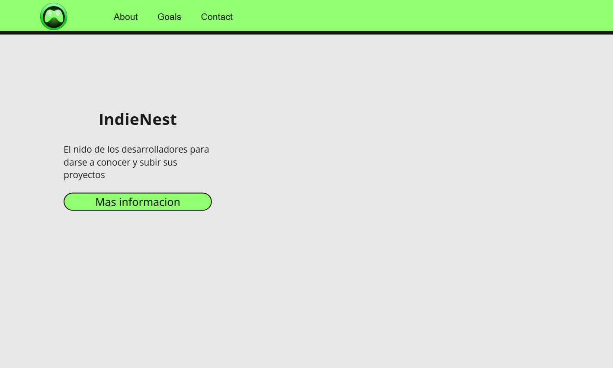

**Ventana About**
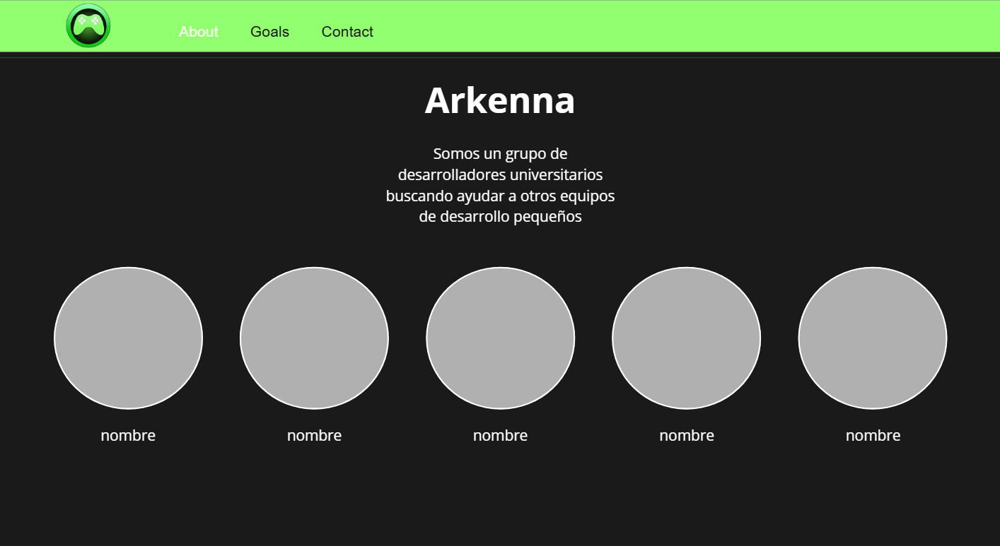

**Ventana Goals**
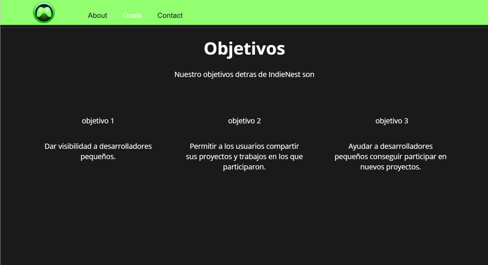

**Ventanna Contacts**

 **Wireframes para la versión móvil**

**Ventana Principal móvil**
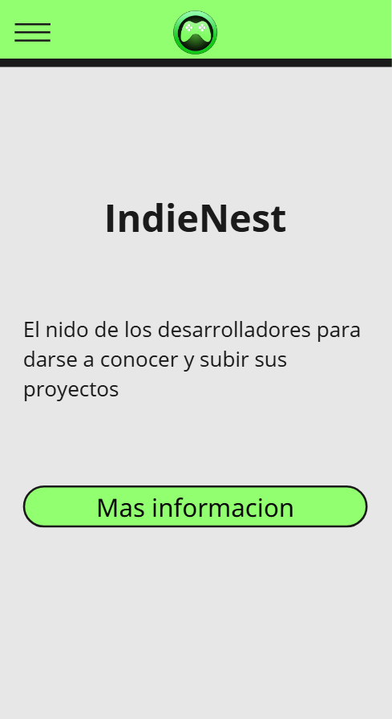

**Ventana Principal menu móvil**
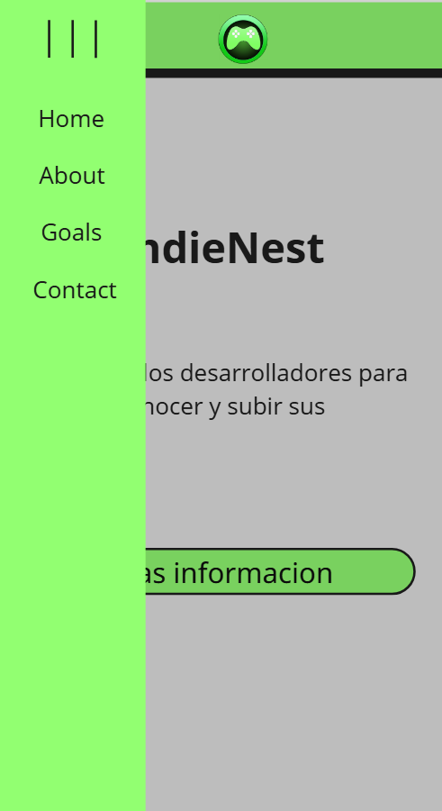

**Ventana About móvil**
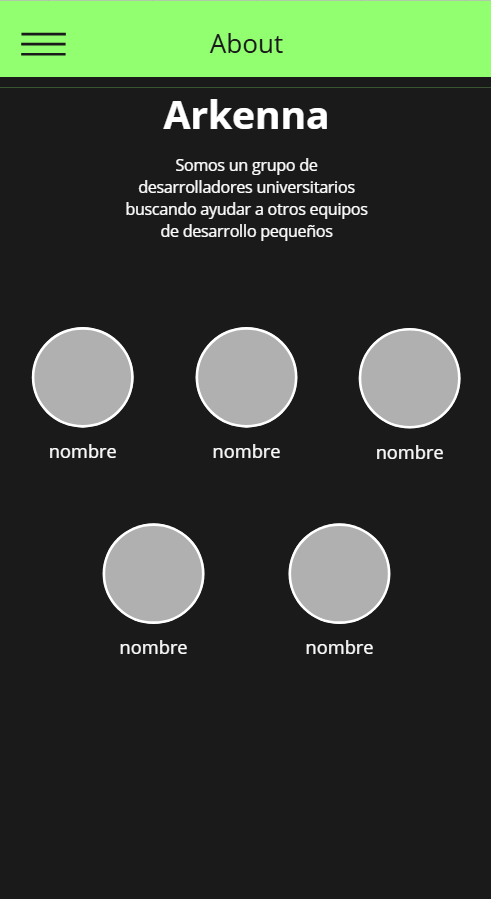

**Ventana Goals móvil**

**Ventana Contacts móvil**
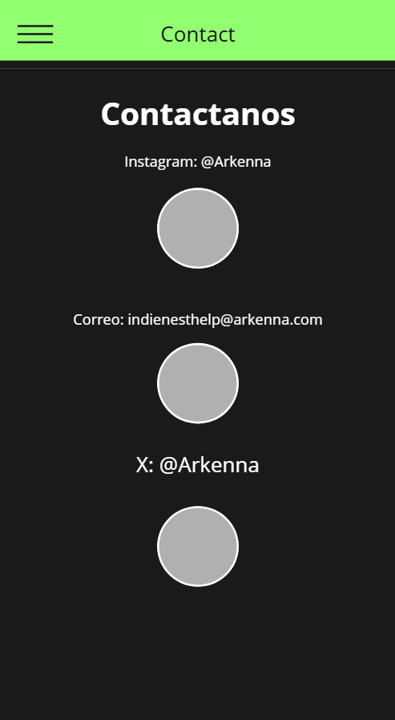

En la versión móvil, se adapta el diseño mediante un menú tipo “hamburguesa” ubicado en la parte superior izquierda, optimizando la experiencia en pantallas pequeñas. El contenido se organiza en formato vertical, con énfasis en la legibilidad y botones de acción amplios para facilitar la interacción táctil. Las secciones About, Goals y Contact se muestran en bloques diferenciados que conservan la jerarquía informativa del escritorio, pero con una navegación más secuencial e intuitiva.

### 4.3.2. Landing Page Moc-up

A continuación, se presentan los mock-ups de la página de inicio de la plataforma IndieNest, diseñados para dispositivos de escritorio y móviles. Estos prototipos visuales han sido elaborados bajo principios de diseño centrado en el usuario, logrando un equilibrio entre estética, funcionalidad y accesibilidad para todo tipo de creadores.

En la versión para navegador de escritorio, la interfaz propone una experiencia clara y estructurada. Los componentes principales, como el logotipo de IndieNest, la barra de navegación y los botones de acción, están ubicados en la parte superior de la pantalla, asegurando visibilidad inmediata y acceso ágil. El encabezado incluye accesos directos a secciones clave como About, Goals y Contact, lo que facilita la exploración eficiente de los contenidos más relevantes de la plataforma. La aplicación de la paleta de color, con el verde principal #92FF71 y fondos oscuros, mientras que la tipografía Noto Sans.

La versión móvil de la landing page conserva estos principios de diseño centrado en el usuario, adaptándose eficientemente a pantallas reducidas. En esta presentación, la navegación se reorganiza mediante un menú tipo hamburguesa ubicado en la parte superior izquierda, lo que mantiene la interfaz despejada y funcional. Los botones interactivos se amplían para facilitar su selección táctil y los bloques de contenido se organizan en disposición vertical, garantizando una navegación fluida y accesible desde cualquier dispositivo.
## 4.4 Web Applications UX/UI Design
### 4.4.1. Web Applications Wireframes
**Ventana Home**

**Ventana Login**

**Ventana Register**

**Ventana Usuario**

**Ventana Audio**

**Ventana Art**

**Ventana Developer**

**Ventana Comprar**

### 4.4.2. Web Applications Wireflow Diagrams
- User Goal: el usuario ingresa a la web app para registrarse o iniciar sesion en la misma.
TaskFlow:

Pantalla: 
Al ingresas a la aplicacion, el usuario se encontrára en la ventana de iniciar sesion con la opcion de registrarse mediante el boton del mismo nombre.
 
Proceso de registro:
 
Al seleccionar registrar se desplega el formulario para llenar con los datos requeridos para crear su cuenta y luego iniciar sesion.
 
Confirmacion:
 
Al iniciar sesion, la aplicacion manda al usuario a la página principal/home.
 
WireFlow:

### 4.4.3. Web Applications Mock-ups  
**Ventana Home**

**Ventana Login**

**Ventana Register**

**Ventana Usuario**

**Ventana Audio**

**Ventana Art**

**Ventana Developer**

**Ventana Comprar**

### 4.4.4. Web Applications User Flow Diagrams
## 4.5 Web Applications Prototyping
## 4.6 Domain-Driven Software Architecture
### 4.6.1. Design-Level Event Storming

En esta sección nos enfocamos en hacer un diseño más profundo del realizado en el Big Picture Event Storming. Nos enfocamos en diseñar nuevas funcionalidades encontradas en las historias de usuario, asi como pulir los detalles de los flujos ya creados antes. Cabe mencionar que se agregaron para este modelo nuevos elementos a comparación con el visto en el Big Picture, estos son:

-   **Comandos:**  Representados mediante un post-it azul, son aquellos que simbolizan el accionar de eventos del dominio, de esa forma se tiene una idea más clara del quien es el que activa estos eventos. 
    
-   **Aggregates:**  Representados mediante un post-it amarillo claro, son los que generalizan y le dan un rol o identidad a los eventos, por lo que deben ser puestos antes de estos. De esta forma se tiene claro cuales son los aggregates y entidades que se tiene que modelar para nuestro producto.
    
-   **Políticas:**  Representadas mediante un post-it morado, vendrían a ser las reglas del negocio que se encargan de ejecutar los comando, es por esto que siempre antes de un comando se coloca una política que señale lo que se tiene que proceder a hacer.
  

A continuación mostraremos las capturas del Design Level Event Storming realizado, separandolos según el Bounded Context al que pertenezcan y comenzando con los Core del negocio.

  
   
  
**Bounded Context Project:** 

 

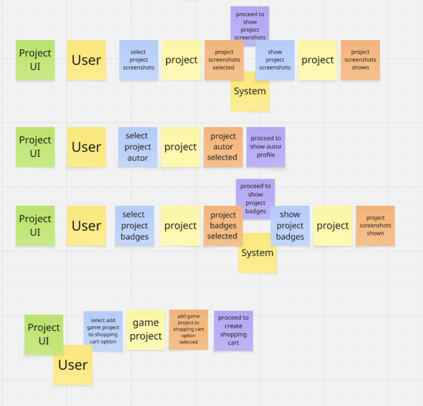

  
   
  
**Bounded Context Portfolio:**  

   
  
**Bounded Context Marketplace:**  

  
   
  
**Bounded Context Support:**  

  
   
  
**Bounded Context Community:**  

  
 
**Bounded Context Profile:**  

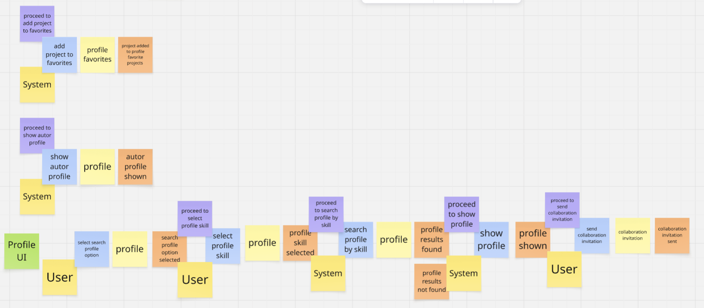

   

**Bounded Context IAM:** 

   
  
**Bounded Context Notification:** 

 
   
  
**Bounded Context Payment:** 

### 4.6.2. Software Architecture Context Diagram

  
 

  
 
### 4.6.3. Software Architecture Container Diagrams

 

 
 
### 4.6.4.Software Architecture Components Diagrams
  
**Fronted Components:**

**Backend Components:** 
 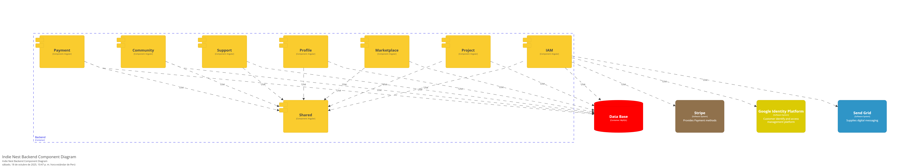

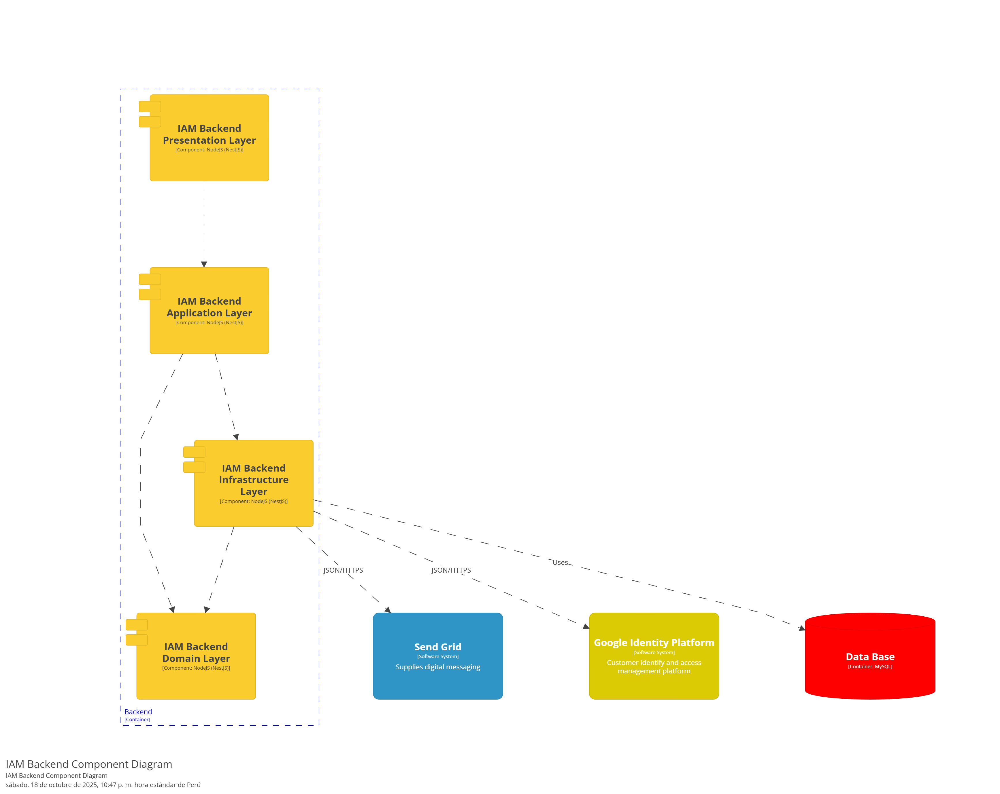
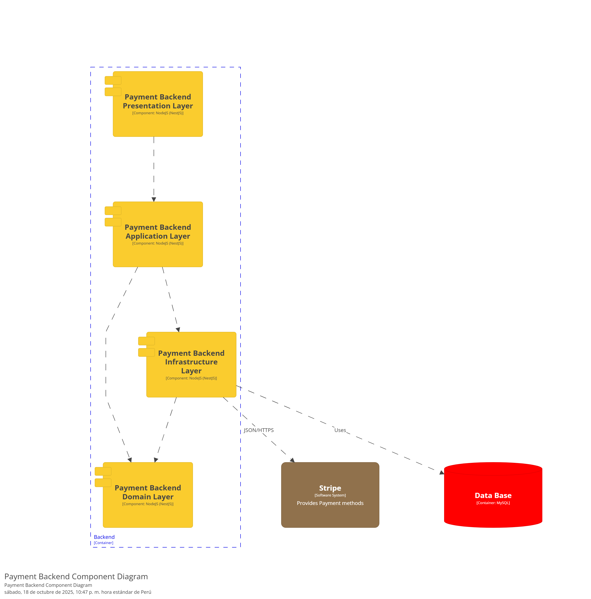
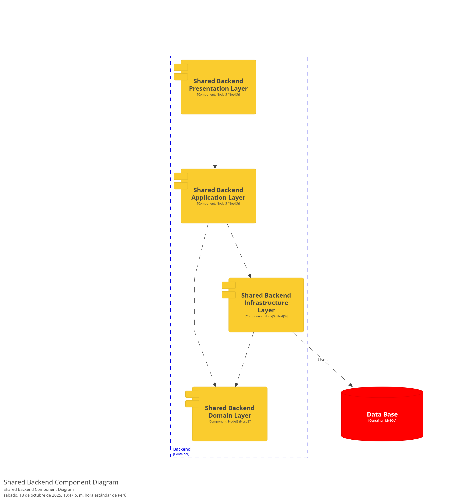
  
 
## 4.7 Software Object-Oriented Design

### 4.7.1. Class Diagrams

**Frontend Class Diagram:**

## 4.8. Database Design
# IndieNest - Base de Datos (SQL Server)

## Scripts
- [01_indienest_schema.sql](01_indienest_schema.sql) — Script principal.

### 4.8.1.Database Diagrams

---

# 5. Capitulo V Product Implementation, Validation & Deployment
## 5.1. Software Configuration Management
### 5.1.1. Software Development Environment Configuration
Para desarrollar el proyecto IndieNest, utilizaremos como entorno principal WebStorm, ya que este IDE está especialmente optimizado para el desarrollo web y permite trabajar de manera más ágil con JavaScript, HTML y CSS, brindando herramientas avanzadas de depuración y autocompletado.

En cuanto a los lenguajes y tecnologías:
- HTML5: para la estructura del sitio y los objetos estáticos de la aplicación.
- CSS3: para la parte visual y el diseño de estilos, siguiendo los lineamientos establecidos en el Style Guide.
- JavaScript: para implementar la interactividad y funcionalidades dinámicas dentro de la aplicación web.

### 5.1.2. Source Code Management

El repositorio del proyecto se encuentra en GitHub, dentro de la organización del equipo Arkenna. 
Se aplicára la metodología GitFlow, asegurando un flujo de trabajo ordenado:
- La rama main contendrá siempre la versión estable y lista para producción.
- La rama develop será utilizada para integrar las nuevas funcionalidades antes de su pase a producción.
- Las ramas feature/ se emplearán para el desarrollo de funcionalidades específicas, por ejemplo: feature/login.
- Las ramas release/ se destinarán a preparar entregas finales.

Cada commit realizado en el repositorio debe ser descriptivo y cumplir con la convención de Conventional Commits.

## 5.1.3. Source Code Style Guide & Coding Conventions  

Para garantizar la claridad, mantenibilidad y calidad del código en **IndieNest**, el equipo adoptará una serie de convenciones de estilo y nomenclatura basadas en guías de referencia internacionales.  

En primer lugar, todo el código se desarrollará en **inglés**, lo cual favorece la estandarización y la colaboración futura con otros equipos.  

Las convenciones aplicadas por lenguaje son:  

- **HTML / CSS:** Se seguirá la guía Google HTML/CSS Style Guide. Se utilizarán nombres de clases y etiquetas en minúsculas. Los atributos deberán ordenarse de manera consistente, priorizando legibilidad.  
- **JavaScript / TypeScript:** Se aplicará la Google JavaScript Style Guide y la Google TypeScript Style Guide. Las variables y funciones se escribirán en camelCase, mientras que las clases y componentes en PascalCase.  
- **Java:** En caso de ser utilizado para microservicios, se seguirá el Google Java Style Guide. Las clases estarán en PascalCase, los métodos en *camelCase* y los paquetes en minúsculas con puntos como separadores.  
- **Frameworks específicos:** Para Angular (en caso de módulos web), se utilizará el Angular Coding Style Guide, mientras que para microservicios en Spring Boot se tomarán como referencia las Spring Boot Features oficiales.  

Estas convenciones permiten:  
1. Homogeneizar la escritura del código independientemente del lenguaje o framework.  
2. Facilitar la lectura y comprensión por cualquier miembro actual o futuro del equipo.  
3. Reducir errores y ambigüedades al trabajar de manera colaborativa.  

### 5.1.4. Software Deployment Configuration

El despliegue de **IndieNest** se realizará utilizando un entorno basado en **WebStorm**, que será la herramienta principal para el desarrollo y publicación de la aplicación.  
La arquitectura de despliegue contempla los siguientes elementos:  

- **Landing Page:** Será desarrollada y gestionada directamente en **WebStorm**, lo que permite integrar el diseño y la funcionalidad de la interfaz en un solo entorno.  
- **Backend (API REST):** Será implementado en **Node.js**, y desplegado en un servidor configurado para integrarse con la base de datos.  
- **Base de Datos:** El sistema utilizará **MySQL** como gestor de base de datos relacional, asegurando integridad y consistencia en la información almacenada.  
- **Frontend (Web App):** Será desplegado como parte del mismo entorno gestionado en WebStorm, facilitando la sincronización entre el diseño de la interfaz y la lógica del backend.  
## 5.2. Landing Page, Services & Applications Implementation

## 5.2.1. Sprint 1

## 5.2.1.1. Sprint Planning 1
| **Sprint #**                           | Sprint 1                                                                                                                                                                                                                                                                                                                                                                                                                                                 |
|----------------------------------------|----------------------------------------------------------------------------------------------------------------------------------------------------------------------------------------------------------------------------------------------------------------------------------------------------------------------------------------------------------------------------------------------------------------------------------------------------------|
| **Sprint Planning Background**         |                                                                                                                                                                                                                                                                                                                                                                                                                                                          |
| **Date**                               | 2025-09-5                                                                                                                                                                                                                                                                                                                                                                                                                                                |
| **Time**                               | 10:00 AM                                                                                                                                                                                                                                                                                                                                                                                                                                                 |
| **Location**                           | Reunión presencial – Salón UH-52                                                                                                                                                                                                                                                                                                                                                                                                                         |
| **Prepared By**                        | Giuliano Angel Pelaez Vargas                                                                                                                                                                                                                                                                                                                                                                                                                             |
| **Attendees (to planning meeting)**    | Giuliano Angel Pelaez Vargas / Daniel Jonatan Aquino Solorzano / Johnny Alexander Ojanama Abanto / Rolando Andre Torres Diaz / Carlos Augusto Paredes Chavez                                                                                                                                                                                                                                                                                             |
| **Sprint 0 Review Summary**        | No hubo Sprint anterior.                                                                                                                                                                                                                                                                                                                                                                                                                                 |
| **Sprint 0 Retrospective Summary** | No hubo Sprint anterior                                                                                                                                                                                                                                                                                                                                                                                                                                  |
| **Sprint Goal & User Stories**         |                                                                                                                                                                                                                                                                                                                                                                                                                                                          |
| **Sprint 1 Goal**                      | Nos centramos en desarrollar e implementar la primera versión funcional de la página de inicio de IndieNest. Creemos que ofrece una introducción clara y convincente a la misión y la propuesta de valor de nuestra startup para usuarios potenciales (desarrolladores, artistas y gamers). Esto se confirmará cuando los visitantes puedan navegar por todas las secciones principales (About, Objects, Contact) y comprender el propósito de IndieNest. |
| **Sprint 1 Velocity**                  | 15                                                                                                                                                                                                                                                                                                                                                                                                                                                       |
| **Sum of Story Points**                | 13                                                                                                                                                                                                                                                                                                                                                                                                                                    |

## 5.2.1.2. Aspect Leaders and Collaborators.

En el Sprint 1, el equipo se enfocó en los aspectos clave para la creación del Landing Page. Se designó un líder (L) y colaboradores (C) para cada área, asegurando una distribución clara de responsabilidades y una comunicación efectiva.

| **Team Member**   | **GitHub Username** | **UI/UX Design & Wireframing** | **HTML & CSS Development** | **Content & SEO** | **Deployment & Repository** |
|--------------------------|----------------------|-------------------------------|----------------------------|-------------------|-----------------------------|
| Pelaez Vargas, Giuliano  | @SimpleGP | C                             | L                          | C                 | L                           | 
| Aquino Solorzano, Daniel | @DanielAquinoSolorzano | C                             | L                          | C                 | L                           |
| Ojanama Abanto, Johnny | @JohnnyGZ41  | L                             | L                          | C                 | L                           | 
| Torres Diaz, Rolando | @ROLO194 | C                             | C                          | C                 | C                           | 
| Paredes Chavez, Carlos | @CarlossUPC | C                             | C                          | C                 | C                           | 

## 5.2.1.3. Sprint Backlog 1

El objetivo principal del Sprint 1 fue construir y lanzar la primera versión del Landing Page de IndieNest, que funciona como la carta de presentación de nuestro proyecto. Las tareas se centraron en la maquetación HTML, el diseño con CSS, la creación de contenido informativo y el despliegue final.
La tabla siguiente detalla las **5 User Stories priorizadas** y sus tareas asociadas:  

| **Sprint #** | **User Story**                         | **Work-Item / Task** | **Description**                                                                                  | **Estimation (Hours)** | **Assigned To**  | **Status** |
|--------------|----------------------------------------|----------------------|--------------------------------------------------------------------------------------------------|------------------------|------------------|------------|
| Sprint 1     | US35 – Visualizar Página Principal             | T-01: Maquetación del index.html | Desarrollar la estructura HTML de la página de inicio.                                           | 8h                     | Johnny Ojanama   | Done       |
| Sprint 1     | US38 – Visualizar Medios de Contacto            | T-02: Maquetación de contact.html | Desarrollar la página de contacto con los enlaces a redes sociales.                              | 5h                     | Daniel Aquino    | Done       |
| Sprint 1     | US36 – Visualizar Sección del equipo             | T-03: Maquetación de about.html | Crear la estructura HTML de la página "About" con la descripción y miembros del equipo.          | 7h                     | Giuliano Pelaez  | Done       |
| Sprint 1     | US37 – Visualizar Objetivo del Proyecto                | T-04: Maquetación de goals.html | Implementar la estructura HTML de la página "Goals" con los objetivos del proyecto.                                               | 7h                     | Daniel Aquinoa   | Done       |
| Sprint 1     | US39 – Visualizar Barra de Navegación                | T-05: Estilos CSS y Header | Aplicar los estilos CSS a todas las páginas y asegurar el funcionamiento del header de navegación. | 10h                    | Daniel Aquino   | Done  |

## 5.2.1.4. Development Evidence for Sprint Review. 

El desarrollo durante el Sprint 1 se centró exclusivamente en la implementación del Landing Page estático. Se utilizó HTML5 para la estructura semántica y CSS3 para el diseño visual. El trabajo fue gestionado en el repositorio de GitHub, aplicando el flujo GitFlow.

Repositorio del Landing Page: https://github.com/Arkenna/IndieNest-Landing-Page

| Repository | Branch          | Commit Id                                 | Commit Message                           | Commited on (Date) |
|------------|-----------------|-------------------------------------------|------------------------------------------|--------------------|
|Arkenna/IndieNest-Landing-Page| feature/index   | f1978bc5ed305645b4ad14be438a63f301b91b7c  | Add Index.html and Assets (index assets) | 2025-10-08         |
|Arkenna/IndieNest-Landing-Page| feature/about   | 3f0c4bdf6ebc5841d14927dbca998cf7f8e2004f  | Create About page structure              | 2025-10-08         |
|Arkenna/IndieNest-Landing-Page| feature/contact | 80a948c63c3dea3a8cc3661cf440f7070784f442  | Create Contact page                      | 2025-10-08         |
|Arkenna/IndieNest-Landing-Page| feature/goals   | 89cc3be19582e5245c440c36012385cb812b5f48 | Implement Goals page                     | 2025-10-08         |
|Arkenna/IndieNest-Landing-Page| main            | 58c34126030149365bb865b3f79a9aab4084dbf4  | Merge all features and deploy            | 2025-10-08         |

## 5.2.1.5. Execution Evidence for Sprint Review. 

La ejecución del Sprint 1 se enfocó en la construcción de las cuatro páginas estáticas y su correcta vinculación a través de la barra de navegación.

- Acciones ejecutadas:

    - Creación de ramas feature para el desarrollo de las páginas (feature/index, feature/about, feature/goals, feature/contacts).

    - Integración de las ramas completadas en la rama develop para pruebas.

    - Verificación del funcionamiento de todos los enlaces de navegación y la correcta visualización de las imágenes y textos. 

## 5.2.1.6. Services Documentation Evidence for Sprint Review. 

Dado que el objetivo del Sprint 1 fue la creación de un sitio web estático, no se desarrollaron servicios de backend ni se implementó una API REST. La documentación generada se limitó a los siguientes artefactos del frontend: 

- README.md del Repositorio: Se documentó la estructura del proyecto del Landing Page.

- Comentarios en el Código: Se documentó el código HTML y CSS para explicar la función de las secciones y estilos complejos, facilitando su mantenimiento.

## 5.2.1.7. Software Deployment Evidence for Sprint Review. 

El despliegue del Landing Page del Sprint 1 se realizó con éxito, cumpliendo con el objetivo de tener una primera versión funcional y pública. 

- **Plataforma de Despliegue:** Se utilizó GitHub Pages para alojar el sitio estático.

- **URL del Landing Page Desplegado:** https://arkenna.github.io/IndieNest-Landing-Page/

- **Proceso:** El despliegue se configuró para actualizarse automáticamente con cada push a la rama main. 

## 5.2.1.8. Team Collaboration Insights during Sprint.

- Durante este sprint, el equipo se organizó para trabajar en paralelo en las diferentes páginas del sitio web.

- Se definió una dinámica de comunicación constante vía Discord para resolver dudas sobre los estilos CSS y la estructura del header.

- Se identificó como fortaleza la capacidad del equipo para dividir el trabajo en componentes (páginas) y desarrollarlos de forma independiente.

- Como oportunidad de mejora, se acordó centralizar todos los estilos comunes (como los del header y fuentes) en una hoja de estilos general para evitar la duplicación de código en futuros sprints.

## 5.2.2. Sprint 2

## 5.2.2.1. Sprint Planning 2
| **Sprint #**                           | Sprint 2                                                                                                                                                                                                                                                                                                                                                                                                                                                 |
|----------------------------------------|----------------------------------------------------------------------------------------------------------------------------------------------------------------------------------------------------------------------------------------------------------------------------------------------------------------------------------------------------------------------------------------------------------------------------------------------------------|
| **Sprint Planning Background**         |                                                                                                                                                                                                                                                                                                                                                                                                                                                          |
| **Date**                               | 2025-10-8                                                                                                                                                                                                                                                                                                                                                                                                                                                |
| **Time**                               | 10:00 AM                                                                                                                                                                                                                                                                                                                                                                                                                                                 |
| **Location**                           | Reunión presencial – Salón UH-52                                                                                                                                                                                                                                                                                                                                                                                                                         |
| **Prepared By**                        | Giuliano Angel Pelaez Vargas                                                                                                                                                                                                                                                                                                                                                                                                                             |
| **Attendees (to planning meeting)**    | Giuliano Angel Pelaez Vargas / Daniel Jonatan Aquino Solorzano / Johnny Alexander Ojanama Abanto / Rolando Andre Torres Diaz / Carlos Augusto Paredes Chavez                                                                                                                                                                                                                                                                                             |
| **Sprint 1 Review Summary**        | A través de la creación de ramas feature, se desarrolló la Landing Page y se verificó su funcionamiento.                                                                                                                                                                                                                                                                                                                                                                                                                                 |
| **Sprint 1 Retrospective Summary** | El trabajo fue gestionado a través del repositorio de GitHub. Se centró más que nada en la implementación del Landing Page semántico.                                                                                                                                                                                                                                                                                                                                                                                                                                  |
| **Sprint Goal & User Stories**         |                                                                                                                                                                                                                                                                                                                                                                                                                                                          |
| **Sprint 2 Goal**                      | Nos centramos en desarrollar el Endpoint para el desarrollo de portafolios, además de implementar entidades en la base de datos MySQL. Creemos que aporta la funcionalidad buscada por los posibles usuarios. Esto se confirmará cuando los visitantes puedan ocupar cada funcionalidad implementada en este sprint de manera cómoda y comprensible. |
| **Sprint 2 Velocity**                  | 18                                                                                                                                                                                                                                                                                                                                                                                                                                                       |
| **Sum of Story Points**                | 15                                                                                                                                                                                                                                                                                                                                                                                                                                    |

## 5.2.2.2. Aspect Leaders and Collaborators.

En el Sprint 2, el equipo se enfocó en los aspectos clave para la creación del Landing Page. Se designó un líder (L) y colaboradores (C) para cada área, asegurando una distribución clara de responsabilidades y una comunicación efectiva.

| **Team Member**   | **GitHub Username** | **Backend & API** | **Frontend & UI** | **Base de Datos(MySQL)** | **QA & Documentación** |
|--------------------------|----------------------|-------------------|-------------------|--------------------------|------------------------|
| Pelaez Vargas, Giuliano  | @SimpleGP | C                 | C                 | L                        | C                      | 
| Aquino Solorzano, Daniel | @DanielAquinoSolorzano | L                 | C                 | C                        | C                      |
| Ojanama Abanto, Johnny | @JohnnyGZ41  | C                 | L                 | C                        | C                      | 
| Torres Diaz, Rolando | @ROLO194 | C                 | L                 | C                        | C                      | 
| Paredes Chavez, Carlos | @CarlossUPC | C                 | C                 | C                        | L                      | 

## 5.2.2.3. Sprint Backlog 2

El objetivo principal del Sprint 2 fue construir y lanzar la primera versión del Landing Page de IndieNest, que funciona como la carta de presentación de nuestro proyecto. Las tareas se centraron en la maquetación HTML, el diseño con CSS, la creación de contenido informativo y el despliegue final.
La tabla siguiente detalla las **5 User Stories priorizadas** y sus tareas asociadas:  

| **Sprint #** | **User Story**                         | **Work-Item / Task**                     | **Description**                                                                                  | **Estimation (Hours)** | **Assigned To**  | **Status** |
|--------------|----------------------------------------|------------------------------------------|--------------------------------------------------------------------------------------------------|------------------------|------------------|------------|
| Sprint 2     | US01 – Registro de Usuario             | T-06: Modelo de Usuario en BD            | Crear la tabla de Usuarios en la base de datos MySQL para almacenar los datos del registro, basándose en el script SQL.                                           | 5h                     | Giuliano Pelaez   | Done       |
| Sprint 2     | US01 – Registro de Usuario            | T-07: Endpoint de Registro               | Implementar el Endpoint en la API REST para crear nuevas cuentas de usuario.                              | 8h                     | Daniel Aquino    | Done       |
| Sprint 2     | US01 – Registro de Usuario             | T-08: Formulario de Registro (UI)        | Desarrollar el componente de registro en Angular, basándose en el wireframe.          | 6h                     | Rolando Torres  | Done       |
| Sprint 2     | US02 – Crear Portafolio                | T-09: Modelo de Portafolio en BD         | Crear las tablas Perfiles y Portafolios en MySQL, relacionadas con la tablas Usuarios.                                               | 4h                     | Giuliano Pelaez   | Done       |
| Sprint 2     | US02 – Crear Portafolio                | T-10: Endpoint de Creación de Portafolio | Implementar el Endpoint para que un usuario pueda crear su portafolio. | 7h                    | Daniel Aquino   | Done  |
| Sprint 2     | US11 – Redactar Perfil                | T-11: Vista de Perfil/Portafolio (UI)    | Desarrollar la vista inicial del portafolio del usuario en Angular, donde podrá ver su información. | 8h                    | Rolando Torres   | Done  |

## 5.2.2.5. Execution Evidence for Sprint Review. 

La ejecución del Sprint 2 se enfocó en el desarrollo de tareas clave para el registro de usuarios, creación de portafolios y la interfaz de perfil.

- **Evidencia de Ejecución:**

	-   Se desarrolló el modelo de usuario en MySQL (T01), permitiendo la persistencia de datos de registro.
    
	-   Se implementó el Endpoint de registro en la API REST (T07), habilitando la creación de cuentas nuevas.
    
	-   Se construyó el formulario de registro en Angular con validaciones (T08), conectando correctamente con el backend.
    
	-   Se diseñó el modelo de portafolio en base de datos (T09), incluyendo las tablas de perfiles y portafolios.
    
	-   Se desarrolló el Endpoint para la creación de portafolios (T10), integrando la lógica de negocio con la base de datos.
    
	-   Se completó la interfaz de redacción de perfil (T11), permitiendo a los usuarios editar y visualizar su información profesional.

## 5.2.2.6. Services Documentation Evidence for Sprint Review. 

Dado que el objetivo del Sprint 2 fue la implementación de las primeras funcionalidades, se implementó una base de datos y conexiones con los endpoints del frontend. Durante el Sprint 2 se documentaron los siguientes servicios RESTful como parte de la arquitectura del backend:

1.  **POST /api/users/registration**
    
    -   Función: Crear una nueva cuenta de usuario.
        
    -   Validaciones: Email único, contraseña segura, campos obligatorios.
        
    -   Estado: Implementado y probado.
        
2.  **POST /api/portfolios/create**
    
    -   Función: Generar un portafolio vinculado al usuario.
        
    -   Validaciones: Verificación de existencia de usuario, estructura de datos.
        
    -   Estado: Implementado y probado.
        
3.  **GET /api/profile/{id}**
    
    -   Función: Obtener datos del perfil del usuario.
        
    -   Estado: En desarrollo para el próximo sprint, pero la vista UI fue completada.
        

**Base de Datos:**

-   Se crearon las tablas `Usuarios`, `Perfiles` y `Portafolios` en MySQL.
    
-   Scripts SQL fueron documentados y versionados en el repositorio GitHub.
    
-   Se definieron relaciones entre entidades para futuras funcionalidades (colaboraciones, proyectos, comentarios).
    

**Frontend Angular:**

-   Se documentó la estructura de componentes para el formulario de registro y la vista de perfil.
  
-   Se establecieron conexiones con los endpoints mediante servicios Angular (`HttpClient`).
    
-   Validaciones de formulario fueron integradas con mensajes de error personalizados.

## 5.2.2.7. Software Deployment Evidence for Sprint Review. 

El despliegue del Sprint 2 se realizó con éxito en entornos de prueba para validar la primera versión funcional de la aplicación web y sus servicios. 

- **Frontend (Web App):** Desplegado en un servicio de hosting para aplicaciones de JavaScript, permitiendo el acceso público a la interfaz de registro e inicio de sesión.

- **Backend (API REST):** Desplegado en una plataforma como servicio (PaaS) como Render, con la base de datos MySQL conectada.

- **Base de Datos:** La base de datos MySQL fue configurada en un proveedor de cloud para ser accesible por la API desplegada. 

## 5.2.2.8. Team Collaboration Insights during Sprint.

En este sprint se introdujo la complejidad de coordinar el trabajo entre frontend y backend, lo que generó nuevos aprendizajes.
- La comunicación fue crucial. El equipo estableció la necesidad de definir "contratos de API" claros (qué datos espera y devuelve cada endpoint) antes de empezar a programar, para evitar bloqueos.

- Se identificó un pequeño retraso debido a problemas de configuración de CORS (Cross-Origin Resource Sharing) entre la Web App y la API, lo cual sirvió como un aprendizaje técnico importante para el equipo.

- La fortaleza principal fue la capacidad del equipo para dividirse en sub-equipos (backend/frontend) y trabajar en paralelo de manera efectiva.

## 5.2.3. Sprint 3

### 5.2.3.1. Sprint Planning 3

| **Sprint #**                        | Sprint 3                                                                                                                                                                                                                                                                                                                                             |
|-------------------------------------|------------------------------------------------------------------------------------------------------------------------------------------------------------------------------------------------------------------------------------------------------------------------------------------------------------------------------------------------------|
| **Sprint Planning Background**      |                                                                                                                                                                                                                                                                                                                                                      |
| **Date**                            | 2025-01-11                                                                                                                                                                                                                                                                                                                                           |
| **Time**                            | 15:00 PM                                                                                                                                                                                                                                                                                                                                             |
| **Location**                        | Reunión virtual - Discord                                                                                                                                                                                                                                                                                                                            |
| **Prepared By**                     | Giuliano Angel Pelaez Vargas                                                                                                                                                                                                                                                                                                                         |
| **Attendees (to planning meeting)** | Giuliano Angel Peláez Vargas / Daniel Jonatan Aquino Solorzano / Johnny Alexander Ojanama Abanto  / Carlos Augusto Paredes Chavez                                                                                                                                                                                                                    |
| **Sprint 2 Review Summary**         | Se completaron los endpoints de Registro (T07) y Creación de Portafolio (T10), junto con sus modelos de BD (T01, T09) y las vistas de UI (T08, T11).                                                                                                                                                                                                 |
| **Sprint 2 Retrospective Summary**  | La coordinación entre backend y frontend mejoró, pero se identificó la necesidad de definir los contratos de API (Technical Stories) con más antelación.                                                                                                                                                                                             |
| **Sprint Goal & User Stories**      |                                                                                                                                                                                                                                                                                                                                                      |
| **Sprint 3 Goal**                   | Nos centramos en desarrollar el Endpoint para el desarrollo de portafolios, además de implementar entidades en la base de datos MySQL. Creemos que aporta la funcionalidad buscada por los posibles usuarios. Esto se confirmará cuando los visitantes puedan ocupar cada funcionalidad implementada en este sprint de manera cómoda y comprensible. |
| **Sprint 3 Velocity**               | 20                                                                                                                                                                                                                                                                                                                                                   |
| **Sum of Story Points**             | 17                                                                                                                                                                                                                                                                                                                                                   |

---

### 5.2.3.2. Aspect Leaders and Collaborators

En el Sprint 3,  se enfocó en la construcción de los servicios del backend (API REST) para las entidades core, basándose en los contextos definidos.

| Team Member | GitHub Username | Backend (Project & Support) | Backend (Community & Payment) | Backend (IAM) | QA & Documentation |
| :--- | :--- | :--- | :--- | :--- | :--- |
| Pelaez Vargas, Giuliano | @SimpleGP |  C | C | C | L |
| Aquino Solorzano, Daniel | @DanielAquinoSolorzano | L | L | C | C |
| Ojanama Abanto, Johnny | @JohnnyGZ41 |  C | C | L | C |
| Paredes Chavez, Carlos | @CarlossUPC | C | C |  C | L |

---

### 5.2.3.3. Sprint Backlog 3

El objetivo del Sprint 3 fue implementar los endpoints CRUD (Crear y Leer) para las entidades principales del backend, basándose en las Technical Stories (TS) definidas en el Capítulo 3.1.

| Sprint # | User Story / Technical Story | Work-Item / Task | Description | Estimation (Hours) | Assigned To | Status |
| :--- |:-----------------------------| :--- | :--- | :--- | :--- | :--- |
| Sprint 3 | TS-G001, TS-G002, TS-G003    | T-12: Endpoints Game | Implementar los endpoints para Crear, Obtener Todos y Obtener por ID para Game (Project Context). | 6h| Aquino Solorzano | Done |
| Sprint 3 | TS-AR001, TS-AR002, TS-AR003 | T-13: Endpoints Art | Implementar los endpoints para Crear, Obtener Todos y Obtener por ID para Art (Project Context). | 7h | Aquino Solorzano | Done |
| Sprint 3 | TS-AU001, TS-AU002, TS-AU003 | T-14: Endpoints Audio | Implementar los endpoints para Crear, Obtener Todos y Obtener por ID para Audio (Project Context). | 7h | Aquino Solorzano | Done |
| Sprint 3 | TS-PU001, TS-PU002, TS-PU003 | T-15: Endpoints Publication | Implementar los endpoints para Crear, Obtener Todos y Obtener por ID para Publication (Community Context). | 7h | Aquino Solorzano | Done |
| Sprint 3 | TS-AN001, TS-AN002, TS-AN003 | T-16: Endpoints Answer | Implementar los endpoints para Crear, Obtener Todos y Obtener por ID para Answer (Community Context). | 6h | Aquino Solorzano | Done |
| Sprint 3 | TS-RE001, TS-RE002, TS-RE003 | T-17: Endpoints Review | Implementar los endpoints para Crear, Obtener Todos y Obtener por ID para Review (Support Context). | 5h | Aquino Solorzano | Done |
| Sprint 3 | TS-SC001, TS-SC002, TS-SC003 | T-18: Endpoints ShoppingCart | Implementar los endpoints para Crear, Obtener Todos y Obtener por ID para ShoppingCart (Payment Context). | 5h | Aquino Solorzano | Done |
| Sprint 3 | TS-AC001, TS-AC002, TS-AC003 | T-19: Endpoints Account | Implementar los endpoints para Crear, Obtener Todos y Obtener por ID para Account (IAM Context). | 8h | Johnny Ojanama | Done |
| Sprint 3 | TS-IAM001, TS-IAM002         | T-20: Endpoints Auth | Implementar la lógica y endpoints para SignUp y SignIn (IAM Context). | 8h | Johnny Ojanama | Done |

---

### 5.2.3.5. Execution Evidence for Sprint Review

La ejecución del Sprint 3 se centró en la implementación y prueba de los servicios de backend definidos en el backlog.

* Se implementaron los servicios y repositorios para las entidades Game, Art, y Audio (T-12, T-13, T-14).
* Se desarrollaron los endpoints para Publication y Answer (T-15, T-16) para el manejo de la comunidad.
* Se creó el servicio de Review (T-17) para el contexto de soporte.
* Se implementó la lógica de ShoppingCart (T-18) para el contexto de pagos.
* Se completaron los servicios de Account (T-19) y la lógica de autenticación para SignUp y SignIn (T-20).

---

### 5.2.3.6. Services Documentation Evidence for Sprint Review

Durante el Sprint 3 se implementaron los servicios RESTful (API Backend) que sirven como núcleo funcional para la aplicación.

#### COMMUNITY CONTEXT:
*  **POST /api/v1/publications** : Crear Publication (TS-PU001)
* **GET /api/v1/publications**: Obtener Todos los Publication (TS-PU003)
* **GET /api/v1/publications/{id}**: Obtener un Publication por id (TS-PU002)
* **POST /api/v1/answers** : Crear Answer (TS-AN001)
* **GET /api/v1/answers** : Obtener Todos los Answer (TS-AN003)
* **GET /api/v1/answers/{id}**: Obtener un Answer por id (TS-AN002)

#### PAYMENT CONTEXT:
*  **POST /api/v1/shopping-cart**: Crear ShoppingCart (Este endpoint no estaba en las TS originales, pero fue implementado)
*  **GET /api/v1/shopping-cart**: Obtener Todos los ShoppingCart
*  **GET /api/v1/shopping-cart/{id}**: Obtener un ShoppingCart por id

#### PROJECT CONTEXT:
* **POST /api/v1/games**: Crear Game (TS-G001)
* **GET /api/v1/games**: Obtener Todos los Game (TS-G003)
* **GET /api/v1/games/{id}**: Obtener un Game por id (TS-G002)
* **POST /api/v1/arts**: Crear Art (TS-AR001)
* **GET /api/v1/arts**: Obtener Todos los Art (TS-AR003)
* **GET /api/v1/arts/{id}**: Obtener un Art por id (TS-AR002)
* **POST /api/v1/audios**: Crear Audio (TS-AU001)
* **GET /api/v1/audios**: Obtener Todos los Audio (TS-AU003)
* **GET /api/v1/audios/{id}**: Obtener un Audio por id (TS-AU002)

#### SUPPORT CONTEXT:
*  **POST /api/v1/reviews**: Crear Review (TS-RE001)
*  **GET /api/v1/reviews**: Obtener Todos los Review (TS-RE003)
*  **GET /api/v1/reviews/{id}**: Obtener un Review por id (TS-RE002)

#### IAM (Identity and Access Management) CONTEXT:
*  **POST /api/v1/accounts**: Crear Account (TS-AC001)
*  **GET /api/v1/accounts**: Obtener Todos los Account (TS-AC003)
*  **GET /api/v1/accounts/{id}**: Obtener un Account por id (TS-AC002)
*  **POST /api/v1/auth/sign-up**: SignUp (Endpoint para registro, relacionado a TS-U001 y TS-AC001)
*  **POST /api/v1/auth/sign-in**: SignIn (Endpoint de autenticación)

---

### 5.2.3.7. Software Deployment Evidence for Sprint Review

El despliegue del Sprint 3 se centró en actualizar la API REST en la nube para incluir los nuevos endpoints.

* **Backend (API REST):** La API de Spring Boot fue actualizada y desplegada, asegurando que los nuevos endpoints de Project, Community, Support, Payment, e IAM estén activos y funcionales.
* **Base de Datos:** Se actualizaron las tablas en la base de datos MYSQL workbench en la nube para reflejar las nuevas entidades.
* **Pruebas:** Se realizaron pruebas de integración post-despliegue usando IntelliJ IDEA  para verificar la conectividad con la base de datos y la correcta respuesta de todos los nuevos servicios.

---

### 5.2.3.8. Team Collaboration Insights during Sprint

* Este sprint fue intensivo en desarrollo de backend. El equipo demostró una gran capacidad para paralelizar el trabajo por contextos (Project, IAM, Community).
* La definición previa de las Technical Stories (TS) en el Sprint 2 fue fundamental para que el desarrollo de los endpoints en Sprint 3 fuera rápido y sin ambigüedades.
* La colaboración se centró en la revisión de PRs (Pull Requests) para asegurar que los modelos de datos y la lógica de servicio fueran consistentes entre los diferentes contextos.
* Se consolidó el uso de GitFlow para manejar las múltiples features de API que se estaban desarrollando en paralelo sin generar conflictos.

# Anexos
- Enlace al Trello del Product Backlog https://trello.com/b/SBmiXIZJ/indienest

- Enlace del video de las entrevistas: https://upcedupe-my.sharepoint.com/:v:/g/personal/u202321613_upc_edu_pe/EbQaKTrBnMBKoJ1hoQwwTC0B6Uwkffz66WSolVvJ4KQQAg?e=l6yEE3&nav=eyJyZWZlcnJhbEluZm8iOnsicmVmZXJyYWxBcHAiOiJTdHJlYW1XZWJBcHAiLCJyZWZlcnJhbFZpZXciOiJTaGFyZURpYWxvZy1MaW5rIiwicmVmZXJyYWxBcHBQbGF0Zm9ybSI6IldlYiIsInJlZmVycmFsTW9kZSI6InZpZXcifX0%3D

- Enlace del repositorio de documentación: https://github.com/Arkenna/upc-pre-202520-1asi0729-7349-Arkenna-report-TB1/blob/main/README.md

- Enlace del repositorio del Landing Page: https://github.com/Arkenna/IndieNest-Landing-Page

- Enlace del Landing Page Desplegado: https://arkenna.github.io/IndieNest-Landing-Page/

- Enlace del Figma: https://www.figma.com/board/Nwuu2iPGCaTCbsdDlg0pv4/IndieNest?node-id=0-1&p=f&t=rh3YpcM5QT6v2Emq-0
- Enlace a la aplicación: https://github.com/Arkenna/IndieNest-Web-Application
- Enlace del diagrama de clases frontend: https://github.com/Arkenna/upc-pre-202520-1asi0729-7349-Arkenna-report-TB1/blob/main/fronted-class-diagram.puml

# Conclusiones

- ### Se consolidó la base técnica para el registro y gestión de usuarios, integrando exitosamente el backend en MySQL con endpoints funcionales y una interfaz en Angular que valida y conecta los datos.
- ### El equipo cumplió con todas las tareas asignadas, logrando cerrar 215 puntos de historia en 18 User Stories, lo que demuestra una ejecución eficiente y alineada con los objetivos del sprint.
- ### Se establecieron los cimientos para la funcionalidad de portafolios, permitiendo que los usuarios comiencen a construir su identidad profesional dentro de la plataforma, lo cual será clave para futuras interacciones y visibilidad.

# Referencias bibliográficas

> Trivi M. (2020). Varios desarrolladores independientes critican la poca visibilidad de sus juegos en la eShop. [https://www.anaitgames.com/noticias/desarrolladores-independientes-criticas-visibilidad-eshop](https://www.anaitgames.com/noticias/desarrolladores-independientes-criticas-visibilidad-eshop)

> Trivi M. (2018). Los desarrolladores indies se muestran pesimistas con el estado actual de la industria. [https://www.anaitgames.com/articulos/los-desarrolladores-indies-se-muestran-pesimista-con-el-estado-actual-de-la-industria](https://www.anaitgames.com/articulos/los-desarrolladores-indies-se-muestran-pesimista-con-el-estado-actual-de-la-industria)

> Revista Economía. (2025). Cómo los juegos indie están conquistando el mercado y redefiniendo la industria del gaming. [https://www.revistaeconomia.com/como-los-juegos-indie-estan-conquistando-el-mercado-y-redefiniendo-la-industria-del-gaming](https://www.revistaeconomia.com/como-los-juegos-indie-estan-conquistando-el-mercado-y-redefiniendo-la-industria-del-gaming)

> Perales A. (2018). El arte en los videojuegos españoles: mucho más que una cuestión de estética. [https://theobjective.com/further/cultura/2018-08-01/arte-videojuegos-espanoles](https://theobjective.com/further/cultura/2018-08-01/arte-videojuegos-espanoles)

> Delgado M. (2021). Itchio: El mejor sitio para descubrir juegos indie. [https://vandal.elespanol.com/reportaje/itchio-el-mejor-sitio-para-descubrir-videojuegos-indies](https://vandal.elespanol.com/reportaje/itchio-el-mejor-sitio-para-descubrir-videojuegos-indies)

> WriteSeen (2025). Game Jolt: What It Is, How It Works, And Key Features. [https://writeseen.com/blog/game-jolt](https://writeseen.com/blog/game-jolt)

